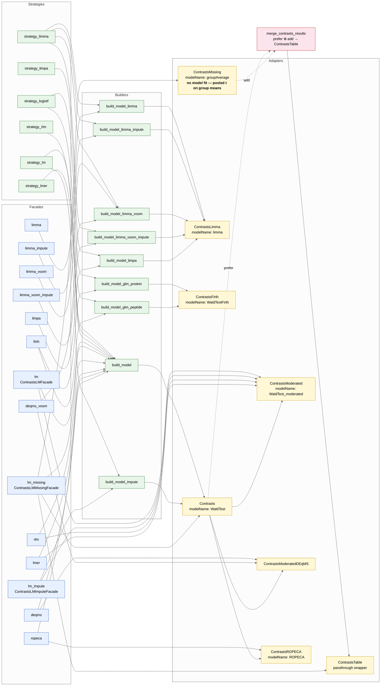
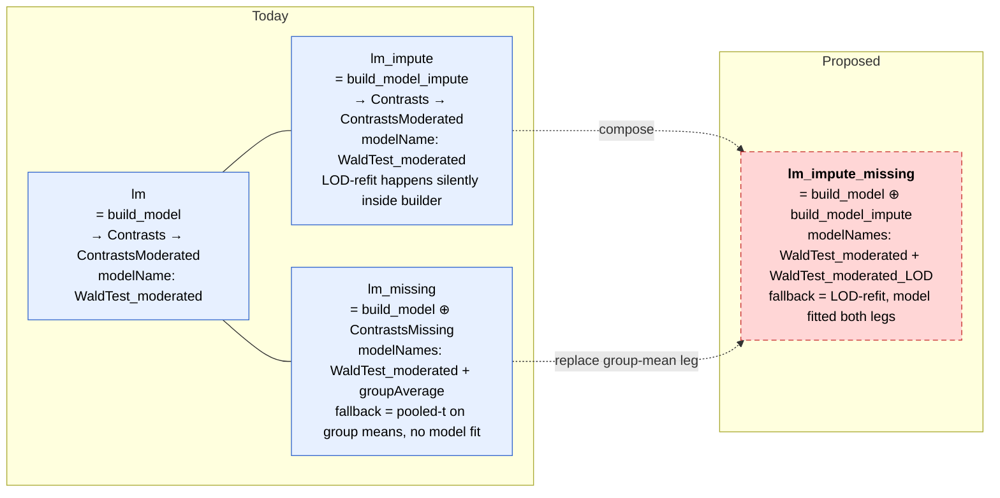

# Facade / model / contrast adapter dependency analysis

## Status: ARCHIVED 2026-06-23

The concrete source gap that made this note active has been resolved without
adding a separate `lm_impute_missing` facade. `build_model_impute()` now marks
LOD-rescued rows in `model_df$imputed`, `Contrasts` propagates that flag into
`modelName = "WaldTest_imputed"`, and `ContrastsModerated` renders rescued
rows as `WaldTest_moderated_imputed`. Downstream `prolfquapp` maps the legacy
`model = "prolfqua"` plus `model_missing = TRUE` alias to `lm_impute`, so users
get the desired visible two-path output from the existing facade.

The dependency analysis below is kept as historical architecture context.

Triggered by the WU345302 PPE4-vs-CONTROL re-run: the user expected the
"prolfqua + model_missing: yes" alias to produce a contrast table with
two `modelName` levels showing where LM-impute had stepped in. The
current `lm_missing` facade actually merges plain LM with
**`ContrastsMissing`** (a group-mean fill-in that does not fit a
model), not with **`lm_impute`** (LOD-imputed refit). This document
maps the as-built dependency graph and proposes a new facade that
fills the actual gap.

## 1. As-built dependency graph



(Edges from Facade to "final Adapter wrap" capture the public-facing
contrast object — what `facade$contrast` points to after construction.
Limma-family facades wrap `ContrastsLimma` directly because limma's
`eBayes` already does moderation.)

## 2. LM family — focus



Key observation: `lm_impute` and `lm_missing` are **parallel** today,
not nested. Their second-leg semantics differ fundamentally:

| Facade | Second leg | Second-leg method | Output modelName(s) | Imputation evidence |
|---|---|---|---|---|
| `lm` | none | — | `WaldTest_moderated` | none |
| `lm_impute` | LOD-refit inside `build_model_impute` | `impute_refit_singular` — replaces missing values with LOD, refits LM, borrows variance from successful fits | `WaldTest_moderated` (silent) | hidden — every row looks the same |
| `lm_missing` | group-mean fill-in via `ContrastsMissing` | no fit; pooled-variance t-test on `mean(treatment) - mean(control)` after group-mean imputation | `WaldTest_moderated` + `groupAverage` | visible — two modelNames |

## 3. ContrastsMissing in detail

- File: `R/ContrastsSimpleImpute.R`.
- Inherits `ContrastsInterface`.
- Wraps `LFQData` directly (not a `Model`).
- Strategy: for proteins where one group is entirely missing, substitute
  the median single-sample abundance in that group (or LOD as
  fallback), pool variance across all groups, run a Welch-style t-test
  on `mean(treatment) − mean(control)`.
- Returns columns: `diff`, `FDR`, `p.value`, `sigma`, `std.error`. No
  `statistic` column.
- `modelName = "groupAverage"`.
- This is "the old implementation" — predates the per-protein refit
  machinery in `build_model_impute`. It is statistically weak (single-
  group mean, pooled variance) and is the path the user wants to
  retire from the LM-with-fallback workflow.

## 4. The gap

There is no facade that does:

```
1. fit plain LM (build_model) for every protein
2. for proteins where the LM fit was singular or failed, refit them
   with build_model_impute (LOD imputation + borrowed variance)
3. MERGE the two contrast tables, keeping a per-protein modelName
   that distinguishes the path
```

`lm_impute` is close to (1+2) but homogenises the output —
`impute_refit_singular` substitutes refitted rows into the same Model
object, so by the time `ContrastsModerated` wraps the result every row
carries the same `modelName`. The distinction between "fit cleanly"
and "needed LOD refit" is lost.

`lm_missing` is close to (1+merge) but its second leg is
`ContrastsMissing`, not LOD-refit.

A proposed `lm_impute_missing` facade would close the gap by:

1. Constructing a base contrast object from `build_model` →
   `Contrasts` → `ContrastsModerated` (call it `base`,
   modelName `"WaldTest_moderated"`).
2. Constructing a refit contrast object from `build_model_impute` →
   `Contrasts` → `ContrastsModerated` with a distinct
   `model_name` argument (e.g. `"WaldTest_moderated_LOD"`).
3. Calling `merge_contrasts_results(prefer = base, add = refit)`.
4. Returning the merged `ContrastsTable` as `self$contrast`, with the
   facade tag `"lm_impute_missing"`.

The `merge_contrasts_results` utility already exists in
`R/ContrastsInterface.R` and is the same primitive `lm_missing` uses.
The two legs would expose distinct modelNames, so volcano legends and
downstream filtering would correctly attribute each protein to its
fitting path.

## 5. Where this leaves `lm_impute` and `lm_missing`

Open questions for review, **not** yet decided:

1. Once `lm_impute_missing` exists, is `lm_impute` worth keeping in the
   public registry? The user said yes — "might be interesting for
   testing." Options:
   - keep registered as-is
   - keep registered but document as a stripped-down testing variant
     of `lm_impute_missing`
   - move to `@keywords internal` and remove from `FACADE_REGISTRY`
2. Once `lm_impute_missing` exists, should `lm_missing` (with the
   `ContrastsMissing` group-mean leg) be kept, deprecated, or
   redirected? The group-mean variant is statistically weaker than the
   LOD-refit variant on most realistic datasets.
3. Does the `"prolfqua"` YAML alias (`model: prolfqua` +
   `model_missing: yes`) currently mapped in
   `prolfquapp/R/R6_DEAnalyse.R::.resolve_facade_model` to
   `lm_missing` want to be re-pointed at `lm_impute_missing` once it
   lands? The alias was flipped from `lm_impute` to `lm_missing` in
   this session at the user's request; flipping again is cheap but is
   a public breaking change for legacy YAMLs.
4. Should the new facade also be available for `rlm` (a parallel
   `rlm_impute_missing`)? `build_model` accepts an `rlm` strategy
   identically; the symmetry is free if useful.
5. Naming. `lm_impute_missing` is descriptive but long. Alternatives:
   `lm_lod` (focuses on the LOD aspect), `lm_refit` (focuses on the
   refit semantics), `lm_robust_missing` (emphasises the robustness
   gain over `lm_missing`). The convention used by existing facades
   (`lm`, `lm_impute`, `lm_missing`) suggests `lm_impute_missing` reads
   most consistently.

## 6. Files to touch when the design is approved

- `prolfqua/R/ContrastsFacades.R` — add `ContrastsLMImputeMissingFacade`
  near the existing `ContrastsLMMissingFacade` block; register via
  `.builtin_facade_entry`.
- `prolfqua/tests/testthat/test-ContrastsFacades.R` — exercise the new
  facade; verify two `modelName` levels appear in `get_contrasts()`,
  verify `filter_significant()` and `get_ora()` work, verify
  `get_missing()` returns the leftover protein × contrast pairs.
- `prolfqua/man/*` — regenerated by `make document`.
- (Optional) `prolfquapp/R/R6_DEAnalyse.R::.resolve_facade_model` —
  re-point the `prolfqua + model_missing` YAML alias if § 5.3 is
  approved.
- (Optional) `~/.claude/skills/prolfqua-adding-models/SKILL.md` — note
  the "merge two builders" pattern as a recipe for composing two
  fitted models with `merge_contrasts_results`.

## 7. Reference tables

### 7.1 All 14 facades and what they actually compose

| Facade | Registry | Builder | Adapter chain | Merge? | Needs |
|---|---|---|---|---|---|
| ContrastsLMFacade | lm | build_model | Contrasts → ContrastsModerated | no | aggregated |
| ContrastsRLMFacade | rlm | build_model | Contrasts → ContrastsModerated | no | aggregated |
| ContrastsLmerFacade | lmer | build_model | Contrasts → ContrastsModerated | no | nested |
| ContrastsLMImputeFacade | lm_impute | build_model_impute | Contrasts → ContrastsModerated | no | aggregated |
| ContrastsLMMissingFacade | lm_missing | build_model + ContrastsMissing | merge(Contrasts→ContrastsModerated, ContrastsMissing) | yes | aggregated |
| ContrastsLimmaFacade | limma | build_model_limma | ContrastsLimma | no | aggregated |
| ContrastsLimmaImputeFacade | limma_impute | build_model_limma_impute | ContrastsLimma | no | aggregated |
| ContrastsLimmaVoomFacade | limma_voom | build_model_limma_voom | ContrastsLimma | no | aggregated |
| ContrastsLimmaVoomImputeFacade | limma_voom_impute | build_model_limma_voom_impute | ContrastsLimma | no | aggregated |
| ContrastsLimpaFacade | limpa | build_model_limpa | ContrastsLimma (model_name=limpa) | no | aggregated_limpa |
| ContrastsDEqMSFacade | deqms | build_model | Contrasts → ContrastsModeratedDEqMS | no | aggregated |
| ContrastsDEqMSVoomFacade | deqms_voom | build_model_limma_voom | ContrastsLimma(eBayes=F) → ContrastsModeratedDEqMS | no | aggregated |
| ContrastsROPECAFacade | ropeca | build_model | Contrasts → ContrastsROPECA | no | nested |
| ContrastsFirthFacade | firth | build_model_glm_protein or build_model_glm_peptide | ContrastsFirth | no | either |

### 7.2 Builder summaries

| Builder | What it does differently from `build_model` |
|---|---|
| `build_model` | baseline per-protein lm/rlm/lmer fit via `model_analyse` |
| `build_model_impute` | `build_model` + `impute_refit_singular` — refits failed/singular proteins after substituting missing values at LOD; borrows variance from successful fits |
| `build_model_limma` | limma matrix-based fit (`limma::lmFit + eBayes`); all-proteins-at-once not per-protein |
| `build_model_limma_impute` | `build_model_limma` + LOD imputation for proteins with NA coefficients; borrows variance |
| `build_model_limma_voom` | `build_model_limma` with vooma precision weights (mean-variance lowess) |
| `build_model_limma_voom_impute` | `build_model_limma_voom` + LOD imputation |
| `build_model_limpa` | limma wrapper around `limpa::voomaLmFitWithImputation` (imputation-aware vooma + eBayes) |
| `build_model_glm_protein` | per-protein Firth logistic regression on missingness encoding |
| `build_model_glm_peptide` | as above but with peptide-level hierarchy appended to the formula |

### 7.3 Adapter behaviours

| Adapter | Inherits | Wraps | Default modelName | Notes |
|---|---|---|---|---|
| `Contrasts` | ContrastsInterface | `Model` | `WaldTest` | Wald-test per-protein |
| `ContrastsModerated` | ContrastsInterface | any `Contrasts*` | `{parent}_moderated` | replaces df/sigma/p.value with limma-moderated values |
| `ContrastsLimma` | ContrastsInterface | `ModelLimma` | `limma` | matrix-based |
| `ContrastsModeratedDEqMS` | ContrastsInterface | any `Contrasts*` | `{parent}_DEqMS` | count-dependent variance shrinkage |
| `ContrastsFirth` | ContrastsInterface | `ModelFirth` | `WaldTestFirth` | Firth-corrected logistic |
| `ContrastsROPECA` | ContrastsInterface | any `Contrasts*` | `ROPECA` | peptide-level p-value aggregation |
| `ContrastsMissing` | ContrastsInterface | `LFQData` | `groupAverage` | **no model fit** — pooled-t on group means |
| `ContrastsTable` | ContrastsInterface | raw data.frame | user-specified | passthrough; primary output of `merge_contrasts_results` |
