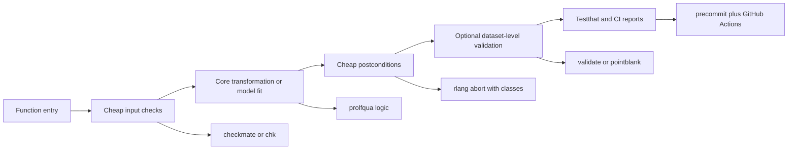
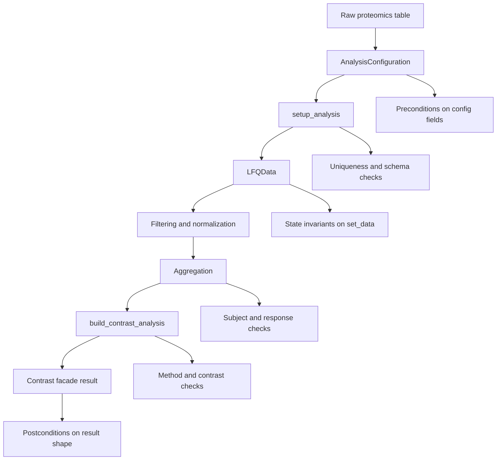

# Verifying R Preconditions and Postconditions for prolfqua

## Executive summary

For **package-internal runtime contracts** in `fgcz/prolfqua`, the strongest pairing is **`checkmate` for cheap, expressive argument checks** plus **`rlang` for structured condition signaling**. `checkmate` is current on CRAN, largely C-backed, has a mature four-family API (`assert*`, `test*`, `check*`, `expect_*`) plus the compact `qassert()` DSL, and its own vignette explicitly discusses speed trade-offs and benchmarks. `rlang` is not a full assertion framework, but it is the most robust foundation for **error classes, bullets, backtraces, chained errors, and argument helpers** like `arg_match()` and `check_dots_empty()`. Together, they map well to `prolfqua`’s current style, which already uses explicit `stop()`, `match.arg()`, `message()`, and hand-written data checks in key entry points such as `setup_analysis()` and `build_contrast_analysis()`. citeturn33view0turn42view0turn34view0turn20view0turn12view0turn12view2turn14view3turn14view4

For **dataset-level and pipeline-style validation**, the best fit is **`validate`** first and **`pointblank`** second. `validate` is designed around reusable rule objects and explicit confrontation of datasets against rule sets, including cross-record and cross-dataset checks; that is a natural match for proteomics-level integrity rules such as uniqueness of hierarchy keys per sample, finite intensity values, missingness thresholds, or decoy/contaminant prevalence limits. `pointblank` is stronger when you want rich HTML reports, database-backed validation, or analyst-facing data-quality reporting, but it is heavier and less attractive as an always-on dependency inside a modelling package. `assertr` is still useful, but mainly for analyst pipelines and diagnostic workflows rather than low-level package contracts. citeturn35view0turn40view1turn40view2turn35view1turn39view0turn39view1turn39view2turn34view1turn38view0

For **new work**, I would not choose `assertthat`, `assertive`, or `checkr` as the primary foundation. `assertthat` is simple and readable, but its CRAN release is still `0.2.1` from 2019 and its GitHub history also stops in 2019. `assertive` was archived on CRAN in 2023 because of archived dependencies, and the GitHub repository visible today is a read-only CRAN mirror pointing back to Bitbucket. `checkr` was likewise removed from CRAN in 2023, with CRAN itself recommending `chk` instead. If you want a lighter modern alternative to `checkmate`, **`chk`** is the best extra package to consider: it is current on CRAN, active on GitHub, positions itself as simple/fast/customizable, and emits `rlang` errors of class `chk_error`. citeturn34view2turn29view2turn36view0turn37view0turn35view3turn34view4turn31view0turn32view0

Repository inspection of `prolfqua` on its default branch shows a package organized around an **`AnalysisConfiguration` R6 class**, an **`LFQData` R6 class**, a **long-format tabular data workflow**, and modelling/contrast facades. The current code already enforces some high-value invariants: `setup_analysis()` requires `file_name`, checks that the configured file-name column exists, stops when no factors are configured, builds hierarchy and factor columns, and stops on duplicate hierarchy-key/sample combinations unless `debug = TRUE`; `build_contrast_analysis()` restricts `method` via `match.arg()` and removes decoys conditionally; `LFQData$initialize()` can delegate to `setup_analysis()`, but `set_data()` and `set_config_value()` currently replace internals without visible validation in the inspected file. There is an active `testthat` suite and a GitHub Actions workflow running `R CMD check` plus coverage. citeturn12view0turn12view1turn12view2turn12view3turn14view0turn18view0turn19view0turn17view0

My practical recommendation is a **three-layer strategy**. Keep **cheap runtime guards** on hot package entry points with `checkmate` or `chk`; standardize all user-facing failures with `rlang::abort()` and package-specific classes; and move **heavier, dataset-level postconditions** into optional helpers backed by `validate` or `pointblank`, exercised in tests and CI rather than on every call. For `prolfqua`, the first functions I would harden are `setup_analysis()`, `LFQData$initialize()`, `LFQData$set_data()`, `build_contrast_analysis()`, and the aggregation/model-construction gateways. citeturn42view0turn34view0turn35view0turn35view1turn12view0turn12view1turn12view2

## Evaluation of the R contract ecosystem

The ecosystem splits cleanly into two families. One family focuses on **low-overhead argument checking inside package code**: `checkmate`, `rlang`, `chk`, `dbc`, `assertthat`, and historically `assertive`. The other focuses on **data-quality pipelines and reportable validation outcomes**: `validate`, `pointblank`, and `assertr`. `precommit` belongs to a third category entirely: it is not a runtime assertion framework, but a developer-tooling layer for enforcing formatting, linting, and related gates before code reaches CI or users. citeturn42view0turn20view0turn31view0turn41view4turn26view0turn37view0turn35view0turn35view1turn38view0turn35view2

A useful selection criterion for `prolfqua` is not “which package has the most predicates,” but rather **where the check executes and what it should optimize for**. At a function boundary, you want low ceremony, low allocation, and failures that compose with package APIs. At the dataset boundary, you want rule reuse, summaries, and informative reports. At the repository boundary, you want hooks and CI. That distinction is why `checkmate` and `rlang` look strong for core runtime code, while `validate` and `pointblank` look stronger for proteomics-table integrity rules and CI reports. citeturn42view0turn20view0turn35view0turn39view0turn35view2



For maintenance risk, the package landscape is highly uneven. `rlang`, `pointblank`, `checkmate`, `dbc`, `chk`, and `precommit` all show recent 2026 GitHub activity. `validate` is not moving as quickly as `rlang`, but its CRAN and GitHub history still show recent late-2025 maintenance and an active issue tracker. By contrast, `assertr` is serviceable but slower-moving, `assertthat` appears effectively legacy, and `assertive`/`checkr` are archived paths rather than forward-looking choices. citeturn24view0turn29view0turn23view0turn25view0turn32view0turn29view1turn28view0turn25view1turn29view2turn36view0turn35view3

## Package findings and comparative assessment

The table below emphasizes the attributes that matter most for `prolfqua`: maintenance, surface area, performance posture, condition reporting, and whether the package is better suited to **package internals** or **pipeline/data-quality** checks.

| Package | Current status | Assertion and validation surface | Error and reporting model | Best fit for `prolfqua` | Sources |
|---|---|---|---|---|---|
| **checkmate** | CRAN `2.3.4` published 2026-02-03; GitHub issues visible; latest commit 2026-02-04. | Families: `assert*`, `test*`, `check*`, `expect_*`; compact `qassert()` / `qtest()` / `qexpect()` DSL; examples include `assertCount()`, `assertChoice()`, `assertNumeric()`, `testDataFrame()`. | Returns either errors, logicals, strings, or testthat expectations depending on prefix; substantial C implementation; vignette benchmarks show strong performance especially on larger objects and early exits. | **Excellent primary runtime checker** for package entry points and cheap postconditions. | citeturn33view0turn21view0turn23view0turn42view0 |
| **rlang** | CRAN `1.3.0` published 2026-07-05; active GitHub with latest commit 2026-07-15. | Not a full assertion suite, but provides `arg_match()`, `check_required()`, `check_exclusive()`, `check_dots_used()`, `check_dots_empty()`, `check_installed()`. | Best-in-class structured conditions: `abort()`, bullet lists, condition metadata, parent errors, `global_entrace()`, `last_error()`, `last_warnings()`, backtrace support. | **Excellent condition substrate**; pair with `checkmate` or `chk`. | citeturn34view0turn20view0turn24view0 |
| **dbc** | No CRAN page found; GitHub-only package with latest release `v0.8.1` on 2026-06-04 and latest commits on 2026-05-25. | Generated `assert_*` functions geared to input/output contracts; README example shows `assert_is_character_nonNA_vector()` and `assert_is_data_frame_with_required_names()` plus `assertion_type`. | Design-by-contract framing; pure-R repository; no issue backlog visible; less ecosystem adoption than `checkmate`/`rlang`. | **Good optional layer** for explicit contract-heavy APIs, but not my first core dependency. | citeturn21view1turn25view0turn41view4 |
| **assertr** | CRAN `3.0.1` published 2023-11-23; GitHub redirects from `ropensci/assertr` to `tonyfischetti/assertr`; latest commit 2024-04-11. | `assert`, `verify`, `insist`, `assert_rows`, `insist_rows`; examples include `has_all_names()`, `within_n_sds()`, `within_bounds()`, `in_set()`, `maha_dist()`. | Strong pipeline summaries, including multi-error tables across verbs (`chain_start` / `chain_end` style reporting). | **Good for analyst pipelines and diagnostics**, weaker as core package runtime infrastructure. | citeturn34view1turn38view0turn25view1 |
| **validate** | CRAN `1.1.7` published 2025-12-10; GitHub active in late 2025. | Rule objects and confrontation workflow; CRAN and README emphasize per-field, in-record, cross-record, and cross-dataset rules; examples use `check_that()` and summaries; package docs center `validator`/`confront` infrastructure. | Results can be summarized, plotted, annotated, investigated, and manipulated as first-class rule objects; compiled code present but performance is not the main marketing focus. | **Best dataset-level rule engine** for reusable proteomics table contracts. | citeturn35view0turn40view1turn40view2turn28view0turn27view0 |
| **pointblank** | CRAN `0.12.4` published 2026-07-21; GitHub active on 2026-07-21. | `create_agent()`, `interrogate()`, `scan_data()`, `col_vals_between()`, `col_vals_lt()`, `col_is_numeric()`, `warn_on_fail()`, `stop_on_fail()`, `action_levels()`. | Rich `agent` reports, HTML scans, thresholded warnings/errors; README states local validation is fast and remote validation executes in-database for supported backends. | **Best reporting layer** for data-quality dashboards and CI artifacts; heavier than needed for hot runtime paths. | citeturn35view1turn27view1turn29view0turn39view0turn39view1turn39view2turn39view3 |
| **assertthat** | CRAN `0.2.1` published 2019-03-21; GitHub latest commit 2019-05-21. | `assert_that()`, `see_if()`, `validate_that()`, helper predicates like `is.flag()`, `is.string()`, `has_name()`, `is.count()`, `not_empty()`, `noNA()`. | Friendly messages and `on_failure()` customization, but no modern typed condition system or recent evolution. | **Readable but legacy**; not the best new dependency for `prolfqua`. | citeturn34view2turn26view0turn29view2 |
| **assertive** | Archived on CRAN on 2023-10-24 due to archived dependency chain; visible GitHub repo is a read-only CRAN mirror. | Huge `assert_*` and `is_*` surface; README examples show `assert_is_not_null()`, vectorized predicates, `cause` attributes, and virtual-package composition over multiple subpackages. | Historically informative, but current path is maintenance-poor and fragmented. | **Do not adopt for new work**. | citeturn36view0turn37view0 |
| **checkr** | Removed from CRAN on 2023-10-15; CRAN recommends `chk`. | Former argument-checking package. | Archived path. | **Do not adopt; use `chk` instead**. | citeturn35view3turn34view4 |
| **chk** | CRAN `0.10.0` published 2025-01-24; GitHub active through 2026-07-18. | Simple `chk_*` functions such as `chk_string()`, `chk_flag()`, `chk_range()`, and broader argument-checking families. | Emits `rlang` errors of class `chk_error`; positions itself as simple, customizable, and fast. | **Strong lightweight alternative** to `checkmate`, especially if you want tidyverse-style conditions. | citeturn34view4turn31view0turn32view0 |
| **precommit** | CRAN `0.4.3` published 2024-07-22; GitHub active through 2026-07-07. | Git hooks, wrappers to the `pre-commit` executable, formatting/lint/spell/documentation hooks, plus CI guidance in vignettes. | Developer-experience and repository hygiene, not runtime validation. | **Useful companion tooling**, not a runtime contract library. | citeturn35view2turn27view2turn29view1 |

The package selection that best balances **maturity, maintenance, ergonomics, and fit** is therefore: **`checkmate` + `rlang`** for package internals, **`validate`** for reusable data contracts, **`pointblank`** when you want richer reports or remote-table validation, and **`precommit`** for repository hygiene. `chk` is the main alternative worth considering if you prefer a smaller API and `rlang`-native condition behavior over `checkmate`’s broader assertion menu and testthat extension. citeturn42view0turn34view0turn35view0turn35view1turn35view2turn34view4

A brief note on licenses, since dependency choices can matter later even if you asked me not to treat license compatibility as a constraint: `checkmate` is BSD-3-Clause, `rlang`, `assertr`, `pointblank`, `chk`, and `assertions` are MIT-family packages, while `validate`, `assertthat`, and `precommit` are GPL-3. I am not making a legal recommendation here, only noting that this is another reason to keep heavy or optional validation/reporting tools in `Suggests` when practical. citeturn33view0turn34view0turn34view1turn35view1turn34view4turn34view3turn35view0turn34view2turn35view2

## prolfqua source analysis

`prolfqua`’s public design centers on **configuration-plus-long-table analysis**. In the files inspected on the default branch, `AnalysisConfiguration` exposes fields such as `factors`, `hierarchy`, `factor_depth`, `hierarchy_depth`, `pattern_decoys`, `pattern_contaminants`, and response-column tracking via `set_response()` / `get_response()`. `LFQData` is an R6 container that stores the data and configuration and can call `setup_analysis()` from its initializer. `setup_analysis()` itself shows that the package expects a long data frame with a configured file-name column, factor columns, hierarchy columns that are possibly concatenated into hierarchy keys, and a sample identifier that can be derived when absent. citeturn12view0turn12view1turn12view3

The strongest existing validation logic is already in `setup_analysis()`. In the inspected source, it stops if `configuration$file_name` is missing, stops if the configured file-name column is not present in `data`, stops if no factors are defined, constructs hierarchy and factor columns, derives `sampleName` when needed, and explicitly checks for duplicate hierarchy-key/sample combinations, stopping with an informative message unless `debug = TRUE`, in which case it returns the diagnostic count table. That is already the shape of a contract boundary; it simply needs more systematic surface checks and better structured condition classes. citeturn12view0turn14view0

The modelling path is similarly clear. `build_contrast_analysis()` determines valid methods from the facade registry, applies `match.arg()`, stops on unknown methods, and conditionally removes decoys before modelling when the configuration sets `pattern_decoys`, emitting a diagnostic `message()` about how many decoys were dropped. This is exactly the kind of function that benefits from layered contracts: cheap preconditions on input object shape and method choice, followed by postconditions on the object returned by the builder. citeturn12view2

The inspected `LFQData` methods reveal one especially important gap: the initializer sets internal `.data` and `.config`, but `set_data()` simply replaces the internal data frame, and `set_config_value()` simply mutates the configuration field. In an R6-heavy design, these mutator methods are high leverage because they can silently invalidate assumptions established during initialization. That makes them prime candidates for **cheap invariant checks every time state changes**. citeturn12view1

I also did not see `rlang::abort()` in the inspected `setup_analysis()` or `LFQData` files, and the failure style in those files is still mostly `stop()` plus ad hoc message construction. In other words, `prolfqua` already has meaningful validation logic, but it does not yet have **typed conditions, consistent error classes, or a clear separation between hot-path boundary checks and heavier dataset-level validation**. citeturn14view3turn14view4turn14view0

The test surface suggests active coverage around the exact domains where contracts matter most: the repository contains tests for `LFQData`, `tidyMS_data_setup`, aggregation, model and contrast facades, missingness summaries, decoy/contaminant detection, and decoy dropping before contrast analysis. The repository also has a GitHub Actions workflow on `main` that runs `R CMD check` on R `4.5.2` and then coverage via `covr::codecov()`. That is a good foundation for adding **postcondition tests** without inventing new infrastructure. citeturn19view0turn17view0



## Integration blueprint for prolfqua

The simplest high-value migration is to standardize on **`checkmate` plus `rlang`** in package code. `checkmate` should answer “is this argument/state cheap to validate right now?” and `rlang` should answer “how do we signal failure in a way downstream code and tests can classify?” I would define a tiny internal helper layer first, then retrofit key functions to use it. The target condition taxonomy should be stable and package-specific. citeturn42view0turn34view0

A practical condition vocabulary for `prolfqua` would look like this:

```r
abort_bad_argument <- function(arg, must, not = NULL, parent = NULL) {
  msg <- c(
    "Invalid argument.",
    x = sprintf("`%s` must %s.", arg, must)
  )
  if (!is.null(not)) {
    msg <- c(msg, i = sprintf("Actual value: %s.", not))
  }

  rlang::abort(
    message = msg,
    class = c("prolfqua_error_bad_argument", "prolfqua_error"),
    parent = parent
  )
}

abort_missing_columns <- function(cols, data_nm = "data") {
  rlang::abort(
    message = c(
      "Required columns are missing.",
      x = sprintf("Missing from `%s`: %s.", data_nm, paste(cols, collapse = ", "))
    ),
    class = c("prolfqua_error_missing_column", "prolfqua_error_bad_argument", "prolfqua_error")
  )
}

abort_postcondition <- function(msg, details = NULL) {
  bullets <- c("Postcondition failed.", x = msg)
  if (!is.null(details)) bullets <- c(bullets, i = details)

  rlang::abort(
    message = bullets,
    class = c("prolfqua_error_postcondition", "prolfqua_error")
  )
}
```

That recommendation follows directly from `rlang`’s explicit condition system, backtraces, and argument-checking helpers. The advantage over today’s `stop()` pattern is not just nicer messages; it is **machine-readable failure classes** for tests, calling code, and issue triage. citeturn20view0turn34view0

The first concrete insertion point is `setup_analysis()`. Today it already enforces several semantic checks. I would add **cheap schema and scalar checks up front** and leave the current duplicate-key diagnostic logic in place, but replace raw `stop()` calls with typed conditions.

```r
setup_analysis <- function(data, configuration, cc = TRUE, from_factors = FALSE, debug = FALSE) {
  checkmate::assert_data_frame(data, min.rows = 1)
  checkmate::assert_flag(cc)
  checkmate::assert_flag(from_factors)
  checkmate::assert_flag(debug)

  if (!inherits(configuration, "AnalysisConfiguration")) {
    abort_bad_argument("configuration", "inherit from `AnalysisConfiguration`",
                       not = paste(class(configuration), collapse = "/"))
  }

  file_name <- configuration$file_name
  if (is.null(file_name) || !nzchar(file_name)) {
    rlang::abort(
      c("Missing configuration field.", x = "`configuration$file_name` must be a non-empty scalar string."),
      class = c("prolfqua_error_invalid_configuration", "prolfqua_error")
    )
  }

  required_cols <- unique(c(
    file_name,
    unlist(configuration$factors, use.names = FALSE),
    unlist(configuration$hierarchy, use.names = FALSE),
    configuration$get_response()
  ))
  missing_cols <- setdiff(required_cols, names(data))
  if (length(missing_cols)) {
    abort_missing_columns(missing_cols)
  }

  # existing prolfqua transformation logic...
  out <- .setup_analysis_impl(data, configuration, cc = cc, from_factors = from_factors, debug = debug)

  # cheap postconditions
  checkmate::assert_data_frame(out, min.rows = 1)
  checkmate::assert_names(
    names(out),
    must.include = c(configuration$sample_name, configuration$file_name,
                     configuration$factor_keys(), configuration$hierarchy_keys())
  )

  out
}
```

The next high-value insertion point is `LFQData`. Because `LFQData` is mutable, it needs **state invariants**. I would require that every call to `set_data()` preserves the minimal schema implied by the current configuration, or route through a validator helper.

```r
LFQData <- R6::R6Class(
  "LFQData",
  public = list(
    initialize = function(data, config, prefix = "ms_", setup = FALSE) {
      checkmate::assert_string(prefix, min.chars = 1)
      if (!inherits(config, "AnalysisConfiguration")) {
        abort_bad_argument("config", "inherit from `AnalysisConfiguration`")
      }

      private$.data <- if (setup) setup_analysis(data, config) else data
      private$.config <- config$clone(deep = TRUE)
      self$prefix <- prefix

      private$validate_state()
    },

    set_data = function(new_data) {
      checkmate::assert_data_frame(new_data, min.rows = 0)
      private$.data <- new_data
      private$validate_state()
      invisible(self)
    }
  ),
  private = list(
    validate_state = function() {
      cfg <- private$.config
      dat <- private$.data

      must_have <- unique(c(cfg$file_name, cfg$sample_name, cfg$factor_keys(), cfg$hierarchy_keys()))
      missing <- setdiff(must_have, names(dat))
      if (length(missing)) {
        abort_postcondition(
          "LFQData internal data no longer satisfies the configured schema.",
          details = paste("Missing columns:", paste(missing, collapse = ", "))
        )
      }
    }
  )
)
```

For `build_contrast_analysis()`, I would keep the existing registry-based design and strengthen its contracts instead of changing architecture. The minimum useful checks are: `lfqdata` class, non-empty `modelstr`, valid `method`, contrasts object shape, and a postcondition that the returned facade exposes an expected method such as `get_contrasts()`.

```r
build_contrast_analysis <- function(lfqdata, modelstr, contrasts, method = "lm", ...) {
  if (!inherits(lfqdata, "LFQData")) {
    abort_bad_argument("lfqdata", "inherit from `LFQData`")
  }
  checkmate::assert_string(modelstr, min.chars = 1)
  method <- rlang::arg_match(method, values = names(list_facades()))
  rlang::check_dots_empty0(...)

  # cheap shape check; refine once contrast object classes are stabilized
  if (!is.list(contrasts) && !inherits(contrasts, "Contrasts")) {
    abort_bad_argument("contrasts", "be a list-like contrasts specification")
  }

  out <- .build_contrast_analysis_impl(lfqdata, modelstr, contrasts, method = method, ...)

  if (!is.function(out$get_contrasts)) {
    abort_postcondition("Returned contrast facade does not expose `get_contrasts()`.")
  }

  out
}
```

`dbc` is most attractive when you want the **contract to be part of the function’s visual signature**, especially for public entry points. I would not use it pervasively inside `prolfqua`, but I would consider it for 2–3 top-level APIs with complex pre/postconditions.

```r
build_contrast_analysis <- function(
  lfqdata,
  modelstr,
  contrasts,
  method = "lm",
  assertion_type = "prod_input",
  ...
) {
  dbc::assert_is_character_nonNA_scalar(modelstr, assertion_type = assertion_type)
  dbc::assert_is_character_nonNA_scalar(method, assertion_type = assertion_type)

  if (!inherits(lfqdata, "LFQData")) {
    rlang::abort(
      c("Invalid argument.", x = "`lfqdata` must inherit from `LFQData`."),
      class = c("prolfqua_error_bad_argument", "prolfqua_error")
    )
  }

  out <- .build_contrast_analysis_impl(lfqdata, modelstr, contrasts, method = method, ...)

  if (!is.function(out$get_contrasts)) {
    rlang::abort(
      c("Postcondition failed.", x = "Returned object must provide `get_contrasts()`."),
      class = c("prolfqua_error_postcondition", "prolfqua_error")
    )
  }

  out
}
```

For **dataset-level proteomics contracts**, `validate` is the cleanest fit because the rules can be externalized, reused in tests, and optionally run in strict modes only. The package explicitly supports per-field, cross-record, and cross-dataset rules, which is exactly what `prolfqua` needs for table-level invariants. citeturn35view0turn40view1turn40view2

```r
lfq_rules <- validate::validator(
  nrow(.) > 0,
  !is.na(sampleName),
  !is.na(protein_Id),
  is.numeric(abundance),
  is.finite(abundance) | is.na(abundance)
)

validate_lfq_table <- function(tbl) {
  cf <- validate::confront(tbl, lfq_rules)
  s <- summary(cf)

  if (any(s$fails > 0 | s$error)) {
    rlang::abort(
      c(
        "LFQ table failed validation.",
        x = paste("Failed rules:", paste(s$rule[s$fails > 0 | s$error], collapse = ", "))
      ),
      class = c("prolfqua_error_dataset_contract", "prolfqua_error")
    )
  }

  invisible(tbl)
}
```

`pointblank` should be reserved for **heavier QA and report generation**, not every modelling call. It is especially nice when you want an HTML artifact in CI or when later workflows may involve remote tables. citeturn39view0turn39view1turn39view2turn39view3

```r
make_pointblank_agent <- function(tbl) {
  tbl %>%
    pointblank::create_agent(label = "prolfqua LFQ contract") %>%
    pointblank::col_is_numeric(columns = abundance) %>%
    pointblank::col_vals_not_null(columns = c(sampleName, protein_Id)) %>%
    pointblank::col_vals_between(
      columns = abundance,
      left = -Inf, right = Inf,
      na_pass = TRUE
    ) %>%
    pointblank::interrogate()
}
```

`assertr` can still be useful inside **analysis-oriented helper functions** or vignettes, especially where a tibble pipeline is already the dominant abstraction. I would not put it on hot internal boundaries, but it is good for readable analyst-facing checks.

```r
checked_tbl <- tbl %>%
  assertr::verify(nrow(.) > 0) %>%
  assertr::verify(all(c("sampleName", "protein_Id", "abundance") %in% names(.))) %>%
  assertr::assert(assertr::not_na, sampleName, protein_Id) %>%
  assertr::assert_rows(assertr::num_row_NAs, assertr::within_bounds(0, 5), dplyr::everything())
```

If you prefer a smaller alternative to `checkmate`, `chk` is a legitimate option, especially because it already emits `rlang` conditions. The main trade-off is breadth: `checkmate` is broader and more entrenched in package-development workflows, while `chk` is narrower and more consistent with tidyverse-style erroring. citeturn31view0turn32view0turn34view4

```r
build_contrast_analysis <- function(lfqdata, modelstr, contrasts, method = "lm", ...) {
  chk::chk_string(modelstr)
  chk::chk_string(method)

  if (!inherits(lfqdata, "LFQData")) {
    abort_bad_argument("lfqdata", "inherit from `LFQData`")
  }

  method <- rlang::arg_match(method, names(list_facades()))
  .build_contrast_analysis_impl(lfqdata, modelstr, contrasts, method = method, ...)
}
```

## Migration, testing, and CI

I would implement the migration in three passes. **Pass one** replaces hand-written `stop()` checks at package entry points with `checkmate` plus `rlang::abort()`. **Pass two** introduces explicit state invariants on mutable R6 objects, especially `LFQData$set_data()` and configuration mutation paths. **Pass three** adds reusable dataset contracts for tests and CI using `validate`, with optional `pointblank` reports for debugging or release engineering. This phased approach preserves behavior while immediately improving observability. citeturn12view0turn12view1turn12view2turn35view0turn35view1

The dependency plan I would use is straightforward. Put **`rlang` and `checkmate` in `Imports`** if you adopt them broadly in internal code. Keep **`validate`, `pointblank`, `assertr`, and `precommit` in `Suggests`** unless you truly want those checks available in all end-user sessions. If you choose `chk` instead of `checkmate`, it should likewise live in `Imports`; I would not import both `checkmate` and `chk` unless there is a very specific reason, because they occupy essentially the same layer of the architecture. This is a design recommendation rather than a claim about the current `DESCRIPTION`. citeturn33view0turn34view0turn35view0turn35view1turn35view2turn34view4

A good `testthat` pattern is to test **error classes, not just messages**. That is where structured `rlang::abort()` becomes valuable.

```r
test_that("setup_analysis rejects missing configured columns", {
  cfg <- prolfqua::AnalysisConfiguration$new()
  cfg$file_name <- "sample"
  cfg$factors["group_"] <- "group"
  cfg$hierarchy[["protein_Id"]] <- "protein"
  cfg$set_response("abundance")

  bad <- tibble::tibble(
    sample = "s1",
    protein = "P1",
    abundance = 10
  )

  expect_error(
    prolfqua::setup_analysis(bad, cfg),
    class = "prolfqua_error_missing_column"
  )
})

test_that("LFQData set_data enforces schema invariants", {
  lfq <- make_valid_lfqdata_fixture()

  bad_tbl <- tibble::tibble(x = 1)
  expect_error(
    lfq$set_data(bad_tbl),
    class = "prolfqua_error_postcondition"
  )
})

test_that("build_contrast_analysis validates method", {
  lfq <- make_valid_lfqdata_fixture()

  expect_error(
    prolfqua::build_contrast_analysis(
      lfqdata = lfq,
      modelstr = "~ group_",
      contrasts = list(),
      method = "definitely_not_real"
    ),
    class = "prolfqua_error_bad_argument"
  )
})
```

For heavier **dataset-level postcondition tests**, I would add dedicated fixtures that intentionally violate known proteomics contracts: duplicated `(sampleName, protein_Id)` keys, all-`NA` abundance columns, invalid decoy regex configuration, and missing factor columns. Those tests should run in CI even if the corresponding validations are only enabled in strict or debug modes at runtime. This recommendation is aligned with the repository’s current test organization and existing CI foundation. citeturn19view0turn17view0

The existing workflow already runs `R CMD check` and coverage. I would extend it with a lightweight explicit contract job rather than rewriting the workflow from scratch. The following sketch is intentionally close to the current `r.yaml` structure.

```yaml
name: R-CMD-check-prolfqua

on:
  push:
    branches: [ main ]
  pull_request:
    branches: [ main ]

jobs:
  R-CMD-check:
    runs-on: ubuntu-latest
    strategy:
      matrix:
        r-version: ['4.5.2']

    steps:
      - uses: actions/checkout@v6

      - uses: r-lib/actions/setup-r@v2
        with:
          r-version: ${{ matrix.r-version }}

      - uses: r-lib/actions/setup-r-dependencies@v2
        with:
          extra-packages: >
            any::rcmdcheck
            any::covr
            any::checkmate
            any::rlang
            any::validate
            any::pointblank

      - uses: r-lib/actions/check-r-package@v2
        with:
          error-on: '"error"'

      - name: Run strict contract tests
        run: |
          testthat::test_dir("tests/testthat", filter = "contract|postcondition|tidyMS_data_setup|LFQData")
        shell: Rscript {0}

      - name: Run reusable dataset validation fixtures
        run: |
          devtools::load_all(".")
          source("tests/testthat/helper-contract-fixtures.R")
          validate_contract_fixtures()
        shell: Rscript {0}

      - name: Generate pointblank artifacts
        if: always()
        run: |
          devtools::load_all(".")
          source("tools/ci-pointblank-report.R")
        shell: Rscript {0}

      - name: Code coverage
        if: success()
        run: covr::codecov(type = "all", token = Sys.getenv("CODECOV_TOKEN"))
        shell: Rscript {0}
```

At the repository boundary, `precommit` is worth adopting if the project wants stricter hygiene before CI. It is not a runtime check framework, but its hooks are well suited to ensuring style, spell-checking, and related standards before code lands on `main`. It complements `prolfqua`’s existing CI; it does not replace package contracts. citeturn35view2turn27view2turn29view1

The bottom-line migration decision is therefore simple. If I were maintaining `prolfqua`, I would choose **`rlang` + `checkmate` as the default runtime contract layer**, add **`validate` as the formal dataset-contract layer**, keep **`pointblank` optional for report generation**, use **`precommit` for developer hygiene**, and treat **`assertr` as an analyst-facing helper rather than a core dependency**. I would keep `dbc` optional and selective, use `chk` only if I consciously wanted a lighter replacement for `checkmate`, and avoid introducing new reliance on `assertthat`, `assertive`, or `checkr`. citeturn42view0turn34view0turn35view0turn35view1turn35view2turn38view0turn41view4turn34view4turn34view2turn36view0turn35view3