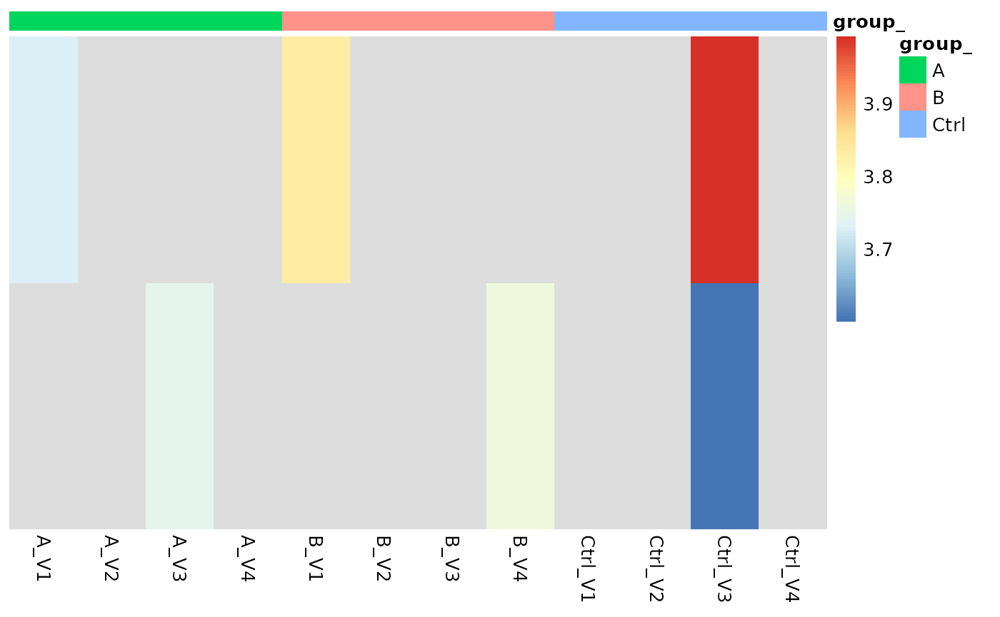

# Comparing Two Groups with prolfqua

## Purpose

This vignette demonstrates how two conditions, e.g., treatment
vs. control, can be compared and the differences statistically tested.
We will again use the Ionstar dataset as an example of an LFQ
experiment. This dataset was preprocessed with the MaxQuant software.
After first examining the data using QC plots and then normalizing the
data, we compare groups of replicates with the different dilutions. The
output of the comparison is the difference in the mean intensities for
quantified proteins (log2 fold-change) in each group, along with
statistical parameters such as degrees of freedom, standard errors,
p-value and the FDR.

## Loading protein abundances from MaxQuant proteinGroups.txt

``` r
library(prolfqua)
```

Specify the path to the MaxQuant `proteinGroups.txt` file. The function
`tidyMQ_ProteinGroups` will read the `proteinGroups.txt` file and
convert it into a tidy table

``` r
xx <- prolfqua::sim_lfq_data_protein_config(Nprot = 100)
xx
```

    ## $data
    ## # A tibble: 1,200 × 8
    ##    sample sampleName group_ isotopeLabel protein_Id abundance qValue nr_peptides
    ##    <chr>  <chr>      <chr>  <chr>        <chr>          <dbl>  <dbl>       <dbl>
    ##  1 A_V1   A_V1       A      light        0EfVhX~39…      20.4      0           2
    ##  2 A_V1   A_V1       A      light        0m5WN4~60…      16.4      0           7
    ##  3 A_V1   A_V1       A      light        0YSKpy~28…      18.2      0           2
    ##  4 A_V1   A_V1       A      light        3QLHfm~89…      23.0      0           1
    ##  5 A_V1   A_V1       A      light        3QYop0~75…      23.1      0           7
    ##  6 A_V1   A_V1       A      light        76k03k~70…      25.5      0           4
    ##  7 A_V1   A_V1       A      light        7cbcrd~73…      27.1      0           2
    ##  8 A_V1   A_V1       A      light        7QuTub~18…      18.4      0           4
    ##  9 A_V1   A_V1       A      light        7soopj~53…      19.5      0           2
    ## 10 A_V1   A_V1       A      light        7zeekV~71…      20.6      0           8
    ## # ℹ 1,190 more rows
    ## 
    ## $config
    ## <AnalysisConfiguration>
    ##   Public:
    ##     annotation_vars: function () 
    ##     bin_resp: 
    ##     clone: function (deep = FALSE) 
    ##     factor_depth: 1
    ##     factor_keys: function () 
    ##     factor_keys_depth: function () 
    ##     factors: list
    ##     file_name: sample
    ##     get_response: function () 
    ##     hierarchy: list
    ##     hierarchy_depth: 1
    ##     hierarchy_keys: function (rev = FALSE) 
    ##     hierarchy_keys_depth: function (names = TRUE) 
    ##     hierarchyKeys: function (rev = FALSE) 
    ##     hkeysDepth: function (names = TRUE) 
    ##     id_required: function () 
    ##     id_vars: function () 
    ##     ident_q_value: qValue
    ##     ident_score: 
    ##     initialize: function () 
    ##     is_response_transformed: FALSE
    ##     isotope_label: isotopeLabel
    ##     min_peptides_protein: 2
    ##     norm_value: NULL
    ##     nr_children: nr_peptides
    ##     opt_mz: 
    ##     opt_rt: 
    ##     opt_se: 
    ##     pop_response: function () 
    ##     sample_name: sampleName
    ##     sep: ~
    ##     set_response: function (colName) 
    ##     value_vars: function () 
    ##     work_intensity: abundance

Create the `LFQData` class instance and remove zeros from data (MaxQuant
encodes missing values with zero).

``` r
lfqdata <- prolfqua::LFQData$new(xx$data, xx$config)
lfqdata$remove_small_intensities()
lfqdata$factors()
```

    ## # A tibble: 12 × 3
    ##    sample  sampleName group_
    ##    <chr>   <chr>      <chr> 
    ##  1 A_V1    A_V1       A     
    ##  2 A_V2    A_V2       A     
    ##  3 A_V3    A_V3       A     
    ##  4 A_V4    A_V4       A     
    ##  5 B_V1    B_V1       B     
    ##  6 B_V2    B_V2       B     
    ##  7 B_V3    B_V3       B     
    ##  8 B_V4    B_V4       B     
    ##  9 Ctrl_V1 Ctrl_V1    Ctrl  
    ## 10 Ctrl_V2 Ctrl_V2    Ctrl  
    ## 11 Ctrl_V3 Ctrl_V3    Ctrl  
    ## 12 Ctrl_V4 Ctrl_V4    Ctrl

You can always convert the data into wide format.

``` r
lfqdata$to_wide()$data[1:3,1:7]
```

    ## # A tibble: 3 × 7
    ##   protein_Id  isotopeLabel  A_V1  A_V2  A_V3  A_V4  B_V1
    ##   <chr>       <chr>        <dbl> <dbl> <dbl> <dbl> <dbl>
    ## 1 0EfVhX~3967 light         20.4  23.8  22.3  21.5  19.1
    ## 2 0m5WN4~6025 light         16.4  NA    16.1  18.2  24.3
    ## 3 0YSKpy~2865 light         18.2  17.7  16.7  17.7  18.2

### Visualization of not normalized data

After this first setting up of the analysis we show now how to normalize
the proteins and the effect of normalization. Furthermore we use some
functions to visualize the missing values in our data.

``` r
lfqplotter <- lfqdata$get_Plotter()
density_nn <- lfqplotter$intensity_distribution_density()
```

#### Visualization of missing data

``` r
lfqplotter$NA_heatmap()
```


Heatmap where missing proteins (zero in case of MaxQuant reported
intensities), black - missing protein intensities, white - present

``` r
lfqdata$get_Summariser()$plot_missingness_per_group()
```


\# of proteins with 0,1,…N missing values

``` r
lfqplotter$missigness_histogram()
```


Intensity distribution of proteins depending on \# of missing values

#### Computing standard deviations, mean and CV.

Other important statistics such as coefficient of variation, means and
standard deviations can be easily calculated using the `get_Stats`
function and visualized with a violin plot.

``` r
stats <- lfqdata$get_Stats()
stats$violin()
```


Violin plots of CVs in the different groups and among all groups

``` r
prolfqua::table_facade( stats$stats_quantiles()$wide, paste0("quantile of ",stats$stat ))
```

| probs |        A |        B |     Ctrl |      All |
|------:|---------:|---------:|---------:|---------:|
|  0.10 | 2.014611 | 1.993591 | 1.762209 | 3.451035 |
|  0.25 | 2.711702 | 2.956419 | 2.882970 | 4.370724 |
|  0.50 | 3.655067 | 3.700140 | 4.261204 | 5.296948 |
|  0.75 | 5.338899 | 5.462486 | 5.904953 | 7.411380 |
|  0.90 | 7.541564 | 7.118907 | 7.471854 | 9.912513 |

quantile of CV

``` r
stats$density_median()
```


Distribution of CV’s for top 50% and bottom 50% proteins by intensity.

### Normalize protein intensities and show diagnostic plots

We normalize the data by $\log_{2}$ transforming and then $z - scaling$.

``` r
lt <- lfqdata$get_Transformer()
transformed <- lt$log2()$robscale()$lfq
transformed$config$is_response_transformed
```

    ## [1] TRUE

``` r
pl <- transformed$get_Plotter()
density_norm <- pl$intensity_distribution_density()
```

``` r
gridExtra::grid.arrange(density_nn, density_norm)
```


Distribution of intensities before and after normalization.

``` r
pl$pairs_smooth()
```


Scatterplot matrix

    ## NULL

``` r
p <- pl$heatmap_cor()
```

``` r
p
```


Heatmap, Rows - proteins, Columns - samples

## Fitting a linear model

For fitting linear models to the transformed intensities for all our
proteins we have to first specify the model function and define the
contrasts that we want to calculate.

``` r
transformed$factors()
```

    ## # A tibble: 12 × 3
    ##    sample  sampleName group_
    ##    <chr>   <chr>      <chr> 
    ##  1 A_V1    A_V1       A     
    ##  2 A_V2    A_V2       A     
    ##  3 A_V3    A_V3       A     
    ##  4 A_V4    A_V4       A     
    ##  5 B_V1    B_V1       B     
    ##  6 B_V2    B_V2       B     
    ##  7 B_V3    B_V3       B     
    ##  8 B_V4    B_V4       B     
    ##  9 Ctrl_V1 Ctrl_V1    Ctrl  
    ## 10 Ctrl_V2 Ctrl_V2    Ctrl  
    ## 11 Ctrl_V3 Ctrl_V3    Ctrl  
    ## 12 Ctrl_V4 Ctrl_V4    Ctrl

``` r
formula_Condition <-  strategy_lm("transformedIntensity ~ group_")

# specify model definition
modelName  <- "Model"
contr_spec <- c("AvsC" = "group_A - group_Ctrl",
"BvsC" = "group_B - group_Ctrl")
```

Here we have to build the model for each protein.

``` r
mod <- prolfqua::build_model(
  transformed$data,
  formula_Condition,
  subject_Id = transformed$config$hierarchy_keys() )
```

In this plot we can see what factors in our model are mostly responsible
for the adjusted p-values calculated from an analysis of variance.

``` r
mod$anova_histogram("FDR")
```

    ## $plot


Distribtuion of adjusted p-values (FDR)

    ## 
    ## $name
    ## [1] "Anova_p.values_Model.pdf"

One also look what proteins do show different abundances in any of our
five dilutions by looking at the FDR values of the analysis of variane.

``` r
aovtable <- mod$get_anova()
head(aovtable)
```

    ## # A tibble: 6 × 10
    ##   protein_Id  factor    Df  Sum.Sq  Mean.Sq F.value  p.value isSingular nr_coef
    ##   <chr>       <chr>  <int>   <dbl>    <dbl>   <dbl>    <dbl> <lgl>        <int>
    ## 1 0EfVhX~3967 group_     2 0.0626  0.0313     5.18  0.0416   FALSE            3
    ## 2 0m5WN4~6025 group_     2 0.324   0.162     29.4   0.000205 FALSE            3
    ## 3 0YSKpy~2865 group_     2 0.00753 0.00376    0.605 0.569    FALSE            3
    ## 4 3QLHfm~8938 group_     2 0.0637  0.0319    13.2   0.00213  FALSE            3
    ## 5 3QYop0~7543 group_     2 0.00121 0.000603   0.178 0.840    FALSE            3
    ## 6 76k03k~7094 group_     2 0.0264  0.0132     3.06  0.0968   FALSE            3
    ## # ℹ 1 more variable: FDR <dbl>

``` r
dim(aovtable)
```

    ## [1] 98 10

``` r
xx <- aovtable |> dplyr::filter(FDR < 0.2)
signif <- transformed$get_copy()
signif$data <- signif$data |> dplyr::filter(protein_Id %in% xx$protein_Id)
hmSig <- signif$get_Plotter()$heatmap()
```

``` r
hmSig
```


Heatmap for proteins with FDR \< 0.2 in the analysis of variance

## Compute contrasts

Next we do calculate the statistics for our defined contrasts for all
the proteins. For this we can use the `Contrasts` function.

``` r
contr <- prolfqua::Contrasts$new(mod, contr_spec)
v1 <- contr$get_Plotter()$volcano()
```

Alternatively, we can moderate the variance and using the Experimental
Bayes method implemented in `ContrastsModerated`.

``` r
contr <- prolfqua::ContrastsModerated$new(contr)
contrdf <- contr$get_contrasts()
```

In the next figure it can be seen WEWinputNEEDED.

``` r
plotter <- contr$get_Plotter()
v2 <- plotter$volcano()
gridExtra::grid.arrange(v1$FDR,v2$FDR, ncol = 1)
```


Volcano plot, Left panel - no moderation, Right panel - with moderation.

``` r
plotter$ma_plotly()
```

MA plot showing the dependency of mean abuncance with respect to the
difference

``` r
#myProteinIDS <- c("sp|Q12246|LCB4_YEAST",  "sp|P38929|ATC2_YEAST",  "sp|Q99207|NOP14_YEAST")
myProteinIDS <- c("sp|P0AC33|FUMA_ECOLI",  "sp|P28635|METQ_ECOLI",  "sp|Q14C86|GAPD1_HUMAN")
dplyr::filter(contrdf, protein_Id %in% myProteinIDS)
```

    ## # A tibble: 0 × 13
    ## # ℹ 13 variables: modelName <chr>, protein_Id <chr>, contrast <chr>,
    ## #   diff <dbl>, std.error <dbl>, avgAbd <dbl>, statistic <dbl>, df <dbl>,
    ## #   p.value <dbl>, conf.low <dbl>, conf.high <dbl>, sigma <dbl>, FDR <dbl>

## Contrasts with missing value imputation

Use this method if there proteins with no observations in one of the
groups. With the `ContrastsMissing` function, we can estimate difference
in mean for proteins that are not observed in one group or condition.
For this we are using the average expression at percentile 0.05 of the
group where the protein is not quantified.

``` r
mC <- prolfqua::ContrastsMissing$new(lfqdata = transformed, contrasts = contr_spec)
colnames(mC$get_contrasts())
```

    ##  [1] "modelName"                "protein_Id"              
    ##  [3] "meanAbundanceImp_group_1" "meanAbundanceImp_group_2"
    ##  [5] "diff"                     "group_1_name"            
    ##  [7] "group_2_name"             "contrast"                
    ##  [9] "avgAbd"                   "indic"                   
    ## [11] "nrMeasured_group_1"       "nrMeasured_group_2"      
    ## [13] "df"                       "sigma"                   
    ## [15] "std.error"                "statistic"               
    ## [17] "p.value"                  "conf.low"                
    ## [19] "conf.high"                "FDR"

Finally we are merging the results and give priority to the results
where we do not have missing values in one group.

``` r
merged <- prolfqua::merge_contrasts_results(prefer = contr,add = mC)$merged
plotter <- merged$get_Plotter()
tmp <- plotter$volcano()
tmp$FDR
```


Volcano plots for the two contrasts with missing value imputation from
the group_average model.

Look at proteins which could not be fitted using the linear model, if
any.

``` r
merged <- prolfqua::merge_contrasts_results(prefer = contr,add = mC)

moreProt <- transformed$get_copy()
moreProt$data <- moreProt$data |> dplyr::filter(protein_Id %in% merged$more$contrast_result$protein_Id)
moreProt$get_Plotter()$raster()
```



``` r
# here we do not get anything because there is nothing imputed!
```

## Gene Set Enrichment Analysis (GSEA)

After computing contrasts, proteins can be ranked by log2 fold change or
t-statistic and subjected to gene set enrichment analysis. The typical
workflow is:

1.  Extract UniProt IDs from the contrast results using
    [`prolfqua::get_UniprotID_from_fasta_header()`](https://wolski.github.io/prolfqua/reference/get_UniprotID_from_fasta_header.md)
2.  Map UniProt IDs to Entrez Gene IDs using `AnnotationDbi::mapIds()`
    with a species-specific annotation package
3.  Create a named ranked list (statistic values named by gene IDs)
4.  Run GSEA using `clusterProfiler::gseGO()` or
    `clusterProfiler::gseKEGG()`

For details see:

- [clusterProfiler
  book](https://yulab-smu.top/biomedical-knowledge-mining-book/) –
  comprehensive guide to enrichment analysis in R
- [clusterProfiler Bioconductor
  page](https://bioconductor.org/packages/clusterProfiler/)
- [AnnotationDbi](https://bioconductor.org/packages/AnnotationDbi/) –
  for mapping between gene identifier types

The `prolfqua` package is described in (Wolski et al. 2022).

## Session Info

``` r
sessionInfo()
```

    ## R version 4.5.2 (2025-10-31)
    ## Platform: x86_64-pc-linux-gnu
    ## Running under: Ubuntu 24.04.4 LTS
    ## 
    ## Matrix products: default
    ## BLAS:   /usr/lib/x86_64-linux-gnu/openblas-pthread/libblas.so.3 
    ## LAPACK: /usr/lib/x86_64-linux-gnu/openblas-pthread/libopenblasp-r0.3.26.so;  LAPACK version 3.12.0
    ## 
    ## locale:
    ##  [1] LC_CTYPE=C.UTF-8       LC_NUMERIC=C           LC_TIME=C.UTF-8       
    ##  [4] LC_COLLATE=C.UTF-8     LC_MONETARY=C.UTF-8    LC_MESSAGES=C.UTF-8   
    ##  [7] LC_PAPER=C.UTF-8       LC_NAME=C              LC_ADDRESS=C          
    ## [10] LC_TELEPHONE=C         LC_MEASUREMENT=C.UTF-8 LC_IDENTIFICATION=C   
    ## 
    ## time zone: UTC
    ## tzcode source: system (glibc)
    ## 
    ## attached base packages:
    ## [1] stats     graphics  grDevices utils     datasets  methods   base     
    ## 
    ## other attached packages:
    ## [1] prolfqua_1.6.1 dplyr_1.2.0   
    ## 
    ## loaded via a namespace (and not attached):
    ##   [1] tidyselect_1.2.1       viridisLite_0.4.3      farver_2.1.2          
    ##   [4] S7_0.2.1               fastmap_1.2.0          lazyeval_0.2.2        
    ##   [7] promises_1.5.0         digest_0.6.39          rpart_4.1.24          
    ##  [10] mime_0.13              lifecycle_1.0.5        survival_3.8-3        
    ##  [13] statmod_1.5.1          magrittr_2.0.4         compiler_4.5.2        
    ##  [16] progress_1.2.3         rlang_1.1.7            sass_0.4.10           
    ##  [19] tools_4.5.2            utf8_1.2.6             yaml_2.3.12           
    ##  [22] data.table_1.18.2.1    knitr_1.51             prettyunits_1.2.0     
    ##  [25] labeling_0.4.3         htmlwidgets_1.6.4      plyr_1.8.9            
    ##  [28] RColorBrewer_1.1-3     KernSmooth_2.23-26     withr_3.0.2           
    ##  [31] purrr_1.2.1            desc_1.4.3             nnet_7.3-20           
    ##  [34] grid_4.5.2             jomo_2.7-6             xtable_1.8-8          
    ##  [37] mice_3.19.0            ggplot2_4.0.2          scales_1.4.0          
    ##  [40] iterators_1.0.14       MASS_7.3-65            cli_3.6.5             
    ##  [43] crayon_1.5.3           UpSetR_1.4.0           rmarkdown_2.31        
    ##  [46] ragg_1.5.2             reformulas_0.4.4       generics_0.1.4        
    ##  [49] otel_0.2.0             httr_1.4.8             minqa_1.2.8           
    ##  [52] cachem_1.1.0           operator.tools_1.6.3.1 splines_4.5.2         
    ##  [55] vctrs_0.7.2            boot_1.3-32            glmnet_4.1-10         
    ##  [58] Matrix_1.7-4           jsonlite_2.0.0         hms_1.1.4             
    ##  [61] mitml_0.4-5            ggrepel_0.9.8          crosstalk_1.2.2       
    ##  [64] systemfonts_1.3.2      foreach_1.5.2          limma_3.66.0          
    ##  [67] plotly_4.12.0          tidyr_1.3.2            jquerylib_0.1.4       
    ##  [70] glue_1.8.0             pkgdown_2.2.0          nloptr_2.2.1          
    ##  [73] pan_1.9                codetools_0.2-20       stringi_1.8.7         
    ##  [76] shape_1.4.6.1          gtable_0.3.6           later_1.4.8           
    ##  [79] lme4_2.0-1             tibble_3.3.1           pillar_1.11.1         
    ##  [82] htmltools_0.5.9        R6_2.6.1               textshaping_1.0.5     
    ##  [85] Rdpack_2.6.6           formula.tools_1.7.1    shiny_1.13.0          
    ##  [88] evaluate_1.0.5         lattice_0.22-7         rbibutils_2.4.1       
    ##  [91] backports_1.5.0        pheatmap_1.0.13        broom_1.0.12          
    ##  [94] httpuv_1.6.17          bslib_0.10.0           Rcpp_1.1.1            
    ##  [97] gridExtra_2.3          nlme_3.1-168           mgcv_1.9-3            
    ## [100] logistf_1.26.1         xfun_0.57              fs_2.0.1              
    ## [103] forcats_1.0.1          pkgconfig_2.0.3

## References

Wolski, Witold E., Paolo Nanni, Jonas Grossmann, Maria d’Errico, Ralph
Schlapbach, and Christian Panse. 2022. “Prolfqua: A Comprehensive
R-package for Proteomics Differential Expression Analysis.” *bioRxiv*.
<https://doi.org/10.1101/2022.06.07.494524>.
