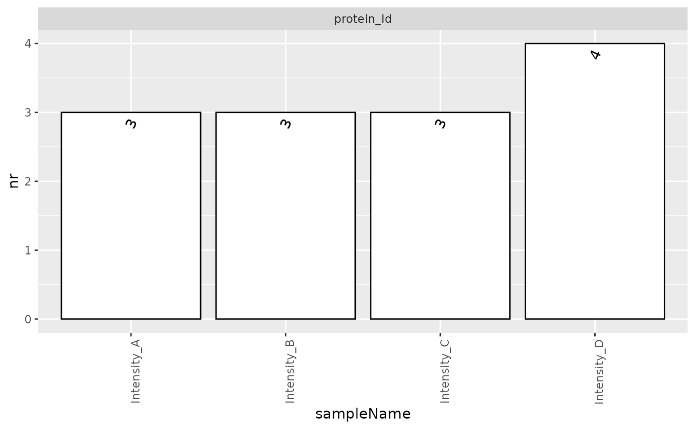

# Getting Started, Data Import, Creating prolfqua Configurations

## Creating a configuration for a file in wide data format

Frequently, the data are available in tables, where the rows represent
proteins, and the columns do represent samples. The example shows such a
table. The first column contains, the protein id, while the other
columns store the intensities for sample A, B, C.

``` r
df <- data.frame(protein_Id = c("tr|A|HUMAN","tr|B|HUMAN","tr|C|HUMAN","tr|D|HUMAN"),
                 Intensity_A = c(100,10000,10,NA),
                 Intensity_B = c(NA, 9000, 20, 100),
                 Intensity_C = c(200,8000,NA,150),
                 Intensity_D = c(130,11000, 50, 50))
df
```

    ##   protein_Id Intensity_A Intensity_B Intensity_C Intensity_D
    ## 1 tr|A|HUMAN         100          NA         200         130
    ## 2 tr|B|HUMAN       10000        9000        8000       11000
    ## 3 tr|C|HUMAN          10          20          NA          50
    ## 4 tr|D|HUMAN          NA         100         150          50

This table can be converted into a table in the long format using:

``` r
table_long <- tidyr::pivot_longer(df, starts_with("Intensity_"),names_to = "Sample", values_to = "Intensity")
table_long
```

    ## # A tibble: 16 × 3
    ##    protein_Id Sample      Intensity
    ##    <chr>      <chr>           <dbl>
    ##  1 tr|A|HUMAN Intensity_A       100
    ##  2 tr|A|HUMAN Intensity_B        NA
    ##  3 tr|A|HUMAN Intensity_C       200
    ##  4 tr|A|HUMAN Intensity_D       130
    ##  5 tr|B|HUMAN Intensity_A     10000
    ##  6 tr|B|HUMAN Intensity_B      9000
    ##  7 tr|B|HUMAN Intensity_C      8000
    ##  8 tr|B|HUMAN Intensity_D     11000
    ##  9 tr|C|HUMAN Intensity_A        10
    ## 10 tr|C|HUMAN Intensity_B        20
    ## 11 tr|C|HUMAN Intensity_C        NA
    ## 12 tr|C|HUMAN Intensity_D        50
    ## 13 tr|D|HUMAN Intensity_A        NA
    ## 14 tr|D|HUMAN Intensity_B       100
    ## 15 tr|D|HUMAN Intensity_C       150
    ## 16 tr|D|HUMAN Intensity_D        50

In addition you will need a table with the Sample annotations. In this
example with have two groups A, B.

``` r
annot <- data.frame(Sample = c("Intensity_A", "Intensity_B", "Intensity_C", "Intensity_D"), Group = c("A","A","B","C"))
```

Now you can annotate the samples in the table with the Intensities.

``` r
table_long <- dplyr::inner_join(annot, table_long)
```

We create a `AnalysisConfiguration` and start annotating the data frame,
that is specifying which column contains wich type of information.

``` r
atable <- prolfqua::AnalysisConfiguration$new()
atable$fileName = "Sample"
atable$workIntensity = "Intensity"
```

The columns identifying the measured features, which are proteins,
peptides or precursors, are described using the named list `hierarchy`.
The values of the list are the column names, while the names are
arbitrary as long as they are valid R column names. Here we use the same
names as the column names.

The list `factors`, is used to point to the columns containing the
factors of your analysis (Group).

``` r
atable$hierarchy[["protein_Id"]]    <-  "protein_Id"
atable$factors[["Group"]] <- "Group"
```

``` r
config <- prolfqua::AnalysisConfiguration$new(atable)
analysis_data <- prolfqua::setup_analysis(table_long, config)
lfqdata <- prolfqua::LFQData$new(analysis_data, config)
```

``` r
lfqdata$hierarchy_counts()
```

    ## # A tibble: 1 × 2
    ##   isotopeLabel protein_Id
    ##   <chr>             <int>
    ## 1 light                 4

``` r
smrz <- lfqdata$get_Summariser()
smrz$plot_hierarchy_counts_sample()
```



## Creating a configuration for a file in long data format.

Given for example a Peptide Quantification Report generated by
Spectronaut (a table in long format), we demonstrate how to create a
configuration that is required to use it with prolfqua. To do this, an
`AnalysisConfiguration` has to be configured and some fields (fileName,
hierarchy, factors, workingIntensity) need to defined. The configuration
object describes the columns in the long table so that prolfqua
functions know which columns to use.

``` r
dataLongFormat <- prolfqua::sim_lfq_data(Nprot = 20, PEPTIDE = TRUE)
head(dataLongFormat)
```

    ## # A tibble: 6 × 12
    ##   proteinID idtype2 average_prot_abundance    sd peptideID sample  group  mean
    ##   <chr>     <chr>                    <dbl> <dbl> <chr>     <chr>   <chr> <dbl>
    ## 1 5pb90S    1460                      20.5     1 mpxNAbn2  Ctrl_V1 Ctrl      0
    ## 2 5pb90S    1460                      20.5     1 mpxNAbn2  Ctrl_V2 Ctrl      0
    ## 3 5pb90S    1460                      20.5     1 mpxNAbn2  Ctrl_V3 Ctrl      0
    ## 4 5pb90S    1460                      20.5     1 mpxNAbn2  Ctrl_V4 Ctrl      0
    ## 5 5pb90S    1460                      22.5     1 mpxNAbn2  A_V1    A        -2
    ## 6 5pb90S    1460                      22.5     1 mpxNAbn2  A_V2    A        -2
    ## # ℹ 4 more variables: N <dbl>, avg_peptide_abd <dbl>, Replicate <chr>,
    ## #   abundance <dbl>

We create a Table annotation object and start annotating the data we
read. Since in this example we eventually want to do more filtering on
data quality we will also define the ident_qValue in this
`AnalysisConfiguration`.

``` r
atable <- prolfqua::AnalysisConfiguration$new()
atable$fileName = "sample"
atable$workIntensity = "abundance"
```

The columns identifying the measured features, which are proteins,
peptides or precursors, are described using the named list `hierarchy`.
The values of the list are the column names, while the names are
arbitrary as long as they are valid R column names. Here we use the same
names as the column names.

The list factors, is used to point to the columns containing the factors
of your analysis (group). Here, we rename the column “R.Condition” to
“Marker”. In figures and legends generated by prolfqua the name “Marker”
will then be used and not “R.Condition”. The data.frame can also contain
more than one factor.

``` r
atable$hierarchy[["proteinID"]]    <-  "proteinID"
atable$hierarchy[["peptideID"]]    <-  "peptideID"
atable$factors[["group"]] <- "group"
```

Lastly, we create an Analysis parameter object, and the Analysis
Configuration. The function `setup_analysis`, creates from data frame in
long format a data.frame compatible with your configuration. We can now
run most of the function in the package using the data and
configuration.

``` r
config <- prolfqua::AnalysisConfiguration$new(atable)
analysis_data <- prolfqua::setup_analysis(dataLongFormat, config)

prolfqua::summarize_hierarchy(analysis_data, config)
```

    ## # A tibble: 20 × 3
    ##    proteinID isotopeLabel_n peptideID_n
    ##    <chr>              <int>       <int>
    ##  1 1DIdTQ                 1           6
    ##  2 1SO1NY                 1           2
    ##  3 2JOCP3                 1           6
    ##  4 5pb90S                 1           2
    ##  5 OyHgjC                 1           2
    ##  6 PDPfVe                 1           2
    ##  7 TvODf3                 1           2
    ##  8 UHjlsA                 1           2
    ##  9 UmCi4L                 1           1
    ## 10 Vphs0t                 1           6
    ## 11 Xp1Tno                 1           1
    ## 12 de5llz                 1           2
    ## 13 hwBDgU                 1           2
    ## 14 pGZKaB                 1           1
    ## 15 rNWbGH                 1           1
    ## 16 wXXHRN                 1           6
    ## 17 yOSJAW                 1           6
    ## 18 yj3Whg                 1          10
    ## 19 z9WqiE                 1           2
    ## 20 zVMmad                 1           2

Now the analysis_data object is ready to generate the `LFQData` class
instance. This object is the start for further analysis.

``` r
lfqdata <- prolfqua::LFQData$new(analysis_data, config)
```

With this, it is possible for example to use the `get_Summariser`
function to visualize and summarise the data efficiently.

``` r
smrz <- lfqdata$get_Summariser()
smrz$plot_hierarchy_counts_sample()
```


Shown are how many precursors or proteins are found in each sample

The `prolfqua` package is described in (Wolski et al. 2022).

## Session Info

``` r
sessionInfo()
```

    ## R version 4.5.2 (2025-10-31)
    ## Platform: x86_64-pc-linux-gnu
    ## Running under: Ubuntu 24.04.3 LTS
    ## 
    ## Matrix products: default
    ## BLAS:   /usr/lib/x86_64-linux-gnu/openblas-pthread/libblas.so.3 
    ## LAPACK: /usr/lib/x86_64-linux-gnu/openblas-pthread/libopenblasp-r0.3.26.so;  LAPACK version 3.12.0
    ## 
    ## locale:
    ##  [1] LC_CTYPE=C.UTF-8       LC_NUMERIC=C           LC_TIME=C.UTF-8       
    ##  [4] LC_COLLATE=C.UTF-8     LC_MONETARY=C.UTF-8    LC_MESSAGES=C.UTF-8   
    ##  [7] LC_PAPER=C.UTF-8       LC_NAME=C              LC_ADDRESS=C          
    ## [10] LC_TELEPHONE=C         LC_MEASUREMENT=C.UTF-8 LC_IDENTIFICATION=C   
    ## 
    ## time zone: UTC
    ## tzcode source: system (glibc)
    ## 
    ## attached base packages:
    ## [1] stats     graphics  grDevices utils     datasets  methods   base     
    ## 
    ## loaded via a namespace (and not attached):
    ##  [1] plotly_4.12.0       sass_0.4.10         utf8_1.2.6         
    ##  [4] generics_0.1.4      tidyr_1.3.2         stringi_1.8.7      
    ##  [7] digest_0.6.39       magrittr_2.0.4      evaluate_1.0.5     
    ## [10] grid_4.5.2          RColorBrewer_1.1-3  fastmap_1.2.0      
    ## [13] plyr_1.8.9          jsonlite_2.0.0      ggrepel_0.9.7      
    ## [16] limma_3.66.0        prolfqua_1.5.0      gridExtra_2.3      
    ## [19] httr_1.4.8          purrr_1.2.1         viridisLite_0.4.3  
    ## [22] scales_1.4.0        UpSetR_1.4.0        lazyeval_0.2.2     
    ## [25] textshaping_1.0.4   jquerylib_0.1.4     cli_3.6.5          
    ## [28] rlang_1.1.7         withr_3.0.2         cachem_1.1.0       
    ## [31] yaml_2.3.12         otel_0.2.0          tools_4.5.2        
    ## [34] dplyr_1.2.0         ggplot2_4.0.2       forcats_1.0.1      
    ## [37] vctrs_0.7.1         R6_2.6.1            lifecycle_1.0.5    
    ## [40] fs_1.6.6            htmlwidgets_1.6.4   MASS_7.3-65        
    ## [43] ragg_1.5.0          pkgconfig_2.0.3     desc_1.4.3         
    ## [46] pkgdown_2.2.0       pillar_1.11.1       bslib_0.10.0       
    ## [49] gtable_0.3.6        data.table_1.18.2.1 glue_1.8.0         
    ## [52] Rcpp_1.1.1          statmod_1.5.1       systemfonts_1.3.1  
    ## [55] xfun_0.56           tibble_3.3.1        tidyselect_1.2.1   
    ## [58] knitr_1.51          farver_2.1.2        htmltools_0.5.9    
    ## [61] labeling_0.4.3      rmarkdown_2.30      pheatmap_1.0.13    
    ## [64] compiler_4.5.2      S7_0.2.1

## References

Wolski, Witold E., Paolo Nanni, Jonas Grossmann, Maria d’Errico, Ralph
Schlapbach, and Christian Panse. 2022. “Prolfqua: A Comprehensive
R-package for Proteomics Differential Expression Analysis.” *bioRxiv*.
<https://doi.org/10.1101/2022.06.07.494524>.
