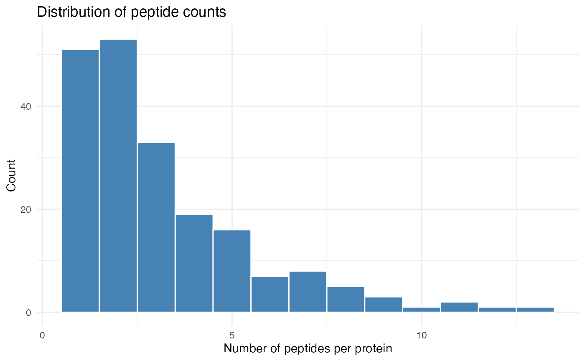
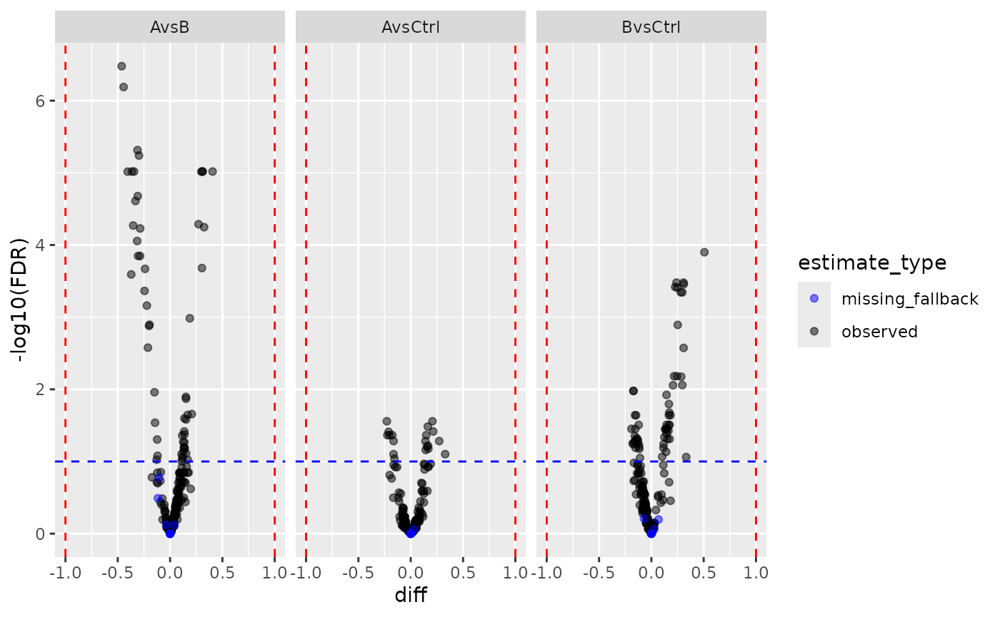

# DEqMS-style Count-Dependent Variance Moderation

## Purpose

This vignette demonstrates `ContrastsModeratedDEqMS`, a count-dependent
variance shrinkage method inspired by the DEqMS approach (Zhu et al.,
2020). It is a drop-in alternative to `ContrastsModerated`:

- **`ContrastsModerated`** (standard): applies a **single global prior
  variance** to all proteins — every protein is shrunk toward the same
  value.
- **`ContrastsModeratedDEqMS`** (count-dependent): the prior variance
  **depends on the number of peptides/PSMs** used to quantify each
  protein. Proteins quantified from many peptides get less shrinkage
  (their variance is already well estimated); proteins from few peptides
  get more.

This matters in proteomics because quantification depth varies hugely
across proteins. A protein quantified from 20 peptides has a much
better-estimated variance than one from 2 peptides, and they should not
receive the same prior.

The user-facing API is identical to `ContrastsModerated`: same
downstream methods (`get_contrasts`, `get_Plotter`, `to_wide`,
`merge_contrasts_results`).

## How it works

1.  **Fit LOESS**: `log(sigma^2) ~ log2(peptide_count)` — captures the
    count-dependent variance trend.
2.  **Estimate prior df (d0)**: from the residual variance around the
    LOESS curve, using the `trigammaInverse` approach (same math as
    limma/squeezeVarRob).
3.  **Count-specific prior variance**: `s0^2(count)` varies per protein,
    derived from the fitted LOESS curve.
4.  **Posterior variance**: Bayesian shrinkage combining observed and
    prior: `var.post = (d0 * s0^2(count) + df * sigma^2) / (d0 + df)`
5.  **Moderated t-statistics and p-values** are recomputed with the
    posterior variance.

## Data preparation

We use simulated protein-level data. The simulation includes a
`nr_peptides` column — the number of peptides per protein — which is
exactly the count we need.

``` r
library(prolfqua)
library(dplyr)
library(ggplot2)

istar <- sim_lfq_data_protein_config(Nprot = 200, weight_missing = 0.3)
lfqdata <- LFQData$new(istar$data, istar$config)
lfqdata$remove_small_intensities()

lt <- lfqdata$get_Transformer()
transformed <- lt$log2()$robscale()$lfq
transformed$rename_response("transformedIntensity")
```

## Define contrasts

``` r
contr_spec <- c(
  "AvsCtrl" = "group_A - group_Ctrl",
  "BvsCtrl" = "group_B - group_Ctrl",
  "AvsB"    = "group_A - group_B"
)
```

## Inspect peptide counts

At the low-level `ContrastsModeratedDEqMS` API we still provide an
explicit count table. The count column can be derived directly from the
`LFQData` object via `config$nr_children`. In this simulated data set
the count variable is `nr_peptides`.

``` r
count_per_prot <- transformed$data_long() |>
  group_by(protein_Id) |>
  summarise(nr_peptides = max(.data[[transformed$nr_children_col()]], na.rm = TRUE))

ggplot(count_per_prot, aes(x = nr_peptides)) +
  geom_histogram(binwidth = 1, fill = "steelblue", color = "white") +
  labs(x = "Number of peptides per protein", y = "Count",
       title = "Distribution of peptide counts") +
  theme_minimal()
```



## Standard moderation pipeline

``` r
mod_lm <- build_model(transformed, strategy_lm("transformedIntensity ~ group_"))
contr_lm <- prolfqua::Contrasts$new(mod_lm, contr_spec)
contr_moderated <- prolfqua::ContrastsModerated$new(contr_lm)
res_moderated <- contr_moderated$get_contrasts()
```

## DEqMS moderation pipeline

The only difference: wrap with `ContrastsModeratedDEqMS` instead of
`ContrastsModerated`, and provide the protein-level peptide counts. If
you use the higher-level
`build_contrast_analysis(..., method = "deqms")` facade, that count
extraction is done for you from the `LFQData` object.

``` r
contr_deqms <- ContrastsModeratedDEqMS$new(contr_lm, count_per_prot, "nr_peptides")
res_deqms <- contr_deqms$get_contrasts()
```

## Diagnostic: variance vs. peptide count

This is the core diagnostic plot for the DEqMS approach. We expect
`log(sigma^2)` to decrease with increasing peptide count, and the LOESS
curve captures this trend.

``` r
# Get the unmoderated results with sigma and count
contr_raw <- contr_lm$get_contrasts()
contr_raw <- inner_join(
  contr_raw,
  count_per_prot,
  by = "protein_Id"
)

# Plot for one contrast
one_contrast <- contr_raw |> filter(contrast == levels(factor(contrast))[1])

ggplot(one_contrast, aes(x = log2(nr_peptides), y = log(sigma^2))) +
  geom_point(alpha = 0.4, size = 2) +
  geom_smooth(method = "loess", span = 0.75, color = "steelblue", se = TRUE) +
  labs(x = "log2(peptide count)",
       y = "log(residual variance)",
       title = paste("Variance vs. peptide count —", one_contrast$contrast[1])) +
  theme_minimal()
```


Residual variance decreases with peptide count. The LOESS curve (blue)
defines the count-specific prior variance.

## Comparing results

### Fold changes are identical

Both decorators wrap the same underlying `Contrasts` object, so fold
changes are identical.

``` r
merged <- inner_join(
  select(res_deqms, protein_Id, contrast, diff_deqms = diff),
  select(res_moderated, protein_Id, contrast, diff_moderated = diff),
  by = c("protein_Id", "contrast")
)

cor(merged$diff_deqms, merged$diff_moderated, use = "complete.obs")
```

    ## [1] 1

### P-values differ (count-dependent shrinkage)

The DEqMS approach produces different p-values because the prior
variance is protein-specific rather than global.

``` r
merged_p <- inner_join(
  select(res_deqms, protein_Id, contrast, p_deqms = p.value),
  select(res_moderated, protein_Id, contrast, p_moderated = p.value),
  by = c("protein_Id", "contrast")
)

cor(-log10(merged_p$p_deqms), -log10(merged_p$p_moderated), use = "complete.obs")
```

    ## [1] 0.9964816

``` r
ggplot(merged_p, aes(x = -log10(p_moderated), y = -log10(p_deqms))) +
  geom_point(alpha = 0.3, size = 1.5) +
  geom_abline(slope = 1, intercept = 0, color = "red", linetype = "dashed") +
  labs(x = "-log10(p) standard moderated",
       y = "-log10(p) DEqMS moderated") +
  theme_minimal()
```


P-values: DEqMS vs. standard moderated. Highly correlated but not
identical — DEqMS adjusts for peptide count.

## Volcano plots

``` r
pl_moderated <- contr_moderated$get_Plotter()
pl_deqms <- contr_deqms$get_Plotter()

gridExtra::grid.arrange(
  pl_moderated$volcano()$FDR + ggtitle("Standard moderated"),
  pl_deqms$volcano()$FDR + ggtitle("DEqMS moderated"),
  ncol = 1
)
```


Volcano plots from both moderation approaches.

## Merging with missing value imputation

`ContrastsModeratedDEqMS` works seamlessly with `ContrastsMissing` and
`merge_contrasts_results`.

``` r
mC <- ContrastsMissing$new(lfqdata = transformed, contrasts = contr_spec)
merged_result <- merge_contrasts_results(prefer = contr_deqms, add = mC)

plotter <- merged_result$merged$get_Plotter()
plotter$volcano()$FDR
```



## Wide format export

``` r
wide <- contr_deqms$to_wide()
head(wide)
```

    ## # A tibble: 6 × 13
    ##   protein_Id diff.AvsCtrl diff.BvsCtrl diff.AvsB p.value.AvsCtrl p.value.BvsCtrl
    ##   <chr>             <dbl>        <dbl>     <dbl>           <dbl>           <dbl>
    ## 1 0EfVhX~76…      0.143      -0.128       0.272         0.00575          0.0117 
    ## 2 0lCgkE~28…     -0.0330     -0.000541   -0.0325        0.506            0.991  
    ## 3 0m5WN4~11…      0.163       0.145       0.0182        0.000510         0.00111
    ## 4 0vgFfT~54…      0.0782     -0.0569      0.135         0.202            0.390  
    ## 5 0YSKpy~75…     -0.00621    -0.0244      0.0182        0.896            0.604  
    ## 6 0ZHbvZ~41…      0.0471     -0.0402      0.0873        0.283            0.344  
    ## # ℹ 7 more variables: p.value.AvsB <dbl>, FDR.AvsCtrl <dbl>, FDR.BvsCtrl <dbl>,
    ## #   FDR.AvsB <dbl>, statistic.AvsCtrl <dbl>, statistic.BvsCtrl <dbl>,
    ## #   statistic.AvsB <dbl>

## Inspecting all columns

Use `all = TRUE` to see both the original and moderated columns side by
side.

``` r
res_all <- contr_deqms$get_contrasts(all = TRUE)
res_all |>
  select(protein_Id, contrast, sigma, diff, statistic,
         moderated.var.prior, moderated.df.prior,
         moderated.var.post, moderated.statistic, moderated.p.value) |>
  head(10)
```

    ## # A tibble: 10 × 10
    ##    protein_Id  contrast  sigma      diff statistic moderated.var.prior
    ##    <chr>       <chr>     <dbl>     <dbl>     <dbl>               <dbl>
    ##  1 0EfVhX~7697 AvsCtrl  0.0659  0.143      3.07                0.00468
    ##  2 0lCgkE~2864 AvsCtrl  0.0531 -0.0330    -0.814               0.00459
    ##  3 0m5WN4~1168 AvsCtrl  0.0367  0.163      6.27                0.00444
    ##  4 0vgFfT~5498 AvsCtrl  0.0860  0.0782     1.29                0.00704
    ##  5 0YSKpy~7538 AvsCtrl  0.0632 -0.00621   -0.139               0.00468
    ##  6 0ZHbvZ~4125 AvsCtrl  0.0490  0.0471     1.36                0.00433
    ##  7 1HZ2jt~5236 AvsCtrl  0.0871  0.000509   0.00827             0.00474
    ##  8 3QYop0~6494 AvsCtrl  0.0477  0.0796     2.04                0.00498
    ##  9 3Zhyy7~9324 AvsCtrl  0.0604 -0.0167    -0.338               0.00485
    ## 10 4E74Ry~7621 AvsCtrl  0.0515  0.0240     0.659               0.00446
    ## # ℹ 4 more variables: moderated.df.prior <dbl>, moderated.var.post <dbl>,
    ## #   moderated.statistic <dbl>, moderated.p.value <dbl>

Note that `moderated.var.prior` varies per protein (count-dependent),
unlike in `ContrastsModerated` where it is constant.

## Session Info

``` r
sessionInfo()
```

    ## R version 4.5.2 (2025-10-31)
    ## Platform: x86_64-pc-linux-gnu
    ## Running under: Ubuntu 24.04.4 LTS
    ## 
    ## Matrix products: default
    ## BLAS:   /usr/lib/x86_64-linux-gnu/openblas-pthread/libblas.so.3 
    ## LAPACK: /usr/lib/x86_64-linux-gnu/openblas-pthread/libopenblasp-r0.3.26.so;  LAPACK version 3.12.0
    ## 
    ## locale:
    ##  [1] LC_CTYPE=C.UTF-8       LC_NUMERIC=C           LC_TIME=C.UTF-8       
    ##  [4] LC_COLLATE=C.UTF-8     LC_MONETARY=C.UTF-8    LC_MESSAGES=C.UTF-8   
    ##  [7] LC_PAPER=C.UTF-8       LC_NAME=C              LC_ADDRESS=C          
    ## [10] LC_TELEPHONE=C         LC_MEASUREMENT=C.UTF-8 LC_IDENTIFICATION=C   
    ## 
    ## time zone: UTC
    ## tzcode source: system (glibc)
    ## 
    ## attached base packages:
    ## [1] stats     graphics  grDevices utils     datasets  methods   base     
    ## 
    ## other attached packages:
    ## [1] ggplot2_4.0.2  dplyr_1.2.1    prolfqua_1.6.1
    ## 
    ## loaded via a namespace (and not attached):
    ##  [1] tidyselect_1.2.1       viridisLite_0.4.3      farver_2.1.2          
    ##  [4] S7_0.2.1-1             fastmap_1.2.0          lazyeval_0.2.3        
    ##  [7] digest_0.6.39          rpart_4.1.24           lifecycle_1.0.5       
    ## [10] survival_3.8-3         statmod_1.5.1          magrittr_2.0.5        
    ## [13] compiler_4.5.2         progress_1.2.3         rlang_1.2.0           
    ## [16] sass_0.4.10            tools_4.5.2            utf8_1.2.6            
    ## [19] yaml_2.3.12            data.table_1.18.2.1    knitr_1.51            
    ## [22] prettyunits_1.2.0      labeling_0.4.3         htmlwidgets_1.6.4     
    ## [25] plyr_1.8.9             RColorBrewer_1.1-3     withr_3.0.2           
    ## [28] purrr_1.2.2            desc_1.4.3             nnet_7.3-20           
    ## [31] grid_4.5.2             jomo_2.7-6             mice_3.19.0           
    ## [34] scales_1.4.0           iterators_1.0.14       MASS_7.3-65           
    ## [37] cli_3.6.6              crayon_1.5.3           UpSetR_1.4.0          
    ## [40] rmarkdown_2.31         ragg_1.5.2             reformulas_0.4.4      
    ## [43] generics_0.1.4         otel_0.2.0             httr_1.4.8            
    ## [46] minqa_1.2.8            cachem_1.1.0           operator.tools_1.6.3.1
    ## [49] splines_4.5.2          vctrs_0.7.3            boot_1.3-32           
    ## [52] glmnet_4.1-10          Matrix_1.7-4           jsonlite_2.0.0        
    ## [55] hms_1.1.4              mitml_0.4-5            ggrepel_0.9.8         
    ## [58] systemfonts_1.3.2      foreach_1.5.2          limma_3.66.0          
    ## [61] plotly_4.12.0          tidyr_1.3.2            jquerylib_0.1.4       
    ## [64] glue_1.8.1             pkgdown_2.2.0          nloptr_2.2.1          
    ## [67] pan_1.9                codetools_0.2-20       stringi_1.8.7         
    ## [70] shape_1.4.6.1          gtable_0.3.6           lme4_2.0-1            
    ## [73] tibble_3.3.1           pillar_1.11.1          htmltools_0.5.9       
    ## [76] R6_2.6.1               textshaping_1.0.5      Rdpack_2.6.6          
    ## [79] formula.tools_1.7.1    evaluate_1.0.5         lattice_0.22-7        
    ## [82] rbibutils_2.4.1        backports_1.5.1        pheatmap_1.0.13       
    ## [85] broom_1.0.12           bslib_0.10.0           Rcpp_1.1.1-1          
    ## [88] gridExtra_2.3          nlme_3.1-168           mgcv_1.9-3            
    ## [91] logistf_1.26.1         xfun_0.57              fs_2.0.1              
    ## [94] forcats_1.0.1          pkgconfig_2.0.3
