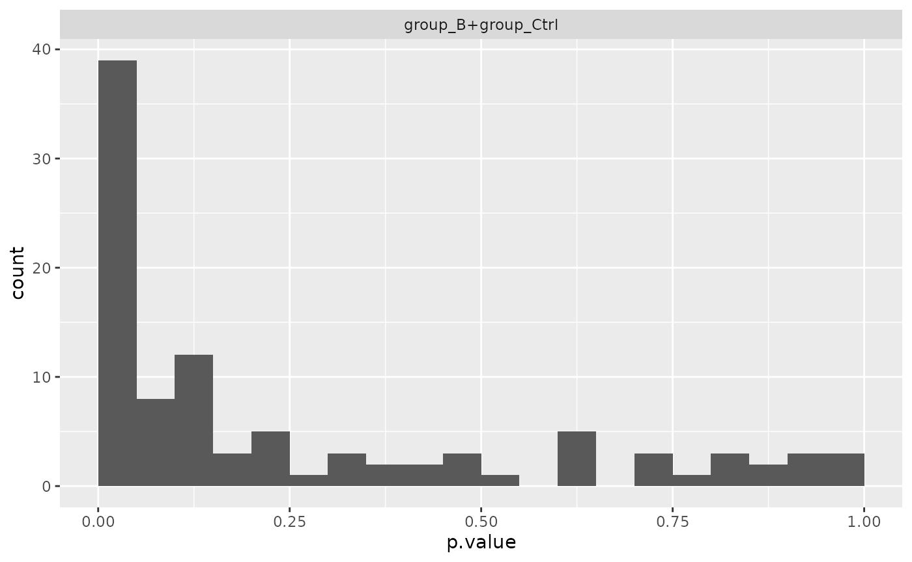
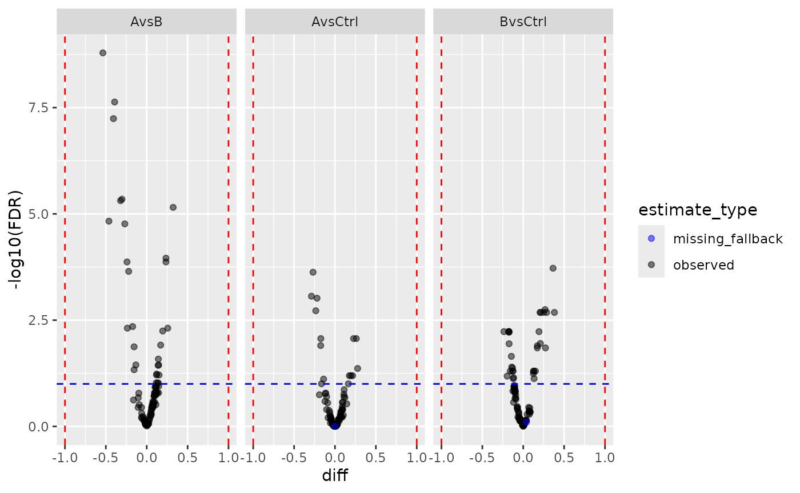
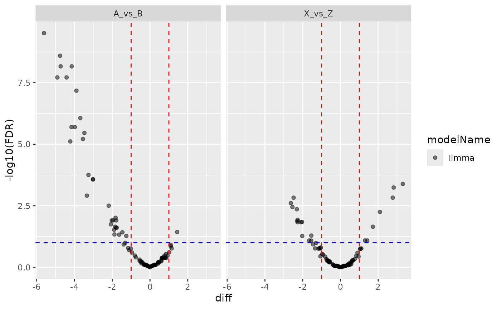
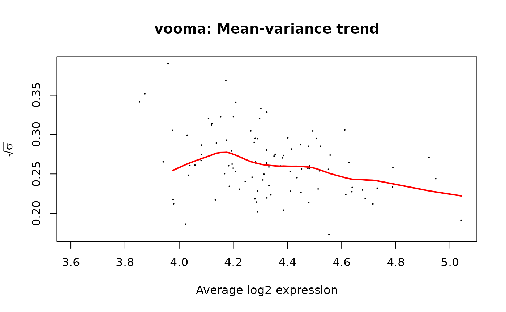
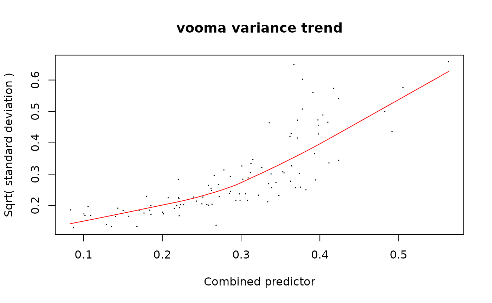
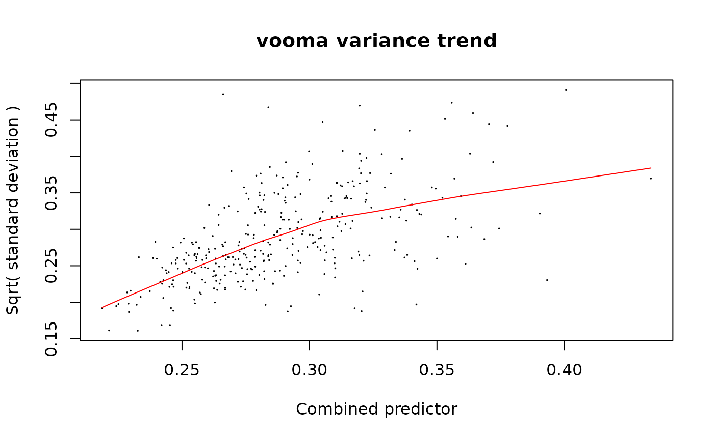

# Limma Backend for prolfqua

## Purpose

This vignette demonstrates the **limma backend** for prolfqua’s
modelling pipeline. The limma backend is a drop-in alternative to the
per-protein `lm` + `squeezeVar` pipeline. Both approaches fit linear
models and perform empirical Bayes variance shrinkage, but:

- **prolfqua default** (`strategy_lm` + `Contrasts` +
  `ContrastsModerated`): fits one
  [`lm()`](https://rdrr.io/r/stats/lm.html) per protein, then applies
  empirical Bayes moderation via
  [`limma::squeezeVar()`](https://rdrr.io/pkg/limma/man/squeezeVar.html).
- **limma backend** (`strategy_limma` + `ContrastsLimma`): uses limma’s
  matrix-based `lmFit` + `contrasts.fit` + `eBayes` pipeline directly.

The user-facing API is identical: same formula specification, same
contrast specification, same downstream methods (`get_contrasts`,
`get_Plotter`, `to_wide`, `merge_contrasts_results`).

## Data preparation

We use simulated protein-level data with 3 groups (A, B, Ctrl) and some
missing values.

``` r
library(prolfqua)
library(dplyr)

istar <- sim_lfq_data_protein_config(Nprot = 100, weight_missing = 0.3)
lfqdata <- LFQData$new(istar$data, istar$config)
lfqdata$remove_small_intensities()

lt <- lfqdata$get_Transformer()
transformed <- lt$log2()$robscale()$lfq
transformed$rename_response("transformedIntensity")
transformed$factors()
```

    ## # A tibble: 12 × 3
    ##    sample  sampleName group_
    ##    <chr>   <chr>      <chr> 
    ##  1 A_V1    A_V1       A     
    ##  2 A_V2    A_V2       A     
    ##  3 A_V3    A_V3       A     
    ##  4 A_V4    A_V4       A     
    ##  5 B_V1    B_V1       B     
    ##  6 B_V2    B_V2       B     
    ##  7 B_V3    B_V3       B     
    ##  8 B_V4    B_V4       B     
    ##  9 Ctrl_V1 Ctrl_V1    Ctrl  
    ## 10 Ctrl_V2 Ctrl_V2    Ctrl  
    ## 11 Ctrl_V3 Ctrl_V3    Ctrl  
    ## 12 Ctrl_V4 Ctrl_V4    Ctrl

## Define contrasts

The same contrast specification is used for both backends.

``` r
contr_spec <- c(
  "AvsCtrl" = "group_A - group_Ctrl",
  "BvsCtrl" = "group_B - group_Ctrl",
  "AvsB"    = "group_A - group_B"
)
```

## prolfqua default pipeline

``` r
mod_lm <- build_model(transformed, strategy_lm("transformedIntensity ~ group_"))
contr_lm <- prolfqua::Contrasts$new(mod_lm, contr_spec)
contr_moderated <- ContrastsModerated$new(contr_lm)
res_moderated <- contr_moderated$get_contrasts()
```

## Limma backend pipeline

The only difference is using `strategy_limma` + `build_model_limma` +
`ContrastsLimma`.

``` r
strat_limma <- strategy_limma("transformedIntensity ~ group_")
mod_limma <- build_model_limma(transformed, strat_limma)
contr_limma <- ContrastsLimma$new(mod_limma, contr_spec)
res_limma <- contr_limma$get_contrasts()
```

### Model-level inspection

The `ModelLimma` object supports the same inspection methods as `Model`.

``` r
mod_limma$get_anova() |> head()
```

    ## # A tibble: 6 × 5
    ##   protein_Id  F.value       p.value factor                     FDR
    ##   <chr>         <dbl>         <dbl> <chr>                    <dbl>
    ## 1 0EfVhX~3967  6.37   0.00377       group_B+group_Ctrl 0.0133     
    ## 2 0m5WN4~6025 28.8    0.00000000998 group_B+group_Ctrl 0.000000329
    ## 3 0YSKpy~2865  1.24   0.298         group_B+group_Ctrl 0.434      
    ## 4 3QLHfm~8938  7.57   0.00146       group_B+group_Ctrl 0.00805    
    ## 5 3QYop0~7543  0.0688 0.934         group_B+group_Ctrl 0.963      
    ## 6 76k03k~7094  3.12   0.0539        group_B+group_Ctrl 0.133

``` r
mod_limma$get_coefficients() |> head()
```

    ## # A tibble: 6 × 6
    ##   protein_Id  factor      Estimate Std..Error t.value Pr...t..
    ##   <chr>       <chr>          <dbl>      <dbl>   <dbl>    <dbl>
    ## 1 0EfVhX~3967 (Intercept)     4.47     0.0359    124. 6.83e-57
    ## 2 0m5WN4~6025 (Intercept)     4.10     0.0407    101. 6.81e-54
    ## 3 0YSKpy~2865 (Intercept)     4.16     0.0368    113. 4.05e-56
    ## 4 3QLHfm~8938 (Intercept)     4.55     0.0340    134. 2.07e-60
    ## 5 3QYop0~7543 (Intercept)     4.51     0.0350    129. 1.08e-59
    ## 6 76k03k~7094 (Intercept)     4.67     0.0355    132. 4.16e-60

``` r
mod_limma$anova_histogram()
```

    ## $plot



    ## 
    ## $name
    ## [1] "Anova_p.values_limma.pdf"

## Comparing results

### Fold changes are identical

Both backends estimate the same linear model, so fold changes (log2 FC)
are identical.

``` r
merged <- inner_join(
  select(res_limma, protein_Id, contrast, diff_limma = diff),
  select(res_moderated, protein_Id, contrast, diff_moderated = diff),
  by = c("protein_Id", "contrast")
)

cor(merged$diff_limma, merged$diff_moderated, use = "complete.obs")
```

    ## [1] 1

``` r
plot(merged$diff_limma, merged$diff_moderated,
     xlab = "limma logFC", ylab = "prolfqua moderated logFC",
     pch = 20, col = rgb(0, 0, 0, 0.3))
abline(0, 1, col = "red")
```


Fold changes: limma vs. prolfqua moderated. Points lie on the diagonal.

### P-values differ (different shrinkage)

The p-values differ because limma and prolfqua use different eBayes
implementations, but they are highly correlated.

``` r
merged_p <- inner_join(
  select(res_limma, protein_Id, contrast, p_limma = p.value),
  select(res_moderated, protein_Id, contrast, p_moderated = p.value),
  by = c("protein_Id", "contrast")
)

cor(-log10(merged_p$p_limma), -log10(merged_p$p_moderated), use = "complete.obs")
```

    ## [1] 0.9941538

``` r
plot(-log10(merged_p$p_limma), -log10(merged_p$p_moderated),
     xlab = "-log10(p) limma", ylab = "-log10(p) prolfqua moderated",
     pch = 20, col = rgb(0, 0, 0, 0.3))
abline(0, 1, col = "red")
```


P-values: limma vs. prolfqua moderated. High correlation but not
identical.

## Volcano plots

``` r
pl_limma <- contr_limma$get_Plotter()
pl_moderated <- contr_moderated$get_Plotter()

gridExtra::grid.arrange(
  pl_limma$volcano()$FDR + ggplot2::ggtitle("limma"),
  pl_moderated$volcano()$FDR + ggplot2::ggtitle("prolfqua moderated"),
  ncol = 1
)
```


Volcano plots from both backends.

## Merging with missing value imputation

`ContrastsLimma` integrates seamlessly with `ContrastsMissing` and
`merge_contrasts_results`.

``` r
mC <- ContrastsMissing$new(lfqdata = transformed, contrasts = contr_spec)
merged_result <- merge_contrasts_results(prefer = contr_limma, add = mC)

plotter <- merged_result$merged$get_Plotter()
plotter$volcano()$FDR
```



## Wide format export

``` r
wide <- contr_limma$to_wide()
head(wide)
```

    ## # A tibble: 6 × 13
    ##   protein_Id diff.AvsCtrl diff.BvsCtrl diff.AvsB p.value.AvsCtrl p.value.BvsCtrl
    ##   <chr>             <dbl>        <dbl>     <dbl>           <dbl>           <dbl>
    ## 1 0EfVhX~39…      0.0875      -0.108      0.195        0.118            0.0555  
    ## 2 0m5WN4~60…     -0.235        0.172     -0.407        0.0000768        0.00258 
    ## 3 0YSKpy~28…      0.00148     -0.0703     0.0718       0.979            0.202   
    ## 4 3QLHfm~89…     -0.0343      -0.177      0.142        0.480            0.000641
    ## 5 3QYop0~75…     -0.0180      -0.00598   -0.0120       0.717            0.904   
    ## 6 76k03k~70…      0.0169      -0.0991     0.116        0.738            0.0544  
    ## # ℹ 7 more variables: p.value.AvsB <dbl>, FDR.AvsCtrl <dbl>, FDR.BvsCtrl <dbl>,
    ## #   FDR.AvsB <dbl>, statistic.AvsCtrl <dbl>, statistic.BvsCtrl <dbl>,
    ## #   statistic.AvsB <dbl>

## Two-factor design

The limma backend handles multi-factor designs in the same way.

``` r
dd <- sim_lfq_data_2factor_config(Nprot = 100, with_missing = FALSE)
lProt2 <- LFQData$new(dd$data, dd$config)
lProt2$rename_response("transformedIntensity")

strat2 <- strategy_limma("transformedIntensity ~ Treatment + Background")
mod2 <- build_model_limma(lProt2, strat2)

Contr2 <- c(
  "A_vs_B" = "TreatmentA - TreatmentB",
  "X_vs_Z" = "BackgroundX - BackgroundZ"
)
contr2 <- ContrastsLimma$new(mod2, Contr2)

pl2 <- contr2$get_Plotter()
pl2$volcano()$FDR
```



## strategy_limma options

The `strategy_limma` function accepts `trend` and `robust` arguments
that are passed to
[`limma::eBayes`](https://rdrr.io/pkg/limma/man/ebayes.html):

- `trend = TRUE`: allows the prior variance to depend on average
  intensity (useful when variance is intensity-dependent)
- `robust = TRUE`: uses a robust empirical Bayes procedure (resistant to
  outlier variances)

``` r
strat_robust <- strategy_limma(
  "transformedIntensity ~ group_",
  trend = TRUE,
  robust = TRUE
)
mod_robust <- build_model_limma(transformed, strat_robust)
contr_robust <- ContrastsLimma$new(mod_robust, contr_spec)
head(contr_robust$get_contrasts())
```

    ## # A tibble: 6 × 14
    ##   modelName estimate_type protein_Id  contrast     diff      FDR std.error
    ##   <chr>     <chr>         <chr>       <chr>       <dbl>    <dbl>     <dbl>
    ## 1 limma     observed      0EfVhX~3967 AvsCtrl   0.0875  0.400       0.0551
    ## 2 limma     observed      0m5WN4~6025 AvsCtrl  -0.235   0.000672    0.0569
    ## 3 limma     observed      0YSKpy~2865 AvsCtrl   0.00148 0.992       0.0641
    ## 4 limma     observed      3QLHfm~8938 AvsCtrl  -0.0343  0.778       0.0476
    ## 5 limma     observed      3QYop0~7543 AvsCtrl  -0.0180  0.931       0.0475
    ## 6 limma     observed      76k03k~7094 AvsCtrl   0.0169  0.931       0.0447
    ## # ℹ 7 more variables: statistic <dbl>, p.value <dbl>, sigma <dbl>, df <dbl>,
    ## #   conf.low <dbl>, conf.high <dbl>, avgAbd <dbl>

## Vooma backend pipeline

The vooma (variance modelling at the observational level) backend
extends limma with observation-level precision weights derived from a
mean-variance trend. This is analogous to voom for RNA-seq but applied
to proteomics intensities. The key idea: instead of assuming equal
variance across all observations, vooma estimates a smooth mean-variance
relationship and down-weights observations with higher expected
variance.

The API mirrors the standard limma pipeline — the only difference is
calling `build_model_limma_voom` instead of `build_model_limma`.

``` r
strat_voom <- strategy_limma("transformedIntensity ~ group_")
mod_voom <- build_model_limma_voom(transformed, strat_voom, plot = TRUE)
```



``` r
contr_voom <- ContrastsLimma$new(mod_voom, contr_spec)
res_voom <- contr_voom$get_contrasts()
```

The plot shows `sqrt(sigma)` vs average log-expression. The red curve is
the lowess trend used to derive per-observation weights.

### Comparing limma vs vooma

``` r
merged_voom <- inner_join(
  select(res_limma, protein_Id, contrast, p_limma = p.value, diff_limma = diff),
  select(res_voom, protein_Id, contrast, p_voom = p.value, diff_voom = diff),
  by = c("protein_Id", "contrast")
)

data.frame(
  Metric = c("Fold-change correlation", "P-value correlation"),
  Value = c(
    cor(merged_voom$diff_limma, merged_voom$diff_voom, use = "complete.obs"),
    cor(-log10(merged_voom$p_limma), -log10(merged_voom$p_voom), use = "complete.obs")
  )
) |> knitr::kable(digits = 4)
```

| Metric                  |  Value |
|:------------------------|-------:|
| Fold-change correlation | 1.0000 |
| P-value correlation     | 0.9886 |

``` r
pl_voom <- contr_voom$get_Plotter()
gridExtra::grid.arrange(
  pl_limma$volcano()$FDR + ggplot2::ggtitle("limma"),
  pl_voom$volcano()$FDR + ggplot2::ggtitle("vooma"),
  ncol = 1
)
```


Volcano plots: limma vs vooma.

## Limpa backend pipeline

The limpa backend uses limpa’s Detection Probability Curve (DPC) for
probabilistic missing value handling, followed by vooma precision
weighting that incorporates the quantification standard errors. The
three-step pipeline is:

1.  **`AggregateLimpa`** — estimates the DPC, then quantifies features
    using
    [`limpa::dpcQuant()`](https://rdrr.io/pkg/limpa/man/dpcQuant.html)
    (peptide→protein) or
    [`limpa::dpcQuantByRow()`](https://rdrr.io/pkg/limpa/man/dpcQuant.html)
    (same-level imputation). Produces standard errors and observation
    counts.
2.  **`build_model_limpa`** — fits a vooma model using
    [`limpa::voomaLmFitWithImputation()`](https://rdrr.io/pkg/limpa/man/voomaLmFitWithImputation.html)
    with the SEs as a bivariate predictor
3.  **`ContrastsLimma`** — reused as-is since the output is a standard
    `MArrayLM`

We show two examples: aggregation to protein level and staying at
peptide level.

### Prepare peptide-level data

Both examples start from the same simulated peptide-level dataset.

``` r
istar_pep <- sim_lfq_data_peptide_config(Nprot = 100)
lfq_peptide <- LFQData$new(istar_pep$data, istar_pep$config)
lfq_peptide <- lfq_peptide$get_Transformer()$log2()$lfq

data.frame(
  Property = c("Hierarchy", "Samples", "NAs"),
  Value = c(
    paste(lfq_peptide$hierarchy_keys(), collapse = " > "),
    length(unique(lfq_peptide$data_long()[[lfq_peptide$sample_name()]])),
    sum(is.na(lfq_peptide$data_long()[[lfq_peptide$response()]]))
  )
) |> knitr::kable()
```

| Property  | Value                    |
|:----------|:-------------------------|
| Hierarchy | protein_Id \> peptide_Id |
| Samples   | 12                       |
| NAs       | 528                      |

### Example 1: Peptide → protein aggregation

#### Step 1: Aggregate with AggregateLimpa

`AggregateLimpa` wraps
[`limpa::dpc()`](https://rdrr.io/pkg/limpa/man/dpc.html) (DPC
estimation) and
[`limpa::dpcQuant()`](https://rdrr.io/pkg/limpa/man/dpcQuant.html)
(protein quantification). The output is a protein-level `LFQData` with
three value columns: intensity, standard error (`config$opt_se`), and
observation count (`config$nr_children`). Missing values are
probabilistically integrated out during quantification — no fabricated
numbers are imputed.

``` r
agg <- AggregateLimpa$new(lfq_peptide, "protein")
lfq_protein_limpa <- agg$aggregate()

data.frame(
  Property = c("Input hierarchy", "Output hierarchy", "Response column",
               "SE column", "Nr children column", "NAs in output",
               "DPC beta0", "DPC beta1"),
  Value = c(
    paste(lfq_peptide$hierarchy_keys(), collapse = " > "),
    paste(lfq_protein_limpa$hierarchy_keys(), collapse = " > "),
    lfq_protein_limpa$response(),
    lfq_protein_limpa$get_config()$opt_se,
    lfq_protein_limpa$nr_children_col(),
    sum(is.na(lfq_protein_limpa$data_long()[[lfq_protein_limpa$response()]])),
    round(agg$dpc_result$dpc[1], 3),
    round(agg$dpc_result$dpc[2], 3)
  )
) |> knitr::kable()
```

| Property           | Value                    |
|:-------------------|:-------------------------|
| Input hierarchy    | protein_Id \> peptide_Id |
| Output hierarchy   | protein_Id               |
| Response column    | limpa                    |
| SE column          | limpa_se                 |
| Nr children column | nr_children_protein_Id   |
| NAs in output      | 0                        |
| DPC beta0          | -2.372                   |
| DPC beta1          | 1                        |

#### Step 2: Build model with build_model_limpa

`build_model_limpa` extracts the SE and observation count matrices from
the aggregated data and passes them to
[`limpa::voomaLmFitWithImputation()`](https://rdrr.io/pkg/limpa/man/voomaLmFitWithImputation.html).
The SEs serve as a second predictor in the vooma variance trend
(bivariate: average intensity + log SE), and the observation counts
identify imputed entries for degree-of-freedom correction.

``` r
response <- lfq_protein_limpa$response()
strat_limpa <- strategy_limpa(paste(response, "~ group_"), plot = TRUE)
mod_limpa_prot <- build_model_limpa(lfq_protein_limpa, strat_limpa)
```



``` r
data.frame(
  Property = c("Model class", "Model name"),
  Value = c(class(mod_limpa_prot)[1], mod_limpa_prot$model_name)
) |> knitr::kable()
```

| Property    | Value      |
|:------------|:-----------|
| Model class | ModelLimma |
| Model name  | limpa      |

``` r
mod_limpa_prot$get_coefficients() |> head() |> knitr::kable(digits = 3)
```

| protein_Id  | factor      | Estimate | Std..Error | t.value | Pr…t.. |
|:------------|:------------|---------:|-----------:|--------:|-------:|
| 0EfVhX~3967 | (Intercept) |    4.566 |      0.032 | 140.675 |      0 |
| 0m5WN4~6025 | (Intercept) |    4.270 |      0.022 | 196.778 |      0 |
| 0YSKpy~2865 | (Intercept) |    4.061 |      0.048 |  85.005 |      0 |
| 3QLHfm~8938 | (Intercept) |    4.652 |      0.034 | 135.632 |      0 |
| 3QYop0~7543 | (Intercept) |    4.564 |      0.014 | 331.068 |      0 |
| 76k03k~7094 | (Intercept) |    4.539 |      0.014 | 314.082 |      0 |

#### Step 3: Compute contrasts with ContrastsLimma

Since `build_model_limpa` returns a standard `ModelLimma`, we reuse
`ContrastsLimma` directly — same as for the limma and vooma backends.

``` r
contr_limpa_prot <- ContrastsLimma$new(mod_limpa_prot, contr_spec, model_name = "limpa")
res_limpa_prot <- contr_limpa_prot$get_contrasts()
head(res_limpa_prot) |> knitr::kable(digits = 3)
```

| modelName | estimate_type | protein_Id  | contrast |   diff |   FDR | std.error | statistic | p.value | sigma |     df | conf.low | conf.high | avgAbd |
|:----------|:--------------|:------------|:---------|-------:|------:|----------:|----------:|--------:|------:|-------:|---------:|----------:|-------:|
| limpa     | observed      | 0EfVhX~3967 | AvsCtrl  |  0.188 | 0.005 |     0.056 |     3.353 |   0.002 | 0.772 | 25.515 |    0.073 |     0.303 |  4.472 |
| limpa     | observed      | 0m5WN4~6025 | AvsCtrl  |  0.078 | 0.033 |     0.032 |     2.418 |   0.023 | 0.855 | 25.515 |    0.012 |     0.145 |  4.231 |
| limpa     | observed      | 0YSKpy~2865 | AvsCtrl  | -0.125 | 0.059 |     0.059 |    -2.108 |   0.045 | 0.968 | 25.515 |   -0.247 |    -0.003 |  4.124 |
| limpa     | observed      | 3QLHfm~8938 | AvsCtrl  |  0.233 | 0.011 |     0.080 |     2.929 |   0.007 | 0.927 | 25.515 |    0.069 |     0.397 |  4.535 |
| limpa     | observed      | 3QYop0~7543 | AvsCtrl  | -0.133 | 0.000 |     0.018 |    -7.379 |   0.000 | 0.887 | 25.515 |   -0.170 |    -0.096 |  4.630 |
| limpa     | observed      | 76k03k~7094 | AvsCtrl  | -0.112 | 0.000 |     0.019 |    -5.814 |   0.000 | 0.966 | 25.515 |   -0.151 |    -0.072 |  4.595 |

#### Volcano plot

``` r
pl_limpa_prot <- contr_limpa_prot$get_Plotter()
pl_limpa_prot$volcano()$FDR
```


Limpa protein-level volcano plot.

#### Facade shortcut

The same pipeline is available as a one-liner via
`build_contrast_analysis(method = "limpa")`. The input must be
`AggregateLimpa` output (not plain `get_Aggregator()` output), because
the facade needs the SE and observation count columns.

``` r
fa_limpa_prot <- build_contrast_analysis(
  lfq_protein_limpa, "~ group_", contr_spec, method = "limpa"
)
fa_limpa_prot$get_contrasts() |> head() |> knitr::kable(digits = 3)
```

| modelName | estimate_type | protein_Id  | contrast |   diff |   FDR | std.error | statistic | p.value | sigma |     df | conf.low | conf.high | avgAbd |
|:----------|:--------------|:------------|:---------|-------:|------:|----------:|----------:|--------:|------:|-------:|---------:|----------:|-------:|
| limpa     | observed      | 0EfVhX~3967 | AvsCtrl  |  0.188 | 0.005 |     0.056 |     3.353 |   0.002 | 0.772 | 25.515 |    0.073 |     0.303 |  4.472 |
| limpa     | observed      | 0m5WN4~6025 | AvsCtrl  |  0.078 | 0.033 |     0.032 |     2.418 |   0.023 | 0.855 | 25.515 |    0.012 |     0.145 |  4.231 |
| limpa     | observed      | 0YSKpy~2865 | AvsCtrl  | -0.125 | 0.059 |     0.059 |    -2.108 |   0.045 | 0.968 | 25.515 |   -0.247 |    -0.003 |  4.124 |
| limpa     | observed      | 3QLHfm~8938 | AvsCtrl  |  0.233 | 0.011 |     0.080 |     2.929 |   0.007 | 0.927 | 25.515 |    0.069 |     0.397 |  4.535 |
| limpa     | observed      | 3QYop0~7543 | AvsCtrl  | -0.133 | 0.000 |     0.018 |    -7.379 |   0.000 | 0.887 | 25.515 |   -0.170 |    -0.096 |  4.630 |
| limpa     | observed      | 76k03k~7094 | AvsCtrl  | -0.112 | 0.000 |     0.019 |    -5.814 |   0.000 | 0.966 | 25.515 |   -0.151 |    -0.072 |  4.595 |

### Example 2: Peptide-level analysis (no aggregation)

In this example we stay at the peptide level. `AggregateLimpa` with
`impute_only = TRUE` calls
[`limpa::dpcQuantByRow()`](https://rdrr.io/pkg/limpa/man/dpcQuant.html),
which fills in missing values at the peptide level while preserving the
full hierarchy. Each peptide row is treated as its own “protein” (one
peptide per group). The output has the same hierarchy as the input but
with no NAs and with SE and observation count columns attached.

This is useful for peptidoform-level analyses (e.g. PTMs) where
aggregation to protein level is not desired.

#### Step 1: Impute at peptide level

``` r
agg_pep <- AggregateLimpa$new(lfq_peptide, impute_only = TRUE)
lfq_peptide_limpa <- agg_pep$aggregate()

data.frame(
  Property = c("Input hierarchy", "Output hierarchy",
               "NAs in input", "NAs in output", "SE column"),
  Value = c(
    paste(lfq_peptide$hierarchy_keys(), collapse = " > "),
    paste(lfq_peptide_limpa$hierarchy_keys(), collapse = " > "),
    sum(is.na(lfq_peptide$data_long()[[lfq_peptide$response()]])),
    sum(is.na(lfq_peptide_limpa$data_long()[[lfq_peptide_limpa$response()]])),
    lfq_peptide_limpa$get_config()$opt_se
  )
) |> knitr::kable()
```

| Property         | Value                    |
|:-----------------|:-------------------------|
| Input hierarchy  | protein_Id \> peptide_Id |
| Output hierarchy | protein_Id \> peptide_Id |
| NAs in input     | 528                      |
| NAs in output    | 0                        |
| SE column        | limpa_se                 |

#### Step 2: Build model at peptide level

The peptide-level data still has `protein_Id` and `peptide_Id` in its
hierarchy. We set `hierarchyDepth` so that `hierarchy_keys()` returns
only `protein_Id` — this makes the data “aggregated” from the model’s
perspective (one row per protein_Id × peptide_Id × sample, with
`subject_id = protein_Id`).

Since each peptide is a separate row in the wide matrix,
`build_model_limpa` fits the model at the peptide level.

``` r
response_pep <- lfq_peptide_limpa$response()
strat_limpa_pep <- strategy_limpa(paste(response_pep, "~ group_"), plot = TRUE)
mod_limpa_pep <- build_model_limpa(lfq_peptide_limpa, strat_limpa_pep)
```



``` r
data.frame(
  Property = c("Model class", "Rows in model (peptides)"),
  Value = c(class(mod_limpa_pep)[1], nrow(mod_limpa_pep$fit$coefficients))
) |> knitr::kable()
```

| Property                 | Value      |
|:-------------------------|:-----------|
| Model class              | ModelLimma |
| Rows in model (peptides) | 350        |

#### Step 3: Compute contrasts

``` r
contr_limpa_pep <- ContrastsLimma$new(mod_limpa_pep, contr_spec, model_name = "limpa_peptide")
res_limpa_pep <- contr_limpa_pep$get_contrasts()

data.frame(
  Property = c("Peptide-level results", "Unique peptides"),
  Value = c(nrow(res_limpa_pep), length(unique(res_limpa_pep$peptide_Id)))
) |> knitr::kable()
```

| Property              | Value |
|:----------------------|------:|
| Peptide-level results |  1050 |
| Unique peptides       |   350 |

``` r
head(res_limpa_pep) |> knitr::kable(digits = 3)
```

| modelName     | estimate_type | protein_Id  | peptide_Id | contrast |   diff |   FDR | std.error | statistic | p.value | sigma |     df | conf.low | conf.high | avgAbd |
|:--------------|:--------------|:------------|:-----------|:---------|-------:|------:|----------:|----------:|--------:|------:|-------:|---------:|----------:|-------:|
| limpa_peptide | observed      | 0EfVhX~3967 | IIhYJDAe   | AvsCtrl  |  0.234 | 0.000 |     0.046 |     5.086 |   0.000 | 1.047 | 35.777 |    0.141 |     0.327 |  4.545 |
| limpa_peptide | observed      | 0EfVhX~3967 | SWkbauTR   | AvsCtrl  |  0.156 | 0.021 |     0.061 |     2.562 |   0.015 | 1.208 | 35.777 |    0.033 |     0.280 |  4.393 |
| limpa_peptide | observed      | 0m5WN4~6025 | 7uKIY8WX   | AvsCtrl  | -0.430 | 0.000 |     0.067 |    -6.396 |   0.000 | 1.164 | 35.777 |   -0.566 |    -0.293 |  4.041 |
| limpa_peptide | observed      | 0m5WN4~6025 | 7xDNA2B6   | AvsCtrl  |  0.272 | 0.000 |     0.061 |     4.485 |   0.000 | 1.069 | 35.777 |    0.149 |     0.395 |  4.187 |
| limpa_peptide | observed      | 0m5WN4~6025 | KT0ROM7b   | AvsCtrl  |  0.697 | 0.000 |     0.058 |    11.988 |   0.000 | 1.071 | 35.777 |    0.579 |     0.815 |  4.186 |
| limpa_peptide | observed      | 0m5WN4~6025 | LYLauRlr   | AvsCtrl  | -0.413 | 0.000 |     0.049 |    -8.470 |   0.000 | 1.108 | 35.777 |   -0.512 |    -0.314 |  4.553 |

#### Volcano plot

``` r
pl_limpa_pep <- contr_limpa_pep$get_Plotter()
pl_limpa_pep$volcano()$FDR
```


Limpa peptide-level volcano plot.

#### Comparison: protein-level vs peptide-level limpa

``` r
data.frame(
  Level = c("Protein", "Peptide"),
  Rows = c(nrow(res_limpa_prot), nrow(res_limpa_pep)),
  Proteins = c(length(unique(res_limpa_prot$protein_Id)),
               length(unique(res_limpa_pep$protein_Id))),
  Peptides = c(NA_integer_, length(unique(res_limpa_pep$peptide_Id)))
) |> knitr::kable()
```

| Level   | Rows | Proteins | Peptides |
|:--------|-----:|---------:|---------:|
| Protein |  300 |      100 |       NA |
| Peptide | 1050 |      100 |      350 |

## Session Info

``` r
sessionInfo()
```

    ## R version 4.5.2 (2025-10-31)
    ## Platform: x86_64-pc-linux-gnu
    ## Running under: Ubuntu 24.04.4 LTS
    ## 
    ## Matrix products: default
    ## BLAS:   /usr/lib/x86_64-linux-gnu/openblas-pthread/libblas.so.3 
    ## LAPACK: /usr/lib/x86_64-linux-gnu/openblas-pthread/libopenblasp-r0.3.26.so;  LAPACK version 3.12.0
    ## 
    ## locale:
    ##  [1] LC_CTYPE=C.UTF-8       LC_NUMERIC=C           LC_TIME=C.UTF-8       
    ##  [4] LC_COLLATE=C.UTF-8     LC_MONETARY=C.UTF-8    LC_MESSAGES=C.UTF-8   
    ##  [7] LC_PAPER=C.UTF-8       LC_NAME=C              LC_ADDRESS=C          
    ## [10] LC_TELEPHONE=C         LC_MEASUREMENT=C.UTF-8 LC_IDENTIFICATION=C   
    ## 
    ## time zone: UTC
    ## tzcode source: system (glibc)
    ## 
    ## attached base packages:
    ## [1] stats     graphics  grDevices utils     datasets  methods   base     
    ## 
    ## other attached packages:
    ## [1] dplyr_1.2.1    prolfqua_1.7.0
    ## 
    ## loaded via a namespace (and not attached):
    ##   [1] Rdpack_2.6.6           gridExtra_2.3.1        rlang_1.3.0           
    ##   [4] magrittr_2.0.5         clue_0.3-68            GetoptLong_1.1.1      
    ##   [7] otel_0.2.0             matrixStats_1.5.0      compiler_4.5.2        
    ##  [10] mgcv_1.9-3             png_0.1-9              systemfonts_1.3.2     
    ##  [13] vctrs_0.7.3            pkgconfig_2.0.3        shape_1.4.6.1         
    ##  [16] crayon_1.5.3           fastmap_1.2.0          backports_1.5.1       
    ##  [19] labeling_0.4.3         utf8_1.2.6             rmarkdown_2.31        
    ##  [22] nloptr_2.2.1           ragg_1.5.2             UpSetR_1.4.1          
    ##  [25] purrr_1.2.2            xfun_0.60              glmnet_5.0            
    ##  [28] jomo_2.7-6             logistf_1.26.1         cachem_1.1.0          
    ##  [31] jsonlite_2.0.0         progress_1.2.3         pan_2.0               
    ##  [34] prettyunits_1.2.0      broom_1.0.13           parallel_4.5.2        
    ##  [37] cluster_2.1.8.1        R6_2.6.1               bslib_0.11.0          
    ##  [40] stringi_1.8.7          RColorBrewer_1.1-3     limma_3.66.0          
    ##  [43] boot_1.3-32            rpart_4.1.24           jquerylib_0.1.4       
    ##  [46] Rcpp_1.1.2             iterators_1.0.14       knitr_1.51            
    ##  [49] IRanges_2.44.0         Matrix_1.7-4           splines_4.5.2         
    ##  [52] nnet_7.3-20            tidyselect_1.2.1       yaml_2.3.12           
    ##  [55] doParallel_1.0.17      codetools_0.2-20       lattice_0.22-7        
    ##  [58] tibble_3.3.1           plyr_1.8.9             withr_3.0.3           
    ##  [61] S7_0.2.2               evaluate_1.0.5         desc_1.4.3            
    ##  [64] survival_3.8-3         circlize_0.4.18        pillar_1.11.1         
    ##  [67] mice_3.19.0            foreach_1.5.2          stats4_4.5.2          
    ##  [70] reformulas_0.4.4       plotly_4.12.0          generics_0.1.4        
    ##  [73] hms_1.1.4              S4Vectors_0.48.1       ggplot2_4.0.3         
    ##  [76] scales_1.4.0           minqa_1.2.8            glue_1.8.1            
    ##  [79] lazyeval_0.2.3         tools_4.5.2            data.table_1.18.4     
    ##  [82] lme4_2.0-6             forcats_1.0.1          fs_2.1.0              
    ##  [85] grid_4.5.2             limpa_1.2.5            tidyr_1.3.2           
    ##  [88] rbibutils_2.4.1        colorspace_2.1-3       nlme_3.1-168          
    ##  [91] formula.tools_1.7.1    cli_3.6.6              textshaping_1.0.5     
    ##  [94] viridisLite_0.4.3      ComplexHeatmap_2.26.1  gtable_0.3.6          
    ##  [97] sass_0.4.10            digest_0.6.39          operator.tools_1.6.3.1
    ## [100] BiocGenerics_0.56.0    ggrepel_0.9.8          rjson_0.2.23          
    ## [103] htmlwidgets_1.6.4      farver_2.1.2           htmltools_0.5.9       
    ## [106] pkgdown_2.2.1          lifecycle_1.0.5        httr_1.4.8            
    ## [109] GlobalOptions_0.1.4    mitml_0.4-5            statmod_1.5.2         
    ## [112] MASS_7.3-65
