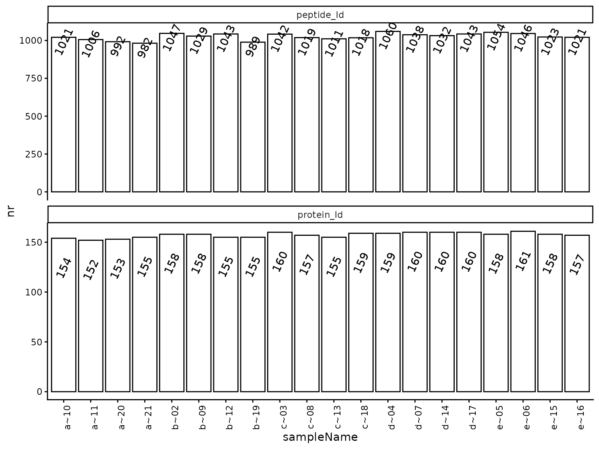
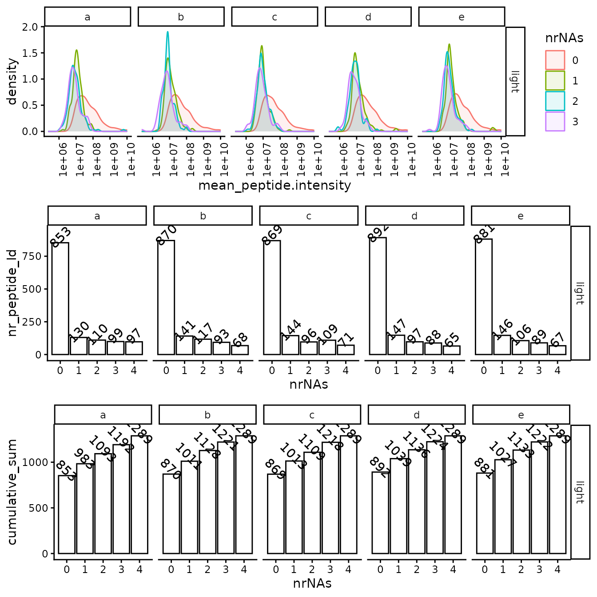
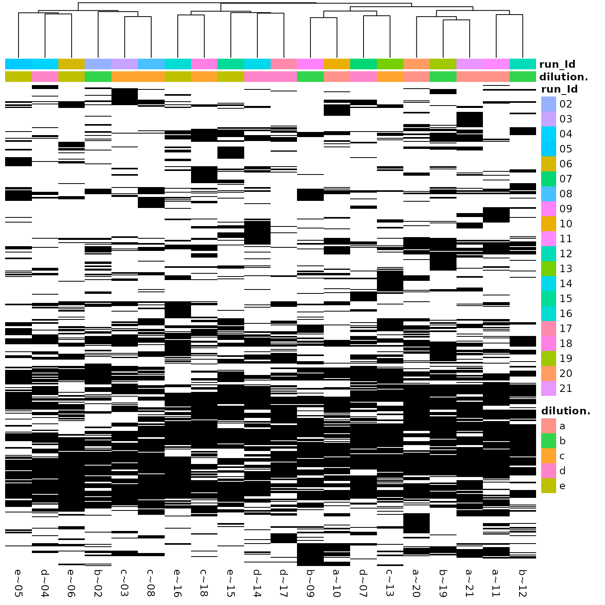
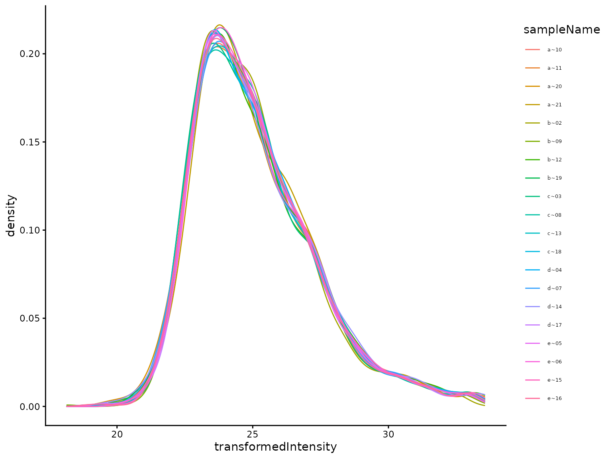
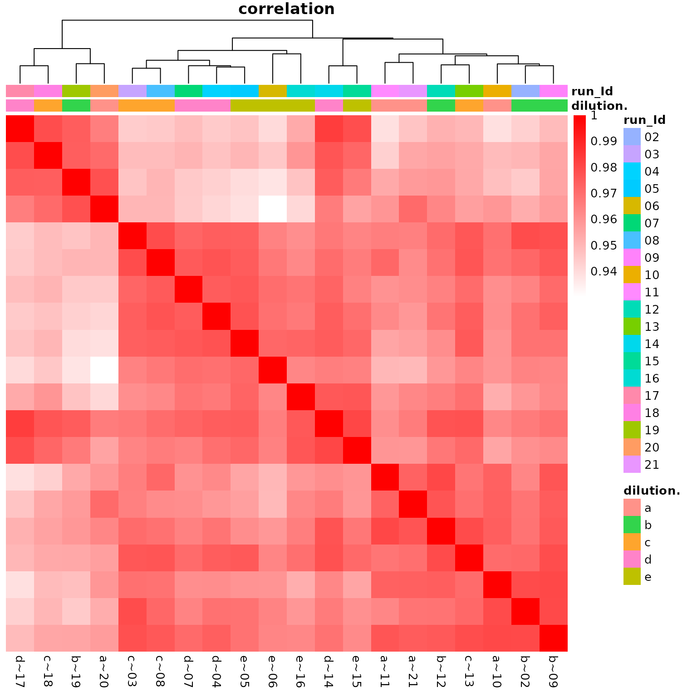
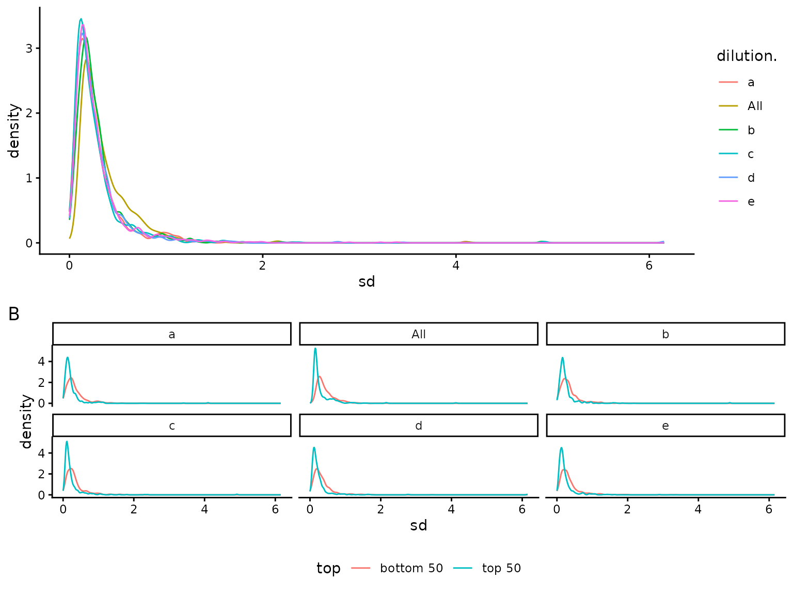
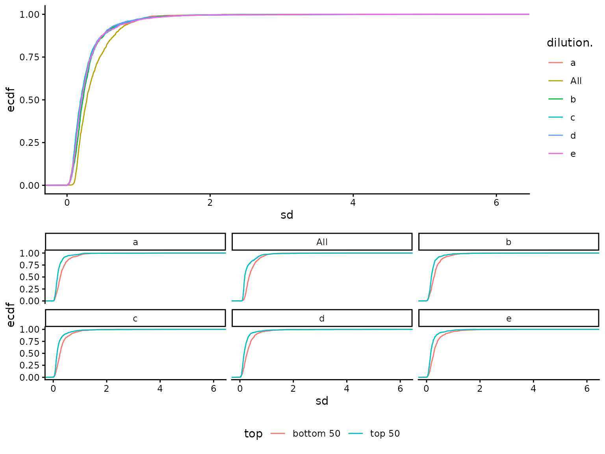
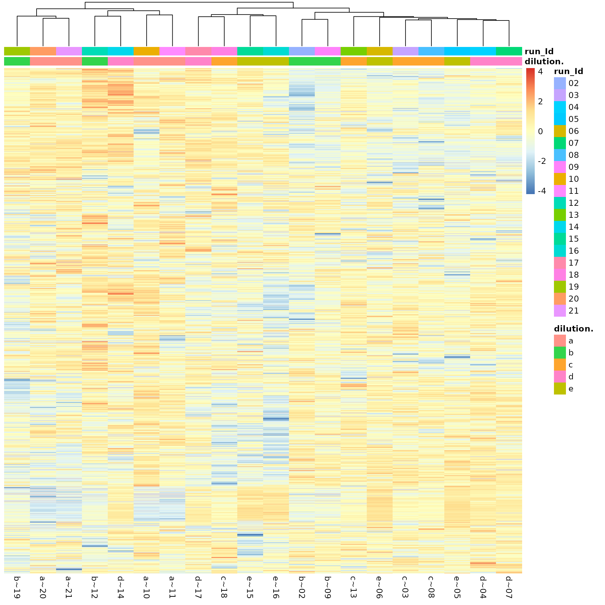
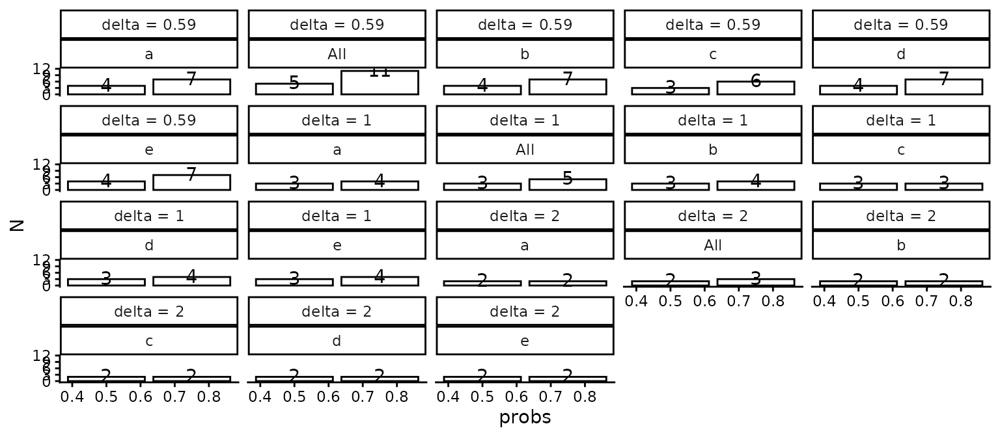

# Quality Control & Sample Size Estimation

## Introduction

- Workunit:
- Project:
- Order :

You were asked to hand in 4 QC samples, to asses the biological,
biochemical, and technical variability of your experiments. We did run
your samples through the same analysis pipeline, which will be applied
in the main experiment. This document summarizes the peptide variability
to asses the reproducibility of the biological samples and estimates the
sample sizes needed for the main experiment.

## Quality Control: Identifications

Here we summarize the number of peptides measured in the QC experiment.
Depending on the type of your sample (e.g., pull-down, supernatant,
whole cell lysate) we observe some dozens up to a few thousands of
proteins , and between a few hundred to up to some few tens of thousands
of peptides. While the overall number of proteins and peptides can
highly vary depending of the type of experiment, it is crucial that the
number of proteins and peptides between your biological replicates is
similar (reproducibility).

| NR.isotope | NR.protein_Id | NR.peptide_Id |
|:-----------|--------------:|--------------:|
| light      |           163 |          1258 |

Nr of proteins and peptides detected in all samples.

(ref:hierarchyCountsSampleBarplot) Number of quantified peptides per
sample.

(ref:hierarchyCountsSampleBarplot)

## Quality Control: Quantification

### Summary of missing data

Ideally, we identify each peptide in all of the samples. However,
because of the limit of detection (LOD) low-intensity peptides might not
be observed in all samples. Ideally, the LOD should be the only source
of missingness in biological replicates. The following figures help us
to verify the reproducibility of the measurement at the level of missing
data.

(ref:missingFigIntensityHistorgram) Top - intensity distribution of
peptides with 0, 1 etc. missing values. B - number of peptides with 0,
1, 2 etc. missing value.

(ref:missingFigIntensityHistorgram)

(ref:missingnessHeatmap) Heatmap of missing peptide quantifications
clustered by sample, black - missing intensities, white - present.

(ref:missingnessHeatmap)

### Variablity of the raw intensities

Without applying any intensity scaling and data preprocessing, the
peptide intensities in all samples should be similar. To asses this we
plotted the distribution of the peptide intensities in the samples
(Figure @ref(fig:plotDistributions)) as well as the distribution of the
coefficient of variation CV for all peptides in the samples (Figure
@ref(fig:intensityDistribution)). Table @ref(tab:printTable) summarises
the CV.

Density plot of peptide level Coefficient of Variations (CV).

| probs |        e |        a |        b |        c |        d |      All |
|------:|---------:|---------:|---------:|---------:|---------:|---------:|
|   0.5 | 19.84150 | 17.19356 | 18.27516 | 18.27122 | 18.34845 | 22.33335 |
|   0.6 | 22.59270 | 20.18408 | 21.12670 | 21.04286 | 21.46828 | 25.65000 |
|   0.7 | 25.93725 | 23.50090 | 24.87077 | 24.89460 | 25.27467 | 30.15509 |
|   0.8 | 32.05808 | 28.34406 | 30.73163 | 31.43322 | 31.74267 | 35.63108 |
|   0.9 | 42.68712 | 41.05645 | 40.27659 | 43.83096 | 40.84628 | 43.73533 |

Summary of the coefficient of variation (CV) at the 50th, 60th, 70th,
80th and 90th percentile.

Distribution of unnormalized intensities.

### Variability of transformed intensities

We $\log_{2}$ transformed and applied the
[`prolfqua::robust_scale()`](https://wolski.github.io/prolfqua/reference/robust_scale.md)
transformation to the data. This transformation transforms and scales
the data to reduce the variance (Figure
@ref(fig:plotTransformedIntensityDistributions)). Because of this, we
can’t report CV anymore but report standard deviations (sd). Figure
@ref(fig:sdviolinplots) shows the distribution of the peptide standard
deviations while Figure @ref(fig:sdecdf) shows the empirical cumulative
distribution function (ecdf). Table @ref(tab:printSDTable) summarises
the sd. The heatmap in Figure @ref(fig:correlationHeat) envisages the
correlation between the QC samples.

(ref:plotTransformedIntensityDistributions) Peptide intensity
distribution after transformation.

(ref:plotTransformedIntensityDistributions)

(ref:correlationHeat) Heatmap of peptide intensity correlation between
samples.

(ref:correlationHeat)

Pairsplot - scatterplot of samples.

    ## NULL

(ref:sdviolinplots) Visualization of peptide standard deviations. A)
all. B) - for low (bottom 50) and high intensity (top 50).

(ref:sdviolinplots)

(ref:sdecdf) Visualization of peptide standard deviations as empirical
cumulative distribution function. A) all. B) - for low (bottom 50) and
high intensity (top 50).

    ## NULL

(ref:sdecdf)

| probs |         e |         a |         b |         c |         d |       All |
|------:|----------:|----------:|----------:|----------:|----------:|----------:|
|   0.5 | 0.2011218 | 0.2029488 | 0.2228691 | 0.1902499 | 0.2070355 | 0.2765971 |
|   0.6 | 0.2488759 | 0.2421942 | 0.2630332 | 0.2357208 | 0.2502207 | 0.3294526 |
|   0.7 | 0.2977759 | 0.2956536 | 0.3111670 | 0.2882928 | 0.3013716 | 0.4069657 |
|   0.8 | 0.3829135 | 0.3794975 | 0.3872640 | 0.3658702 | 0.3817423 | 0.5281339 |
|   0.9 | 0.5695092 | 0.5505065 | 0.5590849 | 0.5793467 | 0.5444276 | 0.7109057 |

Summary of the distribution of standard deviations at the 50th, 60th,
70th, 80th and 90th percentile.

(ref:overviewHeat) Sample and peptide Heatmap.

(ref:overviewHeat)

## Sample Size Calculation

In the previous section, we estimated the peptide variance using the QC
samples. Figure @ref(fig:sdviolinplots) shows the distribution of the
standard deviations. We are using this information, as well as some
typical values for the size and the power of the test to estimate the
required sample sizes for your main experiment.

An important factor in estimating the sample sizes is the smallest
effect size (difference) you are interested in detecting between two
conditions, e.g. a reference and a treatment. Smaller biologically
significant effect sizes require more samples to obtain a statistically
significant result. Typical $log_{2}$ fold change thresholds are
$0.59,1,2$ which correspond to a fold change of $1.5,2,4$.

Table @ref(tab:sampleSize) and Figure @ref(fig:figSampleSize) summarizes
how many samples are needed to detect a fold change of $0.5,1,2$ at a
confidence level of $95\%$ and power of $80\%$, for $50,60,70,80$ and
$90\%$ percent of the measured peptides.

(ref:figSampleSize) Graphical representation of the sample size needed
to detect a log fold change greater than delta with a significance level
of $0.05$ and power 0.8 when using a t-test to compare means, in $X\%$
of peptides (x - axis).

(ref:figSampleSize)

| probs | sdtrimmed | dilution. | delta = 0.59 | delta = 1 | delta = 2 |
|------:|----------:|:----------|-------------:|----------:|----------:|
|  0.50 | 0.2011218 | e         |            4 |         3 |         2 |
|  0.75 | 0.3320049 | e         |            7 |         4 |         2 |
|  0.50 | 0.2029488 | a         |            4 |         3 |         2 |
|  0.75 | 0.3322746 | a         |            7 |         4 |         2 |
|  0.50 | 0.2228691 | b         |            4 |         3 |         2 |
|  0.75 | 0.3414827 | b         |            7 |         4 |         2 |
|  0.50 | 0.1902499 | c         |            3 |         3 |         2 |
|  0.75 | 0.3253138 | c         |            6 |         3 |         2 |
|  0.50 | 0.2070355 | d         |            4 |         3 |         2 |
|  0.75 | 0.3382180 | d         |            7 |         4 |         2 |
|  0.50 | 0.2765971 | All       |            5 |         3 |         2 |
|  0.75 | 0.4573966 | All       |           11 |         5 |         3 |

Sample size needed to detect a difference log fold change greater than
delta with a significance level of 0.05 and power 0.8 when using a
t-test to compare means.

The *power* of a test is $1 - \beta$, where $\beta$ is the probability
of a Type 2 error (failing to reject the null hypothesis when the
alternative hypothesis is true). In other words, if you have a $20\%$
chance of failing to detect a real difference, then the power of your
test is $80\%$.

The *confidence level* is equal to $1 - \alpha$, where $\alpha$ is the
probability of making a Type 1 Error. That is, alpha represents the
chance of a falsely rejecting $H_{0}$ and picking up a false-positive
effect. Alpha is usually set at $5\%$ significance level, for a $95\%$
confidence level.

Fold change: Suppose you are comparing a treatment group to a placebo
group, and you will be measuring some continuous response variable
which, you hypothesize, will be affected by the treatment. We can
consider the mean response in the treatment group, $\mu_{1}$, and the
mean response in the placebo group, $\mu_{2}$. We can then define
$\Delta = \mu_{1} - \mu_{2}$ as the mean difference. The smaller the
difference you want to detect, the larger the required sample size.

## Appendix

| raw.file                                                         | sampleName | dilution. | run_Id |
|:-----------------------------------------------------------------|:-----------|:----------|:-------|
| b03_10_150304_human_ecoli_a_3ul_3um_column_95_hcd_ot_2hrs_30b_9b | a~10       | a         | 10     |
| b03_11_150304_human_ecoli_a_3ul_3um_column_95_hcd_ot_2hrs_30b_9b | a~11       | a         | 11     |
| b03_20_150304_human_ecoli_a_3ul_3um_column_95_hcd_ot_2hrs_30b_9b | a~20       | a         | 20     |
| b03_21_150304_human_ecoli_a_3ul_3um_column_95_hcd_ot_2hrs_30b_9b | a~21       | a         | 21     |
| b03_02_150304_human_ecoli_b_3ul_3um_column_95_hcd_ot_2hrs_30b_9b | b~02       | b         | 02     |
| b03_09_150304_human_ecoli_b_3ul_3um_column_95_hcd_ot_2hrs_30b_9b | b~09       | b         | 09     |
| b03_12_150304_human_ecoli_b_3ul_3um_column_95_hcd_ot_2hrs_30b_9b | b~12       | b         | 12     |
| b03_19_150304_human_ecoli_b_3ul_3um_column_95_hcd_ot_2hrs_30b_9b | b~19       | b         | 19     |
| b03_03_150304_human_ecoli_c_3ul_3um_column_95_hcd_ot_2hrs_30b_9b | c~03       | c         | 03     |
| b03_08_150304_human_ecoli_c_3ul_3um_column_95_hcd_ot_2hrs_30b_9b | c~08       | c         | 08     |
| b03_13_150304_human_ecoli_c_3ul_3um_column_95_hcd_ot_2hrs_30b_9b | c~13       | c         | 13     |
| b03_18_150304_human_ecoli_c_3ul_3um_column_95_hcd_ot_2hrs_30b_9b | c~18       | c         | 18     |
| b03_04_150304_human_ecoli_d_3ul_3um_column_95_hcd_ot_2hrs_30b_9b | d~04       | d         | 04     |
| b03_07_150304_human_ecoli_d_3ul_3um_column_95_hcd_ot_2hrs_30b_9b | d~07       | d         | 07     |
| b03_14_150304_human_ecoli_d_3ul_3um_column_95_hcd_ot_2hrs_30b_9b | d~14       | d         | 14     |
| b03_17_150304_human_ecoli_d_3ul_3um_column_95_hcd_ot_2hrs_30b_9b | d~17       | d         | 17     |
| b03_05_150304_human_ecoli_e_3ul_3um_column_95_hcd_ot_2hrs_30b_9b | e~05       | e         | 05     |
| b03_06_150304_human_ecoli_e_3ul_3um_column_95_hcd_ot_2hrs_30b_9b | e~06       | e         | 06     |
| b03_15_150304_human_ecoli_e_3ul_3um_column_95_hcd_ot_2hrs_30b_9b | e~15       | e         | 15     |
| b03_16_150304_human_ecoli_e_3ul_3um_column_95_hcd_ot_2hrs_30b_9b | e~16       | e         | 16     |

Mapping of raw file names to sample names used throughout this report.

| isotope | sampleName | protein_Id | peptide_Id |
|:--------|:-----------|-----------:|-----------:|
| light   | a~10       |        154 |       1021 |
| light   | a~11       |        152 |       1006 |
| light   | a~20       |        153 |        992 |
| light   | a~21       |        155 |        982 |
| light   | b~02       |        158 |       1047 |
| light   | b~09       |        158 |       1029 |
| light   | b~12       |        155 |       1043 |
| light   | b~19       |        155 |        989 |
| light   | c~03       |        160 |       1042 |
| light   | c~08       |        157 |       1019 |
| light   | c~13       |        155 |       1011 |
| light   | c~18       |        159 |       1018 |
| light   | d~04       |        159 |       1060 |
| light   | d~07       |        160 |       1038 |
| light   | d~14       |        160 |       1032 |
| light   | d~17       |        160 |       1043 |
| light   | e~05       |        158 |       1054 |
| light   | e~06       |        161 |       1046 |
| light   | e~15       |        158 |       1023 |
| light   | e~16       |        157 |       1021 |

Number of quantified peptides and proteins per sample.
