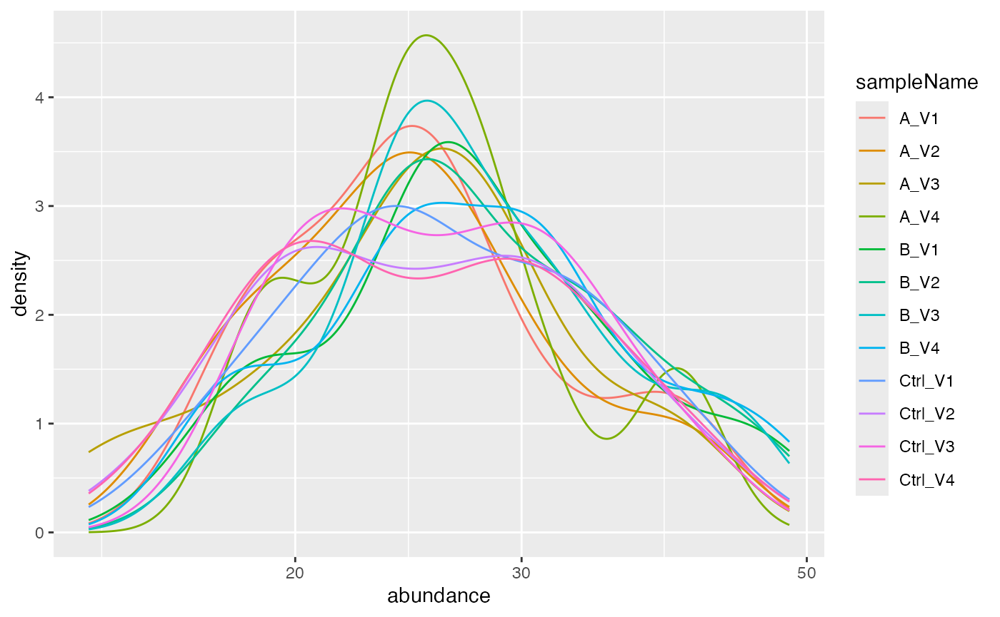

# QC and Sample Size Estimation

## Purpose

This vignette demonstrates how the package can be used to create
descriptive statistics or quality control plots for a dataset. First, we
read a “proteinGroups.txt” file from the MaxQuant software, and next, we
specify a prolfqua configuration. Afterward, the data is transformed and
normalized, and plots describing the data are generated. Finally, we
estimate how many samples are necessary to properly quantify a two-fold
change for $90$ of all the proteins with a power of $0.8$.

## Loading data

Generate Simulated data. To learn how to create prolfqua LFQData objects
see the vignette: creating configurations.

``` r
simdata <- prolfqua::sim_lfq_data_peptide_config()
lfqdata <- prolfqua::LFQData$new(simdata$data,simdata$config)
lfqdata$remove_small_intensities()
```

You can convert the data into a data frame in a wide format, where the
intensities of each sample occupy their columns.

``` r
lfqdata$to_wide()$data[1:3,1:8]
```

    ## # A tibble: 3 × 8
    ##   protein_Id  peptide_Id isotopeLabel  A_V1  A_V2  A_V3  A_V4  B_V1
    ##   <chr>       <chr>      <chr>        <dbl> <dbl> <dbl> <dbl> <dbl>
    ## 1 0EfVhX~0087 ahQLlQY7   light         26.9  25.2  26.1  25.2  26.1
    ## 2 0EfVhX~0087 ITLb4x1q   light         19.4  NA    18.2  18.9  28.9
    ## 3 7cbcrd~5725 D5dQ4nKk   light         30.4  30.4  29.6  27.8  NA

### Visualization of not normalized data

Next we show how the data is distributed before transformation and
normalization.

``` r
lfqplotter <- lfqdata$get_Plotter()
lfqplotter$intensity_distribution_density()
```



#### Visualization of missing data

Often it also makes sense to look into the part of the data that is not
quantified in all samples. Therefore several functions for the
missingess are available. In the `NA_heatmap` function it is possible to
see if some missing proteins are specific for one particular dilution or
if they appear randomly in all samples.

``` r
nah <- lfqplotter$na_heatmap()
```

Prints missing heatmap:

``` r
nah
```


Heatmap, black - missing protein intensities, white - present

Also in the next two figures we show how many missing values are found
in the respective conditions and how many proteins do not have missing
data and how complete the measurements are for each group.

``` r
lfqdata$get_Summariser()$plot_missingness_per_group()
```


\# of proteins with 0,1,…N missing values

``` r
lfqdata$get_Summariser()$plot_missingness_per_group_cumsum()
```


Cumulative sum of the \# of proteins with 0,1,…N missing values

In the `missigness_histogram` we can check if there is a dependency
between NAs (and the number of NAs for earch protein) with respect to
the protein intensity.

``` r
lfqplotter$missigness_histogram()
```


Intensity distribution of proteins depending on \# of missing values

## Computing standard deviations, mean and CV.

Other important statistics that can be easily calculated from the object
are coefficient of variation, means and standard deviations.

``` r
stats <- lfqdata$get_Stats()
prolfqua::table_facade( stats$stats_quantiles()$wide, paste0("quantile of ",stats$stat ))
```

| probs |        A |        B |     Ctrl |       All |
|------:|---------:|---------:|---------:|----------:|
|  0.10 | 1.215060 | 1.236542 | 1.129780 |  7.185163 |
|  0.25 | 2.442726 | 1.999453 | 1.607515 | 12.277918 |
|  0.50 | 3.418211 | 3.026062 | 3.349758 | 15.169313 |
|  0.75 | 4.599101 | 4.155821 | 4.885600 | 19.467593 |
|  0.90 | 6.349093 | 5.322302 | 6.008022 | 21.451325 |

quantile of CV

``` r
stats$density_median()
```


Distribution of CV’s

In the next figure we show the dependency of the standard deviation with
respect to the mean intensitiy of the proteins.

``` r
stdm_raw <- stats$stdv_vs_mean(size = 10000) +
  ggplot2::scale_x_log10() +
  ggplot2::scale_y_log10()
stdm_raw
```


Scatter plot of standard deviation vs mean

### Normalize protein intensities

Next, we want to normalize the data by first $\log_{2}$ transforming it
and then z-scaling. The $log_{2}$ stabilizes the variance, while the
z-scaling removes systematic differences from the samples.

``` r
lt <- lfqdata$get_Transformer()
transformed <- lt$log2()$robscale()$lfq
transformed$config$is_response_transformed
```

    ## [1] TRUE

Again we want to look into the distribution of the intensities in our
samples after normalization.

``` r
pl <- transformed$get_Plotter()
pl$intensity_distribution_density()
```


Normalized intensities.

plots matrix scatter plot in the upper right matrix and some statistics
in the lower left matrix.

``` r
pl$pairs_smooth()
```


Scatterplot matrix

    ## NULL

plots protein heatmap:

``` r
p <- pl$heatmap() 
p 
```


Heatmap, Rows - proteins, Columns - samples

We can also look at the correlation among the samples or look at a PCA
plot.

``` r
hc <- pl$heatmap_cor()
```

``` r
hc
```


Heatmap based on sample correlations, Rows - samples, Columns - samples

``` r
pl$pca()
```


Principal component analysis for all samples

prints the standard deviations:

``` r
stats <- transformed$get_Stats()
prolfqua::table_facade(stats$stats_quantiles()$wide, "Standard deviations")
```

| probs |         A |         B |      Ctrl |       All |
|------:|----------:|----------:|----------:|----------:|
|  0.10 | 0.0355196 | 0.0325012 | 0.0294799 | 0.1152932 |
|  0.25 | 0.0587524 | 0.0582281 | 0.0422670 | 0.1677154 |
|  0.50 | 0.0717438 | 0.0853025 | 0.0566645 | 0.2345489 |
|  0.75 | 0.1240478 | 0.1209993 | 0.0720238 | 0.3004859 |
|  0.90 | 0.1687990 | 0.1388753 | 0.1087199 | 0.3253740 |

Standard deviations

plots density of the standard deviation

``` r
stats$density_median()
```


Density of the standard deviation

Check for heteroskedasticity. After transformation, the standard
deviation should be independent of the mean intensity.

``` r
stdm_trans <- stats$stdv_vs_mean(size = 10000) + ggplot2::scale_x_log10() + ggplot2::scale_y_log10()
stdm_trans
```


Scatter plot of sd vs mean of protein intensity

``` r
#gridExtra::grid.arrange(stdm_raw, stdm_trans, nrow=1)
```

### Estimate sample size

For the sample size estimation we will now focus on only one condition
and the different bio-reps from the *a* group In this condition all
samples have the same concentration and we want to check variability
within this group. Like this we can estimate how many samples are
necessary per group to quantify properly a two-fold change (delta of 1)
for 90% of all the proteins with a power of 0.8 and significance level
of 0.05.

First, we need to filter our data for `group_` *A* only.

``` r
transformedA <- transformed$get_copy()
transformedA$data <- transformedA$data |> dplyr::filter(group_  == "A")
stats <- transformedA$get_Stats()
```

``` r
stats$density(ggstat = "ecdf")
```


Empirical cumulative density function of the standard deviation for all
the proteins in the dataset.

The table indicates that for this kind of data - if a two-fold change
for 90% of all the proteins should be accurately quantified with a power
of 0.8 (at 0.05 significance level) one would need to have 10 samples in
each group.

``` r
sampleSize <- stats$power_t_test_quantiles() |> 
  dplyr::filter(group_ != "All")
prolfqua::table_facade(sampleSize, "Sample sizes. delta - Effect size, N - samplesize")
```

| group\_ | probs | quantiles | sdtrimmed |  N_exact |   N | delta |
|:--------|------:|----------:|----------:|---------:|----:|------:|
| A       |  0.10 | 0.0355196 | 0.0355196 | 1.526948 |   2 |  0.59 |
| A       |  0.25 | 0.0587524 | 0.0587524 | 1.673109 |   2 |  0.59 |
| A       |  0.50 | 0.0717438 | 0.0717438 | 1.758418 |   2 |  0.59 |
| A       |  0.75 | 0.1240478 | 0.1240478 | 2.172950 |   3 |  0.59 |
| A       |  0.90 | 0.1687990 | 0.1687990 | 2.671229 |   3 |  0.59 |
| A       |  0.10 | 0.0355196 | 0.0530265 | 1.500024 |   2 |  1.00 |
| A       |  0.25 | 0.0587524 | 0.0587524 | 1.521541 |   2 |  1.00 |
| A       |  0.50 | 0.0717438 | 0.0717438 | 1.569649 |   2 |  1.00 |
| A       |  0.75 | 0.1240478 | 0.1240478 | 1.768204 |   2 |  1.00 |
| A       |  0.90 | 0.1687990 | 0.1687990 | 1.961551 |   2 |  1.00 |
| A       |  0.10 | 0.0355196 | 0.1060530 | 1.500024 |   2 |  2.00 |
| A       |  0.25 | 0.0587524 | 0.1060530 | 1.500024 |   2 |  2.00 |
| A       |  0.50 | 0.0717438 | 0.1060530 | 1.500024 |   2 |  2.00 |
| A       |  0.75 | 0.1240478 | 0.1240478 | 1.533718 |   2 |  2.00 |
| A       |  0.90 | 0.1687990 | 0.1687990 | 1.616344 |   2 |  2.00 |

Sample sizes. delta - Effect size, N - samplesize

The table summarises visually how many samples are needed for different
expected differences (in log2-scale) and different portions of all
proteins.

``` r
sampleSize |>
  ggplot2::ggplot(ggplot2::aes(x = factor(probs) , y = N)) +
  ggplot2::facet_wrap(~delta) +
  ggplot2::geom_bar(stat = "identity")
```


Estimated sample sizes for various FC levels and various quantiles of
the standard deviation.

It is also possible to get the statistics for each protein in each
group. The information includes group size, number of observations,
standard deviation, variance, mean.

``` r
stats$stats() |> head()
```

    ## # A tibble: 6 × 12
    ##   protein_Id  peptide_Id isotopeLabel group_ nrReplicates nrMeasured nrNAs
    ##   <chr>       <chr>      <chr>        <chr>         <int>      <int> <int>
    ## 1 0EfVhX~0087 ITLb4x1q   light        A                 4          3     1
    ## 2 0EfVhX~0087 ahQLlQY7   light        A                 4          4     0
    ## 3 0EfVhX~0087 dJkdz7so   light        A                 4          2     2
    ## 4 7cbcrd~5725 D5dQ4nKk   light        A                 4          4     0
    ## 5 9VUkAq~4703 eIC06D7g   light        A                 4          4     0
    ## 6 BEJI92~5282 HBkZvdhT   light        A                 4          2     2
    ## # ℹ 5 more variables: sd <dbl>, var <dbl>, meanAbundance <dbl>,
    ## #   medianAbundance <dbl>, interaction <chr>

You can also estimate the sample size needed to perform differential
expression analysis for each protein, given the `power`, `delta`, and
`sig.level`. The next figure shows the distribution of needed sample
sizes for all proteins with a power of 0.8 at signifiance level 0.05 for
a two fold change (delta = 1).

``` r
x <- stats$power_t_test(delta = 1,power = 0.8, sig.level = 0.05)
x <- x |> dplyr::filter(group_ == "A") |> dplyr::arrange(desc(N),protein_Id)
prolfqua::table_facade(x[1:7,], caption = "Sample size for each protein")
```

| protein_Id  | peptide_Id | isotopeLabel | group\_ | nrReplicates | nrMeasured | nrNAs |        sd |       var | meanAbundance | medianAbundance | interaction | delta |  N_exact |   N |
|:------------|:-----------|:-------------|:--------|-------------:|-----------:|------:|----------:|----------:|--------------:|----------------:|:------------|------:|---------:|----:|
| 0EfVhX~0087 | dJkdz7so   | light        | A       |            4 |          2 |     2 | 0.1816806 | 0.0330078 |      3.971469 |        3.971469 | group_A     |     1 | 2.023422 |   3 |
| HvIpHG~9079 | opjydeWJ   | light        | A       |            4 |          3 |     1 | 0.2392614 | 0.0572460 |      4.094835 |        3.997946 | group_A     |     1 | 2.344670 |   3 |
| JcKVfU~9653 | 9LMQBevj   | light        | A       |            4 |          4 |     0 | 0.1871014 | 0.0350069 |      5.482917 |        5.406550 | group_A     |     1 | 2.050429 |   3 |
| 0EfVhX~0087 | ahQLlQY7   | light        | A       |            4 |          4 |     0 | 0.0620097 | 0.0038452 |      4.742744 |        4.735435 | group_A     |     1 | 1.533666 |   2 |
| 0EfVhX~0087 | ITLb4x1q   | light        | A       |            4 |          3 |     1 | 0.1535287 | 0.0235710 |      4.190351 |        4.178250 | group_A     |     1 | 1.892113 |   2 |
| 7cbcrd~5725 | D5dQ4nKk   | light        | A       |            4 |          4 |     0 | 0.0508679 | 0.0025875 |      4.956022 |        4.964554 | group_A     |     1 | 1.500024 |   2 |
| 9VUkAq~4703 | eIC06D7g   | light        | A       |            4 |          4 |     0 | 0.0945821 | 0.0089458 |      4.159728 |        4.182873 | group_A     |     1 | 1.654299 |   2 |

Sample size for each protein

``` r
x |> ggplot2::ggplot(ggplot2::aes(x = N)) +
  ggplot2::geom_histogram() +
  ggplot2::facet_wrap(~delta) +
  ggplot2::xlim(0,100)
```


Distribution of the required sample sizes for two fold change thresholds
for all the proteins.

The `prolfqua` package is described in (Wolski et al. 2022).

## Session Info

``` r
sessionInfo()
```

    ## R version 4.5.2 (2025-10-31)
    ## Platform: x86_64-pc-linux-gnu
    ## Running under: Ubuntu 24.04.4 LTS
    ## 
    ## Matrix products: default
    ## BLAS:   /usr/lib/x86_64-linux-gnu/openblas-pthread/libblas.so.3 
    ## LAPACK: /usr/lib/x86_64-linux-gnu/openblas-pthread/libopenblasp-r0.3.26.so;  LAPACK version 3.12.0
    ## 
    ## locale:
    ##  [1] LC_CTYPE=C.UTF-8       LC_NUMERIC=C           LC_TIME=C.UTF-8       
    ##  [4] LC_COLLATE=C.UTF-8     LC_MONETARY=C.UTF-8    LC_MESSAGES=C.UTF-8   
    ##  [7] LC_PAPER=C.UTF-8       LC_NAME=C              LC_ADDRESS=C          
    ## [10] LC_TELEPHONE=C         LC_MEASUREMENT=C.UTF-8 LC_IDENTIFICATION=C   
    ## 
    ## time zone: UTC
    ## tzcode source: system (glibc)
    ## 
    ## attached base packages:
    ## [1] stats     graphics  grDevices utils     datasets  methods   base     
    ## 
    ## loaded via a namespace (and not attached):
    ##  [1] tidyselect_1.2.1       viridisLite_0.4.3      dplyr_1.2.1           
    ##  [4] farver_2.1.2           S7_0.2.1               fastmap_1.2.0         
    ##  [7] lazyeval_0.2.3         digest_0.6.39          rpart_4.1.24          
    ## [10] prolfqua_1.6.1         lifecycle_1.0.5        survival_3.8-3        
    ## [13] statmod_1.5.1          magrittr_2.0.5         compiler_4.5.2        
    ## [16] rlang_1.2.0            sass_0.4.10            tools_4.5.2           
    ## [19] utf8_1.2.6             yaml_2.3.12            data.table_1.18.2.1   
    ## [22] knitr_1.51             labeling_0.4.3         htmlwidgets_1.6.4     
    ## [25] plyr_1.8.9             RColorBrewer_1.1-3     KernSmooth_2.23-26    
    ## [28] withr_3.0.2            purrr_1.2.1            desc_1.4.3            
    ## [31] nnet_7.3-20            grid_4.5.2             jomo_2.7-6            
    ## [34] mice_3.19.0            ggplot2_4.0.2          scales_1.4.0          
    ## [37] iterators_1.0.14       MASS_7.3-65            cli_3.6.5             
    ## [40] UpSetR_1.4.0           rmarkdown_2.31         ragg_1.5.2            
    ## [43] reformulas_0.4.4       generics_0.1.4         otel_0.2.0            
    ## [46] httr_1.4.8             minqa_1.2.8            cachem_1.1.0          
    ## [49] operator.tools_1.6.3.1 splines_4.5.2          vctrs_0.7.2           
    ## [52] boot_1.3-32            glmnet_4.1-10          Matrix_1.7-4          
    ## [55] jsonlite_2.0.0         mitml_0.4-5            ggrepel_0.9.8         
    ## [58] systemfonts_1.3.2      foreach_1.5.2          limma_3.66.0          
    ## [61] plotly_4.12.0          tidyr_1.3.2            jquerylib_0.1.4       
    ## [64] glue_1.8.0             pkgdown_2.2.0          nloptr_2.2.1          
    ## [67] pan_1.9                codetools_0.2-20       stringi_1.8.7         
    ## [70] shape_1.4.6.1          gtable_0.3.6           lme4_2.0-1            
    ## [73] tibble_3.3.1           pillar_1.11.1          htmltools_0.5.9       
    ## [76] R6_2.6.1               textshaping_1.0.5      Rdpack_2.6.6          
    ## [79] formula.tools_1.7.1    evaluate_1.0.5         lattice_0.22-7        
    ## [82] rbibutils_2.4.1        backports_1.5.1        pheatmap_1.0.13       
    ## [85] broom_1.0.12           bslib_0.10.0           Rcpp_1.1.1            
    ## [88] gridExtra_2.3          nlme_3.1-168           mgcv_1.9-3            
    ## [91] logistf_1.26.1         xfun_0.57              fs_2.0.1              
    ## [94] forcats_1.0.1          pkgconfig_2.0.3

## References

Wolski, Witold E., Paolo Nanni, Jonas Grossmann, Maria d’Errico, Ralph
Schlapbach, and Christian Panse. 2022. “Prolfqua: A Comprehensive
R-package for Proteomics Differential Expression Analysis.” *bioRxiv*.
<https://doi.org/10.1101/2022.06.07.494524>.
