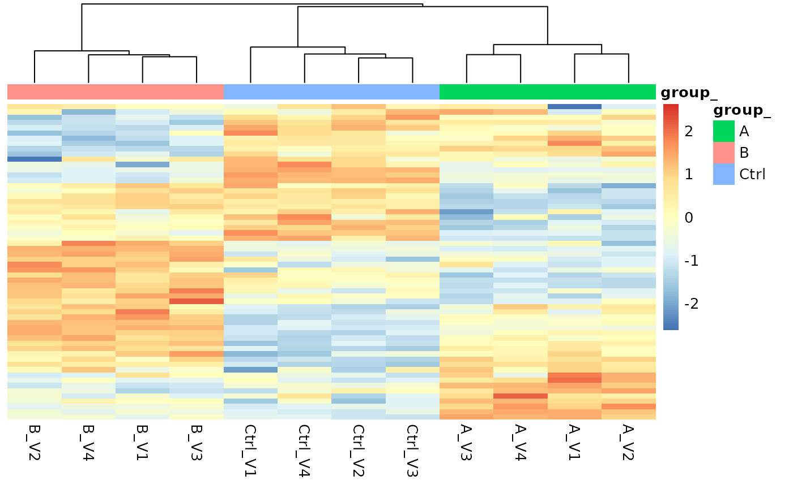
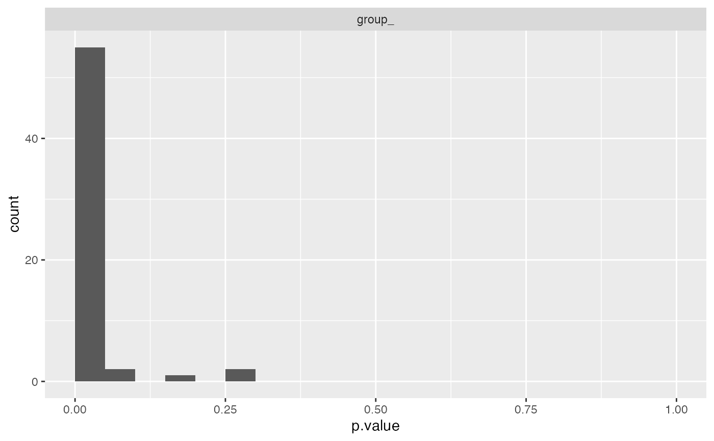

# Simulate Peptide level Data

### Dimulate data

``` r
knitr::opts_chunk$set(warning = FALSE, message = FALSE) 
```

For proteins: - the proteins have a FC either equal 1, 0. or -1, 10%
have 1 80% have 0 and 10% have -1.

What we however are measuring are peptide spectrum matches. Let’s assume
we observing peptides.

For peptides:

- The transformed protein abundances have a log normal distribution with
  `meanlog = log(20)`, and `sd = log(1.2)`.
- The number of peptides per protein follow a geometric distribution,
  $N_{pep} \sim Geo(p)$ with $p = 0.3$
- The peptide abundances of a protein have log normal distribution with
  `meanlog = log(proteinabundance)` and `sd = log(1.2)`
- The log2 intensities of a peptide within a group follow a normal
  distribution distribution \$I\_{pep} LogNormal(,) \$, where $\mu$ is
  the peptide abundance and $\sigma$

``` r
peptideAbundances <- prolfqua::sim_lfq_data(PEPTIDE = TRUE)
```

## Analyse simulated data with prolfqua

``` r
library(prolfqua)

config <- AnalysisConfiguration$new()
config$file_name = "sample"
config$factors["group_"] = "group"
config$hierarchy[["protein_Id"]] = "proteinID"
config$hierarchy[["peptide_Id"]] = "peptideID"
config$set_response("abundance")

adata <- setup_analysis(peptideAbundances, config)

lfqdata <- prolfqua::LFQData$new(adata, config)
lfqdata$is_transformed(TRUE)

lfqdata$remove_small_intensities(threshold = 1)
lfqdata$filter_proteins_by_peptide_count()

lfqdata$factors()
```

    ## # A tibble: 12 × 3
    ##    sample  sampleName group_
    ##    <chr>   <chr>      <chr> 
    ##  1 A_V1    A_V1       A     
    ##  2 A_V2    A_V2       A     
    ##  3 A_V3    A_V3       A     
    ##  4 A_V4    A_V4       A     
    ##  5 B_V1    B_V1       B     
    ##  6 B_V2    B_V2       B     
    ##  7 B_V3    B_V3       B     
    ##  8 B_V4    B_V4       B     
    ##  9 Ctrl_V1 Ctrl_V1    Ctrl  
    ## 10 Ctrl_V2 Ctrl_V2    Ctrl  
    ## 11 Ctrl_V3 Ctrl_V3    Ctrl  
    ## 12 Ctrl_V4 Ctrl_V4    Ctrl

``` r
pl <- lfqdata$get_Plotter()
lfqdata$hierarchy_counts()
```

    ## # A tibble: 1 × 3
    ##   isotopeLabel protein_Id peptide_Id
    ##   <chr>             <int>      <int>
    ## 1 light                16         60

``` r
lfqdata$relevant_hierarchy_keys()
```

    ## [1] "protein_Id"

``` r
pl$heatmap()
```



``` r
pl$intensity_distribution_density()
```


## Fit peptide model

``` r
formula_Condition <-  strategy_lm("abundance ~ group_")
lfqdata$set_config_value("hierarchy_depth", 2)

# specify model definition
modelName  <- "Model"
contr_spec <- c("B_over_Ctrl" = "group_B - group_Ctrl",
               "A_over_Ctrl" = "group_A - group_Ctrl")
lfqdata$subject_id()
```

    ## [1] "protein_Id" "peptide_Id"

``` r
mod <- prolfqua::build_model(
  lfqdata,
  formula_Condition)
aovtable <- mod$get_anova()
mod$anova_histogram()$plot
```



``` r
xx <- aovtable |> dplyr::filter(FDR < 0.05)
signif <- lfqdata$get_copy()
signif$set_data(signif$data_long() |> dplyr::filter(protein_Id %in% xx$protein_Id))
signif$get_Plotter()$heatmap()
```


## Aggregate data

``` r
lfqdata$set_config_value("hierarchy_depth", 1)
protData <- lfqdata$get_Aggregator()$aggregate()
```

``` r
protData$response()
```

    ## [1] "medpolish"

``` r
formula_Condition <-  strategy_lm("medpolish ~ group_")

mod <- prolfqua::build_model(
  protData,
  formula_Condition)

contr <- prolfqua::Contrasts$new(mod, contr_spec)
v1 <- contr$get_Plotter()$volcano()
v1$FDR
```


``` r
ctr <- contr$get_contrasts()
```
