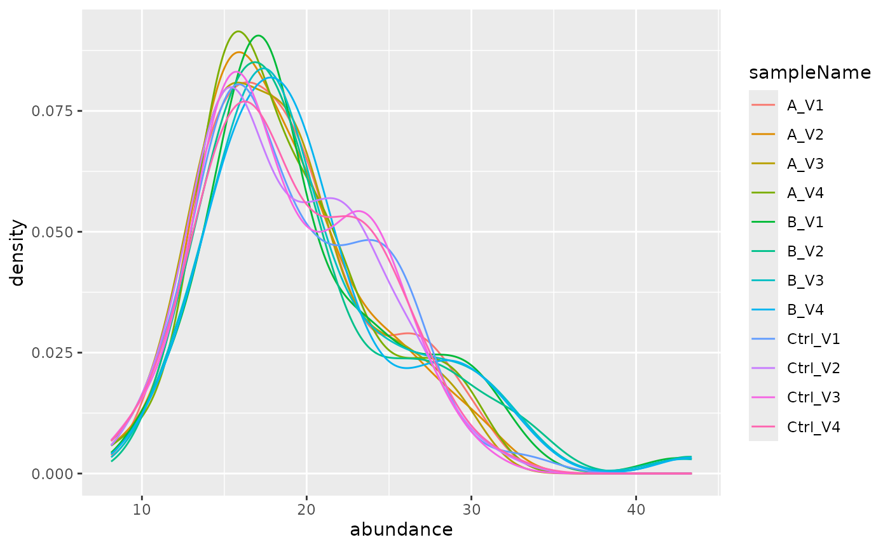
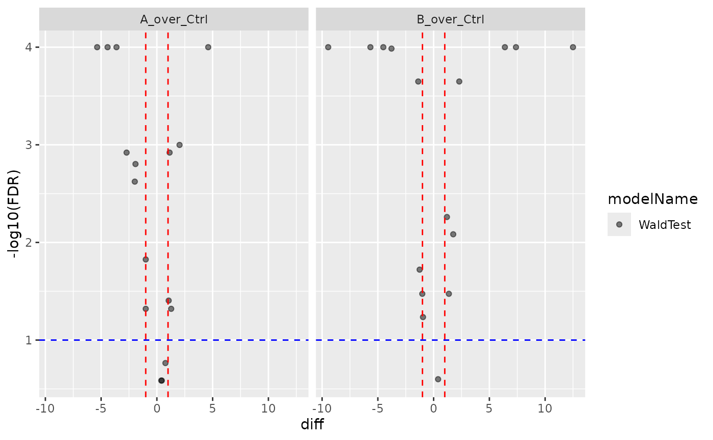

# Simulate Peptide level Data

### Dimulate data

For proteins: - the proteins have a FC either equal 1, 0. or -1, 10%
have 1 80% have 0 and 10% have -1.

What we however are measuring are peptide spectrum matches. Let’s assume
we observing peptides.

For peptides:

- The transformed protein abundances have a log normal distribution with
  `meanlog = log(20)`, and `sd = log(1.2)`.
- The number of peptides per protein follow a geometric distribution,
  $N_{pep} \sim Geo(p)$ with $p = 0.3$
- The peptide abundances of a protein have log normal distribution with
  `meanlog = log(proteinabundance)` and `sd = log(1.2)`
- The log2 intensities of a peptide within a group follow a normal
  distribution distribution \$I\_{pep} LogNormal(,) \$, where $\mu$ is
  the peptide abundance and $\sigma$

``` r
peptideAbundances <- prolfqua::sim_lfq_data(PEPTIDE = TRUE)
```

## Analyse simulated data with prolfqua

``` r
library(prolfqua)

config <- AnalysisConfiguration$new()
config$file_name = "sample"
config$factors["group_"] = "group"
config$hierarchy[["protein_Id"]] = "proteinID"
config$hierarchy[["peptide_Id"]] = "peptideID"
config$set_response("abundance")

adata <- setup_analysis(peptideAbundances, config)

lfqdata <- prolfqua::LFQData$new(adata, config)
lfqdata$is_transformed(TRUE)

lfqdata$remove_small_intensities(threshold = 1)
lfqdata$filter_proteins_by_peptide_count()

lfqdata$factors()
```

    ## # A tibble: 12 × 3
    ##    sample  sampleName group_
    ##    <chr>   <chr>      <chr> 
    ##  1 A_V1    A_V1       A     
    ##  2 A_V2    A_V2       A     
    ##  3 A_V3    A_V3       A     
    ##  4 A_V4    A_V4       A     
    ##  5 B_V1    B_V1       B     
    ##  6 B_V2    B_V2       B     
    ##  7 B_V3    B_V3       B     
    ##  8 B_V4    B_V4       B     
    ##  9 Ctrl_V1 Ctrl_V1    Ctrl  
    ## 10 Ctrl_V2 Ctrl_V2    Ctrl  
    ## 11 Ctrl_V3 Ctrl_V3    Ctrl  
    ## 12 Ctrl_V4 Ctrl_V4    Ctrl

``` r
pl <- lfqdata$get_Plotter()
lfqdata$hierarchy_counts()
```

    ## # A tibble: 1 × 3
    ##   isotopeLabel protein_Id peptide_Id
    ##   <chr>             <int>      <int>
    ## 1 light                16         60

``` r
lfqdata$relevant_hierarchy_keys()
```

    ## [1] "protein_Id"

``` r
pl$heatmap()
```


``` r
pl$intensity_distribution_density()
```



## Fit peptide model

``` r
formula_Condition <-  strategy_lm("abundance ~ group_")
lfqdata$set_config_value("hierarchy_depth", 2)

# specify model definition
modelName  <- "Model"
contr_spec <- c("B_over_Ctrl" = "group_B - group_Ctrl",
               "A_over_Ctrl" = "group_A - group_Ctrl")
lfqdata$subject_id()
```

    ## [1] "protein_Id" "peptide_Id"

``` r
mod <- prolfqua::build_model(
  lfqdata,
  formula_Condition)
aovtable <- mod$get_anova()
mod$anova_histogram()$plot
```


``` r
xx <- aovtable |> dplyr::filter(FDR < 0.05)
signif <- lfqdata$get_copy()
signif$set_data(signif$data_long() |> dplyr::filter(protein_Id %in% xx$protein_Id))
signif$get_Plotter()$heatmap()
```


## Aggregate data

``` r
lfqdata$set_config_value("hierarchy_depth", 1)
protData <- lfqdata$get_Aggregator()$aggregate()
```

``` r
protData$response()
```

    ## [1] "medpolish"

``` r
formula_Condition <-  strategy_lm("medpolish ~ group_")

mod <- prolfqua::build_model(
  protData,
  formula_Condition)

contr <- prolfqua::Contrasts$new(mod, contr_spec)
v1 <- contr$get_Plotter()$volcano()
v1$FDR
```



``` r
ctr <- contr$get_contrasts()
```

## Session Info

``` r
sessionInfo()
```

    ## R version 4.5.2 (2025-10-31)
    ## Platform: x86_64-pc-linux-gnu
    ## Running under: Ubuntu 24.04.4 LTS
    ## 
    ## Matrix products: default
    ## BLAS:   /usr/lib/x86_64-linux-gnu/openblas-pthread/libblas.so.3 
    ## LAPACK: /usr/lib/x86_64-linux-gnu/openblas-pthread/libopenblasp-r0.3.26.so;  LAPACK version 3.12.0
    ## 
    ## locale:
    ##  [1] LC_CTYPE=C.UTF-8       LC_NUMERIC=C           LC_TIME=C.UTF-8       
    ##  [4] LC_COLLATE=C.UTF-8     LC_MONETARY=C.UTF-8    LC_MESSAGES=C.UTF-8   
    ##  [7] LC_PAPER=C.UTF-8       LC_NAME=C              LC_ADDRESS=C          
    ## [10] LC_TELEPHONE=C         LC_MEASUREMENT=C.UTF-8 LC_IDENTIFICATION=C   
    ## 
    ## time zone: UTC
    ## tzcode source: system (glibc)
    ## 
    ## attached base packages:
    ## [1] stats     graphics  grDevices utils     datasets  methods   base     
    ## 
    ## other attached packages:
    ## [1] prolfqua_1.6.3
    ## 
    ## loaded via a namespace (and not attached):
    ##   [1] Rdpack_2.6.6           gridExtra_2.3.1        rlang_1.3.0           
    ##   [4] magrittr_2.0.5         clue_0.3-68            GetoptLong_1.1.1      
    ##   [7] otel_0.2.0             matrixStats_1.5.0      compiler_4.5.2        
    ##  [10] mgcv_1.9-3             png_0.1-9              systemfonts_1.3.2     
    ##  [13] vctrs_0.7.3            pkgconfig_2.0.3        shape_1.4.6.1         
    ##  [16] crayon_1.5.3           fastmap_1.2.0          backports_1.5.1       
    ##  [19] labeling_0.4.3         utf8_1.2.6             promises_1.5.0        
    ##  [22] rmarkdown_2.31         nloptr_2.2.1           ragg_1.5.2            
    ##  [25] UpSetR_1.4.1           purrr_1.2.2            xfun_0.60             
    ##  [28] glmnet_5.0             jomo_2.7-6             logistf_1.26.1        
    ##  [31] cachem_1.1.0           jsonlite_2.0.0         progress_1.2.3        
    ##  [34] later_1.4.8            pan_2.0                prettyunits_1.2.0     
    ##  [37] broom_1.0.13           parallel_4.5.2         cluster_2.1.8.1       
    ##  [40] R6_2.6.1               bslib_0.11.0           stringi_1.8.7         
    ##  [43] RColorBrewer_1.1-3     limma_3.66.0           boot_1.3-32           
    ##  [46] rpart_4.1.24           jquerylib_0.1.4        Rcpp_1.1.2            
    ##  [49] iterators_1.0.14       knitr_1.51             IRanges_2.44.0        
    ##  [52] httpuv_1.6.17          Matrix_1.7-4           splines_4.5.2         
    ##  [55] nnet_7.3-20            tidyselect_1.2.1       yaml_2.3.12           
    ##  [58] doParallel_1.0.17      codetools_0.2-20       lattice_0.22-7        
    ##  [61] tibble_3.3.1           plyr_1.8.9             shiny_1.14.0          
    ##  [64] withr_3.0.3            S7_0.2.2               evaluate_1.0.5        
    ##  [67] desc_1.4.3             survival_3.8-3         circlize_0.4.18       
    ##  [70] pillar_1.11.1          mice_3.19.0            foreach_1.5.2         
    ##  [73] stats4_4.5.2           reformulas_0.4.4       plotly_4.12.0         
    ##  [76] generics_0.1.4         hms_1.1.4              S4Vectors_0.48.1      
    ##  [79] ggplot2_4.0.3          scales_1.4.0           minqa_1.2.8           
    ##  [82] xtable_1.8-8           glue_1.8.1             lazyeval_0.2.3        
    ##  [85] tools_4.5.2            data.table_1.18.4      lme4_2.0-6            
    ##  [88] forcats_1.0.1          fs_2.1.0               grid_4.5.2            
    ##  [91] tidyr_1.3.2            rbibutils_2.4.1        crosstalk_1.2.2       
    ##  [94] colorspace_2.1-3       nlme_3.1-168           formula.tools_1.7.1   
    ##  [97] cli_3.6.6              textshaping_1.0.5      viridisLite_0.4.3     
    ## [100] ComplexHeatmap_2.26.1  dplyr_1.2.1            gtable_0.3.6          
    ## [103] sass_0.4.10            digest_0.6.39          operator.tools_1.6.3.1
    ## [106] BiocGenerics_0.56.0    ggrepel_0.9.8          rjson_0.2.23          
    ## [109] htmlwidgets_1.6.4      farver_2.1.2           htmltools_0.5.9       
    ## [112] pkgdown_2.2.1          lifecycle_1.0.5        httr_1.4.8            
    ## [115] mime_0.13              GlobalOptions_0.1.4    mitml_0.4-5           
    ## [118] statmod_1.5.2          MASS_7.3-65
