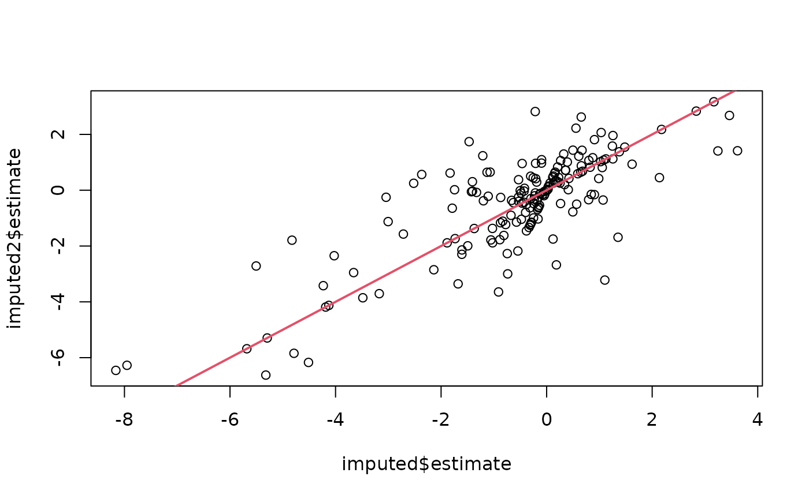
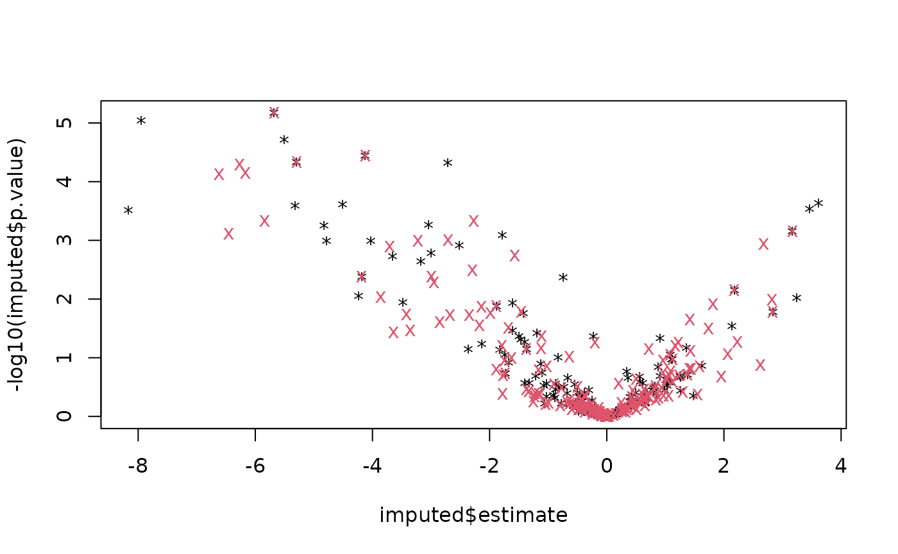

# Impute data using limit of detection (LOD)

This vignette contains experimental code.

## Example using prolfqua::MissingHelpers class

``` r
dd <- prolfqua::sim_lfq_data_protein_config(Nprot = 100,weight_missing = 2)
```

    ## Registered S3 method overwritten by 'prolfqua':
    ##   method         from    
    ##   print.pheatmap pheatmap

    ## creating sampleName from fileName column

    ## completing cases

    ## completing cases done

    ## setup done

``` r
dd$data$abundance |> is.na() |> sum()
```

    ## [1] 552

``` r
contr_spec <- c("dilution.b-a" = "group_A - group_B", "dilution.c-e" = "group_A - group_Ctrl")
mh1 <- prolfqua::MissingHelpers$new(dd$data, dd$config, prob = 0.5,weighted = TRUE)
imputed <- mh1$get_contrasts(Contrasts = contr_spec)
```

    ## completing cases

    ## dilution.b-a=group_A - group_B

    ## dilution.c-e=group_A - group_Ctrl

    ## dilution.b-a=group_A - group_B

    ## dilution.c-e=group_A - group_Ctrl

    ## dilution.b-a=group_A - group_B

    ## dilution.c-e=group_A - group_Ctrl

``` r
mh2 <- prolfqua::MissingHelpers$new(dd$data, dd$config, prob = 0.5,weighted = FALSE)
imputed2 <- mh2$get_contrasts(Contrasts = contr_spec)
```

    ## completing cases

    ## dilution.b-a=group_A - group_B

    ## dilution.c-e=group_A - group_Ctrl

    ## dilution.b-a=group_A - group_B

    ## dilution.c-e=group_A - group_Ctrl

    ## dilution.b-a=group_A - group_B

    ## dilution.c-e=group_A - group_Ctrl

``` r
plot(imputed$estimate, imputed2$estimate)
abline(0 , 1 , col=2 , lwd=2)
```



``` r
mh1$get_LOD()
```

    ##      50% 
    ## 18.13636

``` r
plot( imputed$estimate, -log10(imputed$p.value), pch = "*" )
points(imputed2$estimate, -log10(imputed2$p.value), col = 2, pch = "x")
```



### Modelling with linear models

Model with missing data

``` r
modelName <- "f_condtion_r_peptide"
formula_Protein <-
  prolfqua::strategy_lm("abundance  ~ group_",
              model_name = modelName)


mod <- prolfqua::build_model(
  dd$data,
  formula_Protein,
  modelName = modelName,
  subject_Id = dd$config$hierarchy_keys_depth())
```

    ## Warning: There were 11 warnings in `dplyr::mutate()`.
    ## The first warning was:
    ## ℹ In argument: `linear_model = purrr::map(data, model_strategy$model_fun, pb =
    ##   pb)`.
    ## ℹ In group 18: `protein_Id = "DoWup2~8058"`.
    ## Caused by warning in `value[[3L]]()`:
    ## ! WARN :Error in `contrasts<-`(`*tmp*`, value = contr.funs[1 + isOF[nn]]): contrasts can be applied only to factors with 2 or more levels
    ## ℹ Run `dplyr::last_dplyr_warnings()` to see the 10 remaining warnings.

``` r
mod$modelDF
```

    ## # A tibble: 100 × 9
    ## # Groups:   protein_Id [100]
    ##    protein_Id  data     linear_model has_model_fit isSingular df.residual sigma
    ##    <chr>       <list>   <list>       <lgl>         <lgl>            <dbl> <dbl>
    ##  1 0EfVhX~3967 <tibble> <lm>         TRUE          FALSE                6 1.22 
    ##  2 0m5WN4~6025 <tibble> <lm>         TRUE          FALSE                4 0.447
    ##  3 0YSKpy~2865 <tibble> <lm>         TRUE          TRUE                 1 1.55 
    ##  4 3QLHfm~8938 <tibble> <lm>         TRUE          FALSE                7 0.923
    ##  5 3QYop0~7543 <tibble> <lm>         TRUE          FALSE                7 0.808
    ##  6 76k03k~7094 <tibble> <lm>         TRUE          FALSE                8 1.09 
    ##  7 7cbcrd~7351 <tibble> <lm>         TRUE          FALSE                9 0.889
    ##  8 7QuTub~1867 <tibble> <lm>         TRUE          FALSE                6 0.644
    ##  9 7soopj~5352 <tibble> <lm>         TRUE          FALSE                3 0.920
    ## 10 7zeekV~7127 <tibble> <lm>         TRUE          FALSE                6 1.06 
    ## # ℹ 90 more rows
    ## # ℹ 2 more variables: nr_coef <int>, nr_coef_not_NA <int>

``` r
mod$modelDF$nr_coef_not_NA |> table()
```

    ## 
    ##  2  3 
    ## 15 74

``` r
mod$modelDF$isSingular |> table()
```

    ## 
    ## FALSE  TRUE 
    ##    69    20

``` r
mod$modelDF |> nrow()
```

    ## [1] 100

``` r
mod$get_anova()
```

    ## # A tibble: 69 × 10
    ##    protein_Id  factor    Df Sum.Sq Mean.Sq F.value  p.value isSingular nr_coef
    ##    <chr>       <chr>  <int>  <dbl>   <dbl>   <dbl>    <dbl> <lgl>        <int>
    ##  1 0EfVhX~3967 group_     2 16.1     8.04    5.39  0.0457   FALSE            3
    ##  2 0m5WN4~6025 group_     2 37.9    18.9    94.9   0.000426 FALSE            3
    ##  3 3QLHfm~8938 group_     2  3.90    1.95    2.29  0.172    FALSE            3
    ##  4 3QYop0~7543 group_     2  4.44    2.22    3.40  0.0932   FALSE            3
    ##  5 76k03k~7094 group_     2  2.11    1.05    0.891 0.448    FALSE            3
    ##  6 7cbcrd~7351 group_     2 21.0    10.5    13.3   0.00205  FALSE            3
    ##  7 7QuTub~1867 group_     2 14.1     7.04   17.0   0.00338  FALSE            3
    ##  8 7zeekV~7127 group_     2  0.425   0.212   0.189 0.832    FALSE            3
    ##  9 9VUkAq~9664 group_     2  7.50    3.75   11.8   0.0128   FALSE            3
    ## 10 At886V~1021 group_     2 46.3    23.2    49.4   0.00151  FALSE            3
    ## # ℹ 59 more rows
    ## # ℹ 1 more variable: FDR <dbl>

``` r
prolfqua::model_summary(mod)
```

    ## $exists
    ## 
    ## FALSE  TRUE 
    ##    11    89 
    ## 
    ## $isSingular
    ## 
    ## FALSE  TRUE 
    ##    69    20

``` r
maxcoef <- max(mod$modelDF$nr_coef_not_NA, na.rm = TRUE)
goodmods <- mod$modelDF |> dplyr::filter(isSingular == FALSE, has_model_fit == TRUE, nr_coef_not_NA == maxcoef)

dim(goodmods)
```

    ## [1] 61  9

``` r
xx <- lapply(goodmods$linear_model, vcov)
nr <- sapply(xx, nrow)
nr |> table()
```

    ## nr
    ##  3 
    ## 61

``` r
nr <- sapply(xx, ncol)
nr |> table()
```

    ## nr
    ##  3 
    ## 61

``` r
sum_matrix <- Reduce(`+`, xx)
sum_matrix/length(xx)
```

    ##             (Intercept)    group_B group_Ctrl
    ## (Intercept)   0.4317112 -0.4317112 -0.4317112
    ## group_B      -0.4317112  0.7569259  0.4317112
    ## group_Ctrl   -0.4317112  0.4317112  0.8485382

## Model with lod imputation

``` r
loddata <- dd$data

loddata <- loddata |> dplyr::mutate(abundance = ifelse(is.na(abundance), mh1$get_LOD(), abundance))
modI <- prolfqua::build_model(
  loddata,
  formula_Protein,
  modelName = modelName,
  subject_Id = dd$config$hierarchy_keys_depth())


modI$modelDF$nr_coef_not_NA |> table()
```

    ## 
    ##   3 
    ## 100

``` r
modI$modelDF$isSingular |> table()
```

    ## 
    ## FALSE 
    ##   100

``` r
modI$modelDF |> nrow()
```

    ## [1] 100

``` r
allModels <- modI$modelDF$linear_model

xx <- lapply(allModels, vcov)
sum_matrix <- Reduce(`+`, xx)
sum_matrix/length(xx)
```

    ##             (Intercept)    group_B group_Ctrl
    ## (Intercept)   0.4759103 -0.4759103 -0.4759103
    ## group_B      -0.4759103  0.9518206  0.4759103
    ## group_Ctrl   -0.4759103  0.4759103  0.9518206

``` r
m <- (modI$modelDF$linear_model[[1]])
df.residual(m)
```

    ## [1] 9

``` r
sigma(m)
```

    ## [1] 1.222678

``` r
vcov(m)
```

    ##             (Intercept)    group_B group_Ctrl
    ## (Intercept)   0.3737352 -0.3737352 -0.3737352
    ## group_B      -0.3737352  0.7474704  0.3737352
    ## group_Ctrl   -0.3737352  0.3737352  0.7474704
