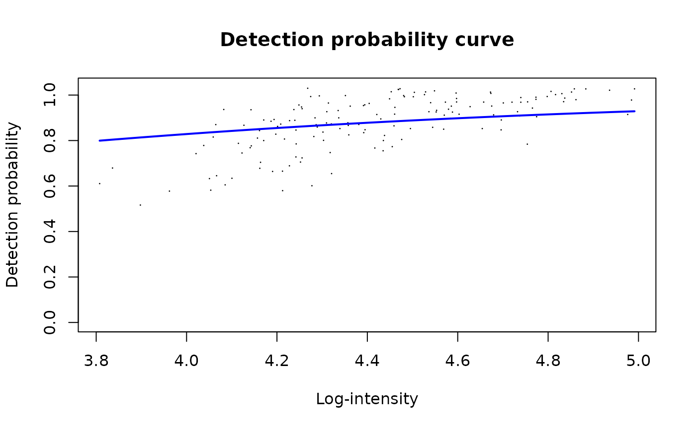
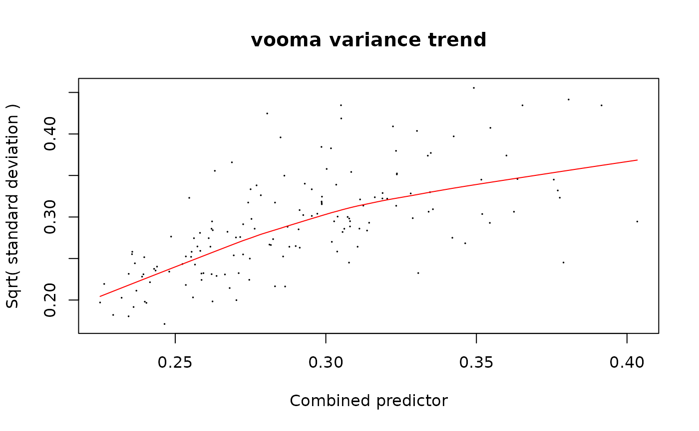
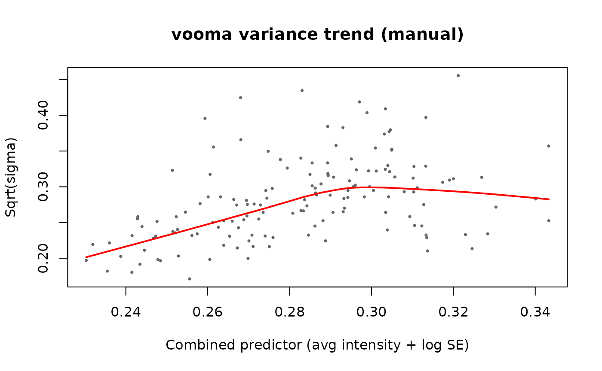
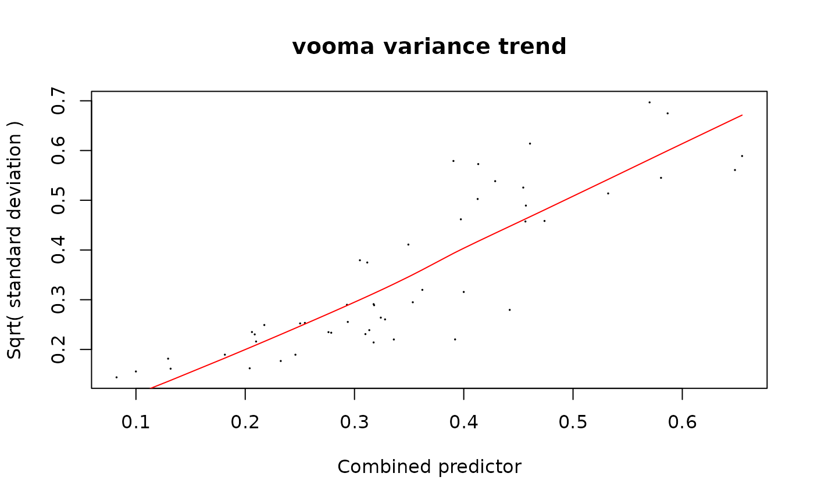

# Using limpa Directly on prolfqua Simulated Data

This vignette demonstrates how to use the **limpa** package directly
(without prolfqua wrappers) on peptide-level data simulated with
prolfqua. Three analyses are shown:

1.  **Baseline: limma with NAs** — standard limma on protein-level
    medpolish-aggregated data (NAs dropped)
2.  **limpa peptide-level** — differential expression at the peptide
    level (no protein aggregation)
3.  **limpa protein-level** — limpa aggregates peptides to proteins via
    [`dpcQuant()`](https://rdrr.io/pkg/limpa/man/dpcQuant.html), then
    tests for DE

### Setup and Data Simulation

``` r
library(prolfqua)
library(limpa)
library(limma)
```

Simulate peptide-level data with 3 groups (Ctrl, A, B), 5 replicates per
group, and 50 proteins with realistic missing values.

``` r
sim <- prolfqua::sim_lfq_data_peptide_config(
  Nprot = 50, N = 5, with_missing = TRUE, seed = 1234
)
lfqdata <- prolfqua::LFQData$new(sim$data, sim$config)
```

Log2-transform and pivot to a wide matrix (peptides x samples) for
limpa.

``` r
lfqdata <- lfqdata$get_Transformer()$log2()$lfq
wide <- lfqdata$data_wide(as.matrix = TRUE)

expr_matrix <- wide$data
annotation <- wide$annotation
rowdata <- wide$rowdata

cat("Matrix dimensions:", nrow(expr_matrix), "peptides x", ncol(expr_matrix), "samples\n")
```

    ## Matrix dimensions: 152 peptides x 15 samples

``` r
cat("Missing values:", sum(is.na(expr_matrix)), "of", length(expr_matrix),
    sprintf("(%.1f%%)\n", 100 * sum(is.na(expr_matrix)) / length(expr_matrix)))
```

    ## Missing values: 278 of 2280 (12.2%)

``` r
cat("Proteins:", length(unique(rowdata$protein_Id)), "\n")
```

    ## Proteins: 50

### Design Matrix and Contrasts

All analyses below use the same design matrix: a cell-means model with
three groups.

``` r
group <- factor(annotation$group_, levels = c("Ctrl", "A", "B"))
design <- stats::model.matrix(~ 0 + group)
colnames(design) <- levels(group)

cont_matrix <- limma::makeContrasts(
  A_vs_Ctrl = A - Ctrl,
  B_vs_Ctrl = B - Ctrl,
  levels = design
)
```

### Baseline: Standard limma Analysis (no limpa)

As a baseline, aggregate peptides to proteins using prolfqua’s medpolish
aggregator, then run a plain
[`limma::lmFit()`](https://rdrr.io/pkg/limma/man/lmFit.html) +
[`eBayes()`](https://rdrr.io/pkg/limma/man/ebayes.html) analysis. NAs
are simply ignored by limma.

``` r
lfqdata_protein <- lfqdata$get_Aggregator()$aggregate()
wide_prot <- lfqdata_protein$data_wide(as.matrix = TRUE)
expr_protein_baseline <- wide_prot$data

cat("Protein matrix:", nrow(expr_protein_baseline), "proteins x",
    ncol(expr_protein_baseline), "samples\n")
```

    ## Protein matrix: 50 proteins x 15 samples

``` r
cat("NAs in protein matrix:", sum(is.na(expr_protein_baseline)), "\n")
```

    ## NAs in protein matrix: 48

Fit limma. `lmFit` handles NAs by fitting each protein on its available
samples only.

``` r
fit_baseline <- limma::lmFit(expr_protein_baseline, design)
fit_baseline <- limma::contrasts.fit(fit_baseline, cont_matrix)
fit_baseline <- limma::eBayes(fit_baseline)

results_baseline_A <- limma::topTable(fit_baseline, coef = "A_vs_Ctrl", number = Inf, sort.by = "none")
cat("Baseline limma — A vs Ctrl: ", sum(results_baseline_A$adj.P.Val < 0.05),
    "significant proteins at FDR < 0.05\n")
```

    ## Baseline limma — A vs Ctrl:  40 significant proteins at FDR < 0.05

``` r
results_baseline_B <- limma::topTable(fit_baseline, coef = "B_vs_Ctrl", number = Inf, sort.by = "none")
cat("Baseline limma — B vs Ctrl: ", sum(results_baseline_B$adj.P.Val < 0.05),
    "significant proteins at FDR < 0.05\n")
```

    ## Baseline limma — B vs Ctrl:  36 significant proteins at FDR < 0.05

### Estimate the Detection Probability Curve (DPC)

The DPC models the probability of observing a peptide as a logit-linear
function of its intensity:
`logit P(detected) = beta0 + beta1 * intensity`. This is a global
parameter estimated once from the entire peptide-level dataset.

- `beta1` (slope) controls the strength of intensity-dependent
  missingness: 0 = MCAR, large = MNAR
- `beta0` (intercept) shifts the detection probability curve left/right

``` r
dpc_est <- limpa::dpc(expr_matrix)
cat("DPC parameters: beta0 =", round(dpc_est$dpc[1], 3),
    ", beta1 =", round(dpc_est$dpc[2], 3), "\n")
```

    ## DPC parameters: beta0 = -2.424 , beta1 = 1

``` r
limpa::plotDPC(dpc_est)
```



### Example 1: Peptide-Level Analysis with limpa

#### Quantify peptides with `dpcQuantByRow()`

[`dpcQuantByRow()`](https://rdrr.io/pkg/limpa/man/dpcQuant.html)
quantifies each peptide row independently (no protein aggregation).
Internally it calls
[`peptides2Proteins()`](https://rdrr.io/pkg/limpa/man/peptide2Proteins.html)
with each row as its own “protein” (using
`protein.id = seq_len(nrow(y))`). Missing values are not filled in with
fabricated numbers — instead, Bayesian maximum posterior estimation
integrates over the missing values using the DPC.

``` r
y_peptide <- limpa::dpcQuantByRow(expr_matrix, dpc = dpc_est)
```

The result is a limma `EList` object. Let’s inspect its structure:

``` r
cat("Class:", class(y_peptide), "\n")
```

    ## Class: EList

``` r
cat("Slots:", names(y_peptide), "\n\n")
```

    ## Slots: E genes other dpc

``` r
cat("$E — expression matrix (peptides x samples), no NAs:\n")
```

    ## $E — expression matrix (peptides x samples), no NAs:

``` r
cat("  dim:", dim(y_peptide$E), "\n")
```

    ##   dim: 152 15

``` r
cat("  NAs:", sum(is.na(y_peptide$E)), "\n")
```

    ##   NAs: 0

``` r
cat("  range:", round(range(y_peptide$E), 2), "\n\n")
```

    ##   range: 3.28 5.5

``` r
cat("$genes — per-peptide annotation:\n")
```

    ## $genes — per-peptide annotation:

``` r
str(y_peptide$genes)
```

    ## 'data.frame':    152 obs. of  1 variable:
    ##  $ PropObs: num  0.733 0.667 0.8 0.867 0.8 ...

``` r
cat("\n")
```

``` r
cat("$other — additional matrices:\n")
```

    ## $other — additional matrices:

``` r
cat("  names:", names(y_peptide$other), "\n")
```

    ##   names: n.observations standard.error

``` r
cat("  $n.observations — how many precursors were observed per row per sample:\n")
```

    ##   $n.observations — how many precursors were observed per row per sample:

``` r
cat("    range:", range(y_peptide$other$n.observations), "\n")
```

    ##     range: 0 1

``` r
cat("  $standard.error — posterior SD of the quantification:\n")
```

    ##   $standard.error — posterior SD of the quantification:

``` r
cat("    range:", round(range(y_peptide$other$standard.error), 4), "\n\n")
```

    ##     range: 0.01 0.3354

``` r
cat("$dpc — the DPC parameters used:\n")
```

    ## $dpc — the DPC parameters used:

``` r
print(y_peptide$dpc)
```

    ##     beta0     beta1 
    ## -2.424456  1.000000

**Key fields:**

- `$E`: The quantified expression matrix. All NAs from the input have
  been replaced by maximum posterior estimates (integrating over the
  DPC). This is a complete matrix.
- `$other$standard.error`: Per-peptide, per-sample posterior standard
  deviations. Peptides that were missing get larger SEs. This
  uncertainty is what limpa propagates into the DE model.
- `$other$n.observations`: How many observations contributed (1 =
  observed, 0 = was missing).
- `$genes$PropObs`: Proportion of samples where the peptide was
  observed.

#### Fit the DE model with `dpcDE()`

[`dpcDE()`](https://rdrr.io/pkg/limpa/man/dpcDE.html) is a thin wrapper
(9 lines of code) that calls
[`voomaLmFitWithImputation()`](https://rdrr.io/pkg/limpa/man/voomaLmFitWithImputation.html).
Here is what it passes and why:

``` r
# From limpa/R/dpcDE.R:
dpcDE <- function(y, design, plot=TRUE, ...) {
  eps <- 1e-6
  voomaLmFitWithImputation(
    y         = y,                              # EList with $E and $other
    imputed   = !y$other$n.observations,        # logical matrix: TRUE where value was missing
    design    = design,                         # design matrix
    predictor = log(y$other$standard.error+eps),# log(SE) as precision predictor
    plot      = plot,
    ...
  )
}
```

**Why vooma when SEs are already estimated?**

The SEs from
[`dpcQuantByRow()`](https://rdrr.io/pkg/limpa/man/dpcQuant.html)/[`dpcQuant()`](https://rdrr.io/pkg/limpa/man/dpcQuant.html)
are *per-observation* quantification uncertainties. But limma needs
*observation-level precision weights* for the linear model.
[`voomaLmFitWithImputation()`](https://rdrr.io/pkg/limpa/man/voomaLmFitWithImputation.html)
converts the SEs into proper weights via a **bivariate lowess trend**:

1.  Fit an initial [`lmFit()`](https://rdrr.io/pkg/limma/man/lmFit.html)
    to get per-protein residual SDs (`sigma`)
2.  Model `sqrt(sigma) ~ average_intensity + log(SE)` using a bivariate
    linear predictor
3.  Smooth with lowess to get a mean-variance trend function `f()`
4.  Compute weights as `w = 1/f(fitted_value)^4` — inverse fourth power
    of the predicted SD

This is analogous to how `voom` converts RNA-seq counts into weights via
a mean-variance trend, but extended with a second predictor (the SE from
quantification). The two predictors capture different variance sources:

- **Average intensity**: the classical mean-variance relationship in
  proteomics
- **log(SE)**: additional variance from quantification uncertainty (more
  missing precursors = larger SE = lower weight)

Additionally,
[`voomaLmFitWithImputation()`](https://rdrr.io/pkg/limpa/man/voomaLmFitWithImputation.html)
corrects residual degrees of freedom for proteins where entire groups
were missing (all values imputed), preventing overconfident inference.

``` r
fit_pep <- limpa::dpcDE(y_peptide, design, plot = TRUE)
```



``` r
fit_pep <- limma::eBayes(fit_pep)
```

The plot shows `sqrt(sigma)` vs the combined predictor (average
intensity + log SE). The red line is the lowess trend used to derive
precision weights.

#### Test contrasts

``` r
fit_pep2 <- limma::contrasts.fit(fit_pep, cont_matrix)
fit_pep2 <- limma::eBayes(fit_pep2)
```

Results for A vs Ctrl at peptide level:

``` r
results_pep_A <- limma::topTable(fit_pep2, coef = "A_vs_Ctrl", number = 10, sort.by = "P")
print(results_pep_A)
```

    ##                                      PropObs      logFC  AveExpr         t
    ## 9VUkAq~8655~lfq~MuiCBcCu~lfq~light 1.0000000 -0.8851463 4.898474 -25.27012
    ## 7QuTub~5556~lfq~YmC8HPCi~lfq~light 0.8666667  0.9350267 4.727822  21.12259
    ## 9VUkAq~8655~lfq~JBvPc2qc~lfq~light 1.0000000  0.6970139 4.821333  20.11020
    ## 76k03k~9735~lfq~HZbAVyOK~lfq~light 1.0000000 -0.8821452 4.544532 -18.87531
    ## 9VUkAq~8655~lfq~SGFBeD1f~lfq~light 1.0000000  0.6462590 4.720641  18.42412
    ## ydeWJl~7145~lfq~39NMZpix~lfq~light 1.0000000  0.5177794 5.040518  17.54125
    ## JV3Z7t~7426~lfq~IpbWaJdN~lfq~light 0.9333333 -0.7605254 4.500164 -16.37530
    ## R2i6w7~5452~lfq~KFwoIdLY~lfq~light 0.8666667 -0.5710462 4.594583 -16.27149
    ## ZHBkZv~6720~lfq~eKM49i6K~lfq~light 1.0000000 -0.5051761 4.933688 -15.79546
    ## I1Jk2Z~7286~lfq~TKuvSqs3~lfq~light 0.8666667 -0.6480346 4.548221 -15.31439
    ##                                         P.Value    adj.P.Val        B
    ## 9VUkAq~8655~lfq~MuiCBcCu~lfq~light 2.474814e-24 3.761718e-22 45.50105
    ## 7QuTub~5556~lfq~YmC8HPCi~lfq~light 9.921774e-22 7.540549e-20 39.52930
    ## 9VUkAq~8655~lfq~JBvPc2qc~lfq~light 4.999951e-21 2.533308e-19 37.85792
    ## 76k03k~9735~lfq~HZbAVyOK~lfq~light 3.955088e-20 1.502933e-18 35.85932
    ## 9VUkAq~8655~lfq~SGFBeD1f~lfq~light 8.659287e-20 2.632423e-18 35.04942
    ## ydeWJl~7145~lfq~39NMZpix~lfq~light 4.202532e-19 1.064641e-17 33.32434
    ## JV3Z7t~7426~lfq~IpbWaJdN~lfq~light 3.740607e-18 8.122461e-17 31.31191
    ## R2i6w7~5452~lfq~KFwoIdLY~lfq~light 4.570919e-18 8.684746e-17 31.04096
    ## ZHBkZv~6720~lfq~eKM49i6K~lfq~light 1.160866e-17 1.960574e-16 30.03217
    ## I1Jk2Z~7286~lfq~TKuvSqs3~lfq~light 3.043369e-17 4.625921e-16 29.12106

Results for B vs Ctrl at peptide level:

``` r
results_pep_B <- limma::topTable(fit_pep2, coef = "B_vs_Ctrl", number = 10, sort.by = "P")
print(results_pep_B)
```

    ##                                      PropObs      logFC  AveExpr         t
    ## 9VUkAq~8655~lfq~40DK097A~lfq~light 0.9333333  1.0947462 4.809034  25.61456
    ## 9VUkAq~8655~lfq~MuiCBcCu~lfq~light 1.0000000 -0.6794121 4.898474 -21.57928
    ## MlNn1V~1396~lfq~PioauYsp~lfq~light 1.0000000 -0.6125184 4.818538 -18.95112
    ## I1Jk2Z~7286~lfq~TKuvSqs3~lfq~light 0.8666667 -0.8846547 4.548221 -17.11230
    ## 9VUkAq~8655~lfq~SGFBeD1f~lfq~light 1.0000000  0.5633911 4.720641  15.73300
    ## 7QuTub~5556~lfq~O5eT1xAS~lfq~light 1.0000000  0.6513203 4.574564  15.39969
    ## Fl4JiV~6934~lfq~tjP5Q817~lfq~light 0.8666667  0.5837830 4.719694  15.16521
    ## 7soopj~3451~lfq~WkbauTR1~lfq~light 1.0000000  0.4407287 4.899098  15.16147
    ## JcKVfU~1514~lfq~mCsMGaAU~lfq~light 1.0000000  0.6780110 4.330367  14.77820
    ## SGIVBl~4918~lfq~U6LlOS6x~lfq~light 0.8000000  0.8278659 4.200734  14.57807
    ##                                         P.Value    adj.P.Val        B
    ## 9VUkAq~8655~lfq~40DK097A~lfq~light 1.566024e-24 2.380356e-22 45.95730
    ## 9VUkAq~8655~lfq~MuiCBcCu~lfq~light 4.887857e-22 3.714772e-20 40.10657
    ## MlNn1V~1396~lfq~PioauYsp~lfq~light 3.472411e-20 1.759355e-18 35.84954
    ## I1Jk2Z~7286~lfq~TKuvSqs3~lfq~light 9.265355e-19 3.520835e-17 32.67289
    ## 9VUkAq~8655~lfq~SGFBeD1f~lfq~light 1.313960e-17 3.994439e-16 29.93253
    ## 7QuTub~5556~lfq~O5eT1xAS~lfq~light 2.561092e-17 6.488101e-16 29.18613
    ## Fl4JiV~6934~lfq~tjP5Q817~lfq~light 4.122372e-17 7.892554e-16 28.73952
    ## 7soopj~3451~lfq~WkbauTR1~lfq~light 4.153976e-17 7.892554e-16 28.59601
    ## JcKVfU~1514~lfq~mCsMGaAU~lfq~light 9.152959e-17 1.545833e-15 28.01480
    ## SGIVBl~4918~lfq~U6LlOS6x~lfq~light 1.390940e-16 2.114228e-15 27.68235

Summary of significant peptides (FDR \< 0.05):

``` r
res_all_pep <- limma::topTable(fit_pep2, coef = "A_vs_Ctrl", number = Inf, sort.by = "none")
cat("A vs Ctrl: ", sum(res_all_pep$adj.P.Val < 0.05), "significant peptides at FDR < 0.05\n")
```

    ## A vs Ctrl:  122 significant peptides at FDR < 0.05

``` r
res_all_pep_B <- limma::topTable(fit_pep2, coef = "B_vs_Ctrl", number = Inf, sort.by = "none")
cat("B vs Ctrl: ", sum(res_all_pep_B$adj.P.Val < 0.05), "significant peptides at FDR < 0.05\n")
```

    ## B vs Ctrl:  115 significant peptides at FDR < 0.05

### Low-Level API: Step-by-Step Peptide Analysis

This section decomposes the limpa pipeline into individual function
calls, showing exactly what happens at each stage. We reuse the same
`expr_matrix`, `dpc_est`, and `design` from above.

#### Step 1: Estimate the DPC

Already done above, but for completeness:

``` r
dpc_est <- limpa::dpc(expr_matrix)
cat("DPC: beta0 =", round(dpc_est$dpc["beta0"], 3),
    ", beta1 =", round(dpc_est$dpc["beta1"], 3), "\n")
```

    ## DPC: beta0 = -2.424 , beta1 = 1

The [`dpc()`](https://rdrr.io/pkg/limpa/man/dpc.html) return value also
contains hyperparameters estimated from the data:

``` r
format_dpc_hyperparameter <- function(dpc_result, field) {
  value <- dpc_result[[field]]
  if (is.numeric(value) && length(value) == 1 && !is.na(value)) {
    return(round(value, 3))
  }
  "not available"
}

cat("mu.prior  (prior mean of row means):", format_dpc_hyperparameter(dpc_est, "mu.prior"), "\n")
```

    ## mu.prior  (prior mean of row means): 4.448

``` r
cat("df.prior  (prior df for variance):", format_dpc_hyperparameter(dpc_est, "df.prior"), "\n")
```

    ## df.prior  (prior df for variance): 3.48

``` r
cat("s2.prior  (prior variance):", format_dpc_hyperparameter(dpc_est, "s2.prior"), "\n")
```

    ## s2.prior  (prior variance): 0.032

#### Step 2: Quantify peptides (row-level, no aggregation)

[`dpcQuantByRow()`](https://rdrr.io/pkg/limpa/man/dpcQuant.html) calls
[`peptides2Proteins()`](https://rdrr.io/pkg/limpa/man/peptide2Proteins.html)
internally, treating each row as its own “protein” (i.e.,
`protein.id = 1:nrow(y)`). The result is an `EList`:

``` r
y_pep <- limpa::dpcQuantByRow(expr_matrix, dpc = dpc_est)
```

#### Step 3: Prepare inputs for the variance model

[`dpcDE()`](https://rdrr.io/pkg/limpa/man/dpcDE.html) is just 3 lines.
Here we do what it does manually:

``` r
# Logical matrix: TRUE where the original value was missing
imputed_matrix <- !y_pep$other$n.observations

cat("Imputed values:", sum(imputed_matrix), "of", length(imputed_matrix), "\n")
```

    ## Imputed values: 278 of 2280

``` r
# Log(SE) as a precision predictor for the variance trend
eps <- 1e-6
predictor <- log(y_pep$other$standard.error + eps)

cat("Predictor (log SE) range:", round(range(predictor), 2), "\n")
```

    ## Predictor (log SE) range: -4.61 -1.09

#### Step 4: What `voomaLmFitWithImputation()` does internally

Below we manually replicate the internals of
[`voomaLmFitWithImputation()`](https://rdrr.io/pkg/limpa/man/voomaLmFitWithImputation.html).
This is the core of limpa’s DE pipeline.

##### Step 4a: Initial linear model fit (unweighted)

First, fit a standard
[`lmFit()`](https://rdrr.io/pkg/limma/man/lmFit.html) without any
precision weights. This gives per-peptide residual standard deviations
(`sigma`) and fitted values.

``` r
fit0 <- limma::lmFit(y_pep, design)

cat("Initial fit — unweighted:\n")
```

    ## Initial fit — unweighted:

``` r
cat("  Coefficients:", dim(fit0$coefficients), "(peptides x groups)\n")
```

    ##   Coefficients: 152 3 (peptides x groups)

``` r
cat("  Sigma range:", round(range(fit0$sigma), 4), "\n")
```

    ##   Sigma range: 0.0293 0.2075

``` r
cat("  df.residual:", unique(fit0$df.residual), "\n")
```

    ##   df.residual: 12

``` r
# Compute per-observation fitted values (peptides x samples)
fitted_values <- fit0$coefficients %*% t(fit0$design)
cat("  Fitted values:", dim(fitted_values), "\n")
```

    ##   Fitted values: 152 15

##### Step 4b: DF correction for fully imputed groups

If a peptide has ALL values imputed within a design-matrix group, its
fitted value for that group is determined entirely by imputed data — so
the residual df should be reduced. This uses the hat matrix to detect
such cases.

``` r
h <- 1 - hat(design)  # leverage complement per sample
df_imputed <- imputed_matrix %*% (1 - h)  # effective imputed df per peptide

n_affected <- sum(df_imputed > 0.9999)
cat("Peptides with fully-imputed groups:", n_affected, "\n")
```

    ## Peptides with fully-imputed groups: 16

``` r
# For affected peptides, refit on observed-only data to get corrected sigma/df
if (n_affected > 0) {
  affected_idx <- which(rowSums(df_imputed > 0.9999) > 0)
  E_affected <- y_pep$E[affected_idx, , drop = FALSE]
  E_affected_NA <- E_affected
  E_affected_NA[imputed_matrix[affected_idx, , drop = FALSE]] <- NA
  fit_NA <- suppressWarnings(limma::lmFit(E_affected_NA, design))

  cat("Corrected df.residual for affected peptides:", fit_NA$df.residual[1:min(5, length(fit_NA$df.residual))], "\n")

  # Replace sigma and df for affected rows
  fit0$sigma[affected_idx] <- fit_NA$sigma
  fit0$df.residual[affected_idx] <- fit_NA$df.residual
}
```

    ## Corrected df.residual for affected peptides: 7 7 6 7 6

##### Step 4c: Bivariate linear predictor (average intensity + log SE)

This is the key innovation over standard `vooma`. Instead of modelling
variance as a function of average intensity alone, limpa uses TWO
predictors:

- `sx` = average log2 expression per peptide (classical mean-variance
  axis)
- `sxc` = average log(SE) per peptide (quantification uncertainty axis)

A linear model `sqrt(sigma) ~ sx + sxc` combines them into a single
predictor.

``` r
# Average expression per peptide
sx <- rowMeans(y_pep$E, na.rm = TRUE)

# Residual SD (square root for the variance trend)
sy <- sqrt(fit0$sigma)

# Average log(SE) per peptide — the precision predictor
sxc <- rowMeans(predictor, na.rm = TRUE)

# Bivariate linear model: sqrt(sigma) ~ 1 + avg_intensity + avg_log_SE
vartrend <- lm.fit(cbind(1, sx, sxc), sy)
beta <- coef(vartrend)
cat("Variance trend coefficients:\n")
```

    ## Variance trend coefficients:

``` r
cat("  Intercept:", round(beta[1], 4), "\n")
```

    ##   Intercept: 0.6832

``` r
cat("  avg_intensity:", round(beta[2], 4), "\n")
```

    ##   avg_intensity: -0.0789

``` r
cat("  avg_log_SE:", round(beta[3], 4),
    ifelse(beta[3] > 0, " (higher SE → higher variance, as expected)", ""), "\n")
```

    ##   avg_log_SE: 0.0119  (higher SE → higher variance, as expected)

``` r
# Combined predictor (per-peptide summary for the lowess x-axis)
sx_combined <- vartrend$fitted.values

# Per-observation combined predictor (for computing weights later)
mu_combined <- beta[1] + beta[2] * fitted_values + beta[3] * predictor
```

##### Step 4d: Lowess smoothing of the variance trend

Smooth the `sqrt(sigma) ~ combined_predictor` relationship with lowess.
The smoothed trend function `f()` will be used to derive weights.

``` r
span <- limma::chooseLowessSpan(nrow(y_pep), small.n = 50, min.span = 0.3, power = 1/3)
cat("Lowess span:", round(span, 3), "\n")
```

    ## Lowess span: 0.783

``` r
l <- lowess(sx_combined, sy, f = span)

# Plot the trend
plot(sx_combined, sy,
     xlab = "Combined predictor (avg intensity + log SE)",
     ylab = "Sqrt(sigma)",
     pch = 16, cex = 0.5, col = "grey40",
     main = "vooma variance trend (manual)")
lines(l, col = "red", lwd = 2)
```



##### Step 4e: Derive precision weights

The lowess trend gives a function `f()` that predicts `sqrt(sigma)` from
the combined predictor. Weights are the inverse fourth power:
`w = 1/f(mu)^4`. This means observations with higher predicted variance
get lower weight.

``` r
# Interpolating function from the lowess fit
f_trend <- approxfun(l, rule = 2, ties = list("ordered", mean))

# Per-observation weights: 1/f(mu_ij)^4
w_manual <- 1 / f_trend(mu_combined)^4
dim(w_manual) <- dim(y_pep$E)

cat("Weights matrix:", dim(w_manual), "\n")
```

    ## Weights matrix: 152 15

``` r
cat("Weight range:", round(range(w_manual), 2), "\n")
```

    ## Weight range: 124.89 606.68

``` r
cat("Weight median:", round(median(w_manual), 2), "\n")
```

    ## Weight median: 165.13

``` r
# Show how weights relate to missingness
cat("\nMean weight for observed values:", round(mean(w_manual[!imputed_matrix]), 2), "\n")
```

    ## 
    ## Mean weight for observed values: 237.64

``` r
cat("Mean weight for imputed values:", round(mean(w_manual[imputed_matrix]), 2), "\n")
```

    ## Mean weight for imputed values: 150.99

Imputed values get systematically lower weights because they have larger
SEs, which pushes them to the high-variance end of the trend.

##### Step 4f: Final weighted linear model fit

Refit [`lmFit()`](https://rdrr.io/pkg/limma/man/lmFit.html) using the
vooma weights. This is the final model — coefficients now reflect
precision-weighted estimates.

``` r
fit_vooma <- limma::lmFit(y_pep, design, weights = w_manual)

# Re-apply DF correction for affected peptides
if (n_affected > 0) {
  fit_NA_w <- suppressWarnings(limma::lmFit(E_affected_NA, design,
                                            weights = w_manual[affected_idx, , drop = FALSE]))
  fit_vooma$sigma[affected_idx] <- fit_NA_w$sigma
  fit_vooma$df.residual[affected_idx] <- fit_NA_w$df.residual
}

cat("Final weighted fit:\n")
```

    ## Final weighted fit:

``` r
cat("  Sigma range:", round(range(fit_vooma$sigma), 4), "\n")
```

    ##   Sigma range: 0.439 2.5172

``` r
cat("  df.residual range:", range(fit_vooma$df.residual), "\n")
```

    ##   df.residual range: 5 12

At this point `fit_vooma` is an `MArrayLM` with precision-weighted
coefficient estimates but no empirical Bayes moderation yet.

#### Step 5: Empirical Bayes moderation with `eBayes()`

[`eBayes()`](https://rdrr.io/pkg/limma/man/ebayes.html) shrinks the
per-peptide variance estimates toward a common prior, producing
moderated t-statistics with increased degrees of freedom:

``` r
fit_eb <- limma::eBayes(fit_vooma)

cat("Before eBayes — df.residual[1:5]:", fit_vooma$df.residual[1:5], "\n")
```

    ## Before eBayes — df.residual[1:5]: 12 7 12 12 12

``` r
cat("After eBayes  — df.total[1:5]:   ", fit_eb$df.total[1:5], "\n")
```

    ## After eBayes  — df.total[1:5]:    21.92524 16.92524 21.92524 21.92524 21.92524

``` r
cat("Prior df (df.prior):", round(fit_eb$df.prior, 2), "\n")
```

    ## Prior df (df.prior): 9.93

``` r
cat("Prior variance (s2.prior):", round(fit_eb$s2.prior, 4), "\n")
```

    ## Prior variance (s2.prior): 1.1021

#### Step 6: Compute contrasts with `contrasts.fit()`

[`contrasts.fit()`](https://rdrr.io/pkg/limma/man/contrasts.fit.html)
re-parameterizes the fitted model from design-matrix coefficients to the
contrasts of interest:

``` r
fit_contr <- limma::contrasts.fit(fit_eb, cont_matrix)
cat("Contrast coefficients:", colnames(fit_contr$coefficients), "\n")
```

    ## Contrast coefficients: A_vs_Ctrl B_vs_Ctrl

``` r
cat("Dimensions:", dim(fit_contr$coefficients), "\n")
```

    ## Dimensions: 152 2

Apply [`eBayes()`](https://rdrr.io/pkg/limma/man/ebayes.html) again
after re-parameterization (this re-computes moderated statistics for the
contrast coefficients):

``` r
fit_contr <- limma::eBayes(fit_contr)
```

#### Step 7: Extract results with `topTable()`

``` r
tt_A <- limma::topTable(fit_contr, coef = "A_vs_Ctrl", number = 10, sort.by = "P")
print(tt_A)
```

    ##                                      PropObs      logFC  AveExpr         t
    ## 9VUkAq~8655~lfq~MuiCBcCu~lfq~light 1.0000000 -0.8851463 4.898474 -24.93390
    ## 9VUkAq~8655~lfq~JBvPc2qc~lfq~light 1.0000000  0.6970139 4.821333  20.12626
    ## 9VUkAq~8655~lfq~SGFBeD1f~lfq~light 1.0000000  0.6462590 4.720641  19.40684
    ## 76k03k~9735~lfq~HZbAVyOK~lfq~light 1.0000000 -0.8821452 4.544532 -18.90755
    ## ydeWJl~7145~lfq~39NMZpix~lfq~light 1.0000000  0.5177794 5.040518  18.22853
    ## 7QuTub~5556~lfq~YmC8HPCi~lfq~light 0.8666667  0.8763615 4.727822  17.92095
    ## ZHBkZv~6720~lfq~eKM49i6K~lfq~light 1.0000000 -0.5051761 4.933688 -16.46951
    ## R2i6w7~5452~lfq~KFwoIdLY~lfq~light 0.8666667 -0.5710462 4.594583 -16.12305
    ## R2i6w7~5452~lfq~2vAYUEfz~lfq~light 1.0000000  0.4678078 4.810543  15.99482
    ## ZHBkZv~6720~lfq~nLeEGNEy~lfq~light 1.0000000 -0.4166154 4.975519 -14.76092
    ##                                         P.Value    adj.P.Val        B
    ## 9VUkAq~8655~lfq~MuiCBcCu~lfq~light 1.392189e-17 2.116127e-15 30.41508
    ## 9VUkAq~8655~lfq~JBvPc2qc~lfq~light 1.261731e-15 9.589152e-14 25.86910
    ## 9VUkAq~8655~lfq~SGFBeD1f~lfq~light 2.690943e-15 1.363411e-13 25.16606
    ## 76k03k~9735~lfq~HZbAVyOK~lfq~light 4.620372e-15 1.755741e-13 24.63018
    ## ydeWJl~7145~lfq~39NMZpix~lfq~light 9.839263e-15 2.991136e-13 23.70404
    ## 7QuTub~5556~lfq~YmC8HPCi~lfq~light 1.397128e-14 3.539391e-13 23.49254
    ## ZHBkZv~6720~lfq~eKM49i6K~lfq~light 7.872433e-14 1.709443e-12 21.66616
    ## R2i6w7~5452~lfq~KFwoIdLY~lfq~light 1.212708e-13 2.304146e-12 21.30782
    ## R2i6w7~5452~lfq~2vAYUEfz~lfq~light 1.425879e-13 2.408151e-12 21.03298
    ## ZHBkZv~6720~lfq~nLeEGNEy~lfq~light 7.181412e-13 1.091575e-11 19.32675

[`topTable()`](https://rdrr.io/pkg/limma/man/toptable.html) returns:

- `logFC` — the contrast estimate (log2 fold change)
- `AveExpr` — average expression across all samples
- `t` — moderated t-statistic
- `P.Value` — p-value from the moderated t-test
- `adj.P.Val` — BH-adjusted p-value (FDR)
- `B` — log-odds of differential expression

#### Step 8: Verify equivalence with `dpcDE()` wrapper

The low-level pipeline should give identical results to
[`dpcDE()`](https://rdrr.io/pkg/limpa/man/dpcDE.html):

``` r
# Compare with the high-level result from Example 1
tt_highlevel <- limma::topTable(fit_pep2, coef = "A_vs_Ctrl", number = Inf, sort.by = "none")
tt_lowlevel <- limma::topTable(fit_contr, coef = "A_vs_Ctrl", number = Inf, sort.by = "none")

# Match by rownames and compare logFC
common <- intersect(rownames(tt_highlevel), rownames(tt_lowlevel))
max_diff <- max(abs(tt_highlevel[common, "logFC"] - tt_lowlevel[common, "logFC"]))
cat("Max logFC difference between high-level and low-level:", max_diff, "\n")
```

    ## Max logFC difference between high-level and low-level: 0.1740179

### Example 2: Protein-Level Analysis with limpa

#### Quantify proteins with `dpcQuant()`

[`dpcQuant()`](https://rdrr.io/pkg/limpa/man/dpcQuant.html) aggregates
peptides to proteins using Bayesian maximum posterior estimation. For
each protein it fits an additive model:
`y_ij = mu_j + alpha_i + epsilon_ij` where `mu_j` is the protein
expression in sample j and `alpha_i` is the peptide-specific offset.
Missing values are integrated out via the DPC (Gauss quadrature, 16
nodes).

``` r
protein_id <- rowdata$protein_Id
y_protein <- limpa::dpcQuant(expr_matrix, protein.id = protein_id, dpc = dpc_est)
```

Inspect the EList structure — same slots as peptide-level but now at
protein level:

``` r
cat("Class:", class(y_protein), "\n")
```

    ## Class: EList

``` r
cat("Slots:", names(y_protein), "\n\n")
```

    ## Slots: E genes other dpc prior.mean prior.sd prior.logFC

``` r
cat("$E — protein expression matrix (no NAs):\n")
```

    ## $E — protein expression matrix (no NAs):

``` r
cat("  dim:", dim(y_protein$E), "\n")
```

    ##   dim: 50 15

``` r
cat("  NAs:", sum(is.na(y_protein$E)), "\n")
```

    ##   NAs: 0

``` r
cat("  range:", round(range(y_protein$E), 2), "\n\n")
```

    ##   range: 2.59 5.22

``` r
cat("$genes — per-protein annotation:\n")
```

    ## $genes — per-protein annotation:

``` r
str(y_protein$genes)
```

    ## 'data.frame':    50 obs. of  3 variables:
    ##  $ Protein  : chr  "0EfVhX~7161" "0m5WN4~3543" "76k03k~9735" "7cbcrd~0495" ...
    ##  $ NPeptides: num  4 1 3 2 12 2 7 1 1 1 ...
    ##  $ PropObs  : num  0.767 0.8 0.911 0.833 0.911 ...

``` r
cat("  NPrec: number of precursor peptides per protein\n")
```

    ##   NPrec: number of precursor peptides per protein

``` r
cat("  PropObs: proportion of (peptide x sample) values that were observed\n\n")
```

    ##   PropObs: proportion of (peptide x sample) values that were observed

``` r
cat("$other$standard.error — posterior SD of protein quantification:\n")
```

    ## $other$standard.error — posterior SD of protein quantification:

``` r
cat("  dim:", dim(y_protein$other$standard.error), "\n")
```

    ##   dim: 50 15

``` r
cat("  range:", round(range(y_protein$other$standard.error), 4), "\n")
```

    ##   range: 0.0544 0.9587

``` r
cat("  Proteins with more missing peptides get larger SEs.\n\n")
```

    ##   Proteins with more missing peptides get larger SEs.

``` r
cat("$other$n.observations — observed peptide count per protein x sample:\n")
```

    ## $other$n.observations — observed peptide count per protein x sample:

``` r
cat("  range:", range(y_protein$other$n.observations), "\n\n")
```

    ##   range: 0 13

``` r
cat("$dpc, $prior.mean, $prior.sd, $prior.logFC — hyperparameters:\n")
```

    ## $dpc, $prior.mean, $prior.sd, $prior.logFC — hyperparameters:

``` r
cat("  DPC:", round(y_protein$dpc, 3), "\n")
```

    ##   DPC: -2.424 1

``` r
cat("  prior.mean:", round(y_protein$prior.mean, 3), "\n")
```

    ##   prior.mean: 4.446

``` r
cat("  prior.sd:", round(y_protein$prior.sd, 3), "\n")
```

    ##   prior.sd: 1

``` r
cat("  prior.logFC:", round(y_protein$prior.logFC, 3), "\n")
```

    ##   prior.logFC: 1

**Key difference from
[`dpcQuantByRow()`](https://rdrr.io/pkg/limpa/man/dpcQuant.html):** Here
multiple peptide rows are aggregated into one protein row. The
`$other$standard.error` now reflects both the within-protein variance
and the impact of missing peptides. `$genes$NPrec` records how many
peptides each protein had.

#### Fit the DE model

Same [`dpcDE()`](https://rdrr.io/pkg/limpa/man/dpcDE.html) call — it
passes `log(SE)` as a precision predictor and the `!n.observations`
matrix as the imputation indicator to
[`voomaLmFitWithImputation()`](https://rdrr.io/pkg/limpa/man/voomaLmFitWithImputation.html).

``` r
fit_prot <- limpa::dpcDE(y_protein, design, plot = TRUE)
```



``` r
fit_prot <- limma::eBayes(fit_prot)
```

#### Test contrasts

``` r
fit_prot2 <- limma::contrasts.fit(fit_prot, cont_matrix)
fit_prot2 <- limma::eBayes(fit_prot2)
```

Results for A vs Ctrl at protein level:

``` r
results_prot_A <- limma::topTable(fit_prot2, coef = "A_vs_Ctrl", number = 10, sort.by = "P")
print(results_prot_A)
```

    ##                 Protein NPeptides   PropObs      logFC  AveExpr          t
    ## ZHBkZv~6720 ZHBkZv~6720         4 0.9833333 -0.2583529 4.950277 -14.812890
    ## WjJPCz~7827 WjJPCz~7827         1 1.0000000 -0.4403868 4.631240 -12.939813
    ## MlNn1V~1396 MlNn1V~1396         2 1.0000000 -0.2718993 4.821361 -12.855005
    ## HvIpHG~7584 HvIpHG~7584         5 0.9466667  0.2745891 4.514262  12.025025
    ## bzNYQZ~8203 bzNYQZ~8203         1 0.9333333  0.5416581 4.744370  11.055897
    ## 76k03k~9735 76k03k~9735         3 0.9111111 -0.4931572 4.421848 -10.758418
    ## HC8K98~2990 HC8K98~2990         5 0.8800000  0.3341429 4.294403  10.067536
    ## CGzoYe~1248 CGzoYe~1248         4 0.8500000 -0.4011100 4.332492  -9.800033
    ## RE5qEz~1673 RE5qEz~1673         1 0.9333333 -0.4840450 4.715879  -9.497032
    ## JV3Z7t~7426 JV3Z7t~7426         3 0.9555556 -0.3182202 4.405652  -9.425937
    ##                  P.Value    adj.P.Val         B
    ## ZHBkZv~6720 3.788107e-11 1.894053e-09 15.778245
    ## WjJPCz~7827 3.155911e-10 5.824345e-09 10.683672
    ## MlNn1V~1396 3.494607e-10 5.824345e-09 12.883890
    ## HvIpHG~7584 9.767647e-10 1.220956e-08 12.517331
    ## bzNYQZ~8203 3.494127e-09 3.494127e-08  7.619698
    ## 76k03k~9735 5.257879e-09 4.381566e-08  7.708104
    ## HC8K98~2990 1.405128e-08 1.003663e-07  9.583694
    ## CGzoYe~1248 2.083556e-08 1.302223e-07  7.423475
    ## RE5qEz~1673 3.286157e-08 1.825643e-07  6.098838
    ## JV3Z7t~7426 3.662376e-08 1.831188e-07  8.117291

Results for B vs Ctrl at protein level:

``` r
results_prot_B <- limma::topTable(fit_prot2, coef = "B_vs_Ctrl", number = 10, sort.by = "P")
print(results_prot_B)
```

    ##                 Protein NPeptides   PropObs      logFC  AveExpr          t
    ## bkh7dJ~8025 bkh7dJ~8025         8 0.8666667  0.2987677 4.294356  14.579753
    ## WjJPCz~7827 WjJPCz~7827         1 1.0000000 -0.5157402 4.631240 -13.799342
    ## 9VUkAq~8655 9VUkAq~8655         7 0.9809524  0.2236035 4.760002  13.643687
    ## GK8UnK~3043 GK8UnK~3043         3 0.8888889  0.4677256 4.510816  13.171632
    ## SGIVBl~4918 SGIVBl~4918         3 0.6666667  0.9271119 4.006036  12.388950
    ## ZDkJUz~5298 ZDkJUz~5298         2 0.9666667  0.4227250 4.777733  12.175197
    ## MlNn1V~1396 MlNn1V~1396         2 1.0000000 -0.2254504 4.821361 -11.338763
    ## aWq1bG~4505 aWq1bG~4505         1 1.0000000  0.3873877 4.879590  10.173520
    ## JV3Z7t~7426 JV3Z7t~7426         3 0.9555556 -0.3589473 4.405652  -9.932470
    ## r2J0Eh~3817 r2J0Eh~3817         1 0.9333333  0.5107426 4.557161   9.792109
    ##                  P.Value    adj.P.Val         B
    ## bkh7dJ~8025 4.868865e-11 2.304285e-09 15.529437
    ## WjJPCz~7827 1.157502e-10 2.304285e-09 14.746780
    ## 9VUkAq~8655 1.382571e-10 2.304285e-09 14.286364
    ## GK8UnK~3043 2.395066e-10 2.993833e-09 13.924139
    ## SGIVBl~4918 6.181167e-10 6.181167e-09 11.795752
    ## ZDkJUz~5298 8.076240e-10 6.730200e-09 12.826036
    ## MlNn1V~1396 2.387606e-09 1.705433e-08 11.463338
    ## aWq1bG~4505 1.204604e-08 7.528778e-08  9.900234
    ## JV3Z7t~7426 1.712711e-08 9.515063e-08  9.766882
    ## r2J0Eh~3817 2.108260e-08 1.054130e-07  9.631145

Summary of significant proteins (FDR \< 0.05):

``` r
res_all_prot <- limma::topTable(fit_prot2, coef = "A_vs_Ctrl", number = Inf, sort.by = "none")
cat("limpa protein — A vs Ctrl: ", sum(res_all_prot$adj.P.Val < 0.05),
    "significant proteins at FDR < 0.05\n")
```

    ## limpa protein — A vs Ctrl:  41 significant proteins at FDR < 0.05

``` r
res_all_prot_B <- limma::topTable(fit_prot2, coef = "B_vs_Ctrl", number = Inf, sort.by = "none")
cat("limpa protein — B vs Ctrl: ", sum(res_all_prot_B$adj.P.Val < 0.05),
    "significant proteins at FDR < 0.05\n")
```

    ## limpa protein — B vs Ctrl:  39 significant proteins at FDR < 0.05

### Summary Comparison

``` r
comparison <- data.frame(
  method = c("baseline limma (medpolish + lmFit)",
             "limpa peptide-level (dpcQuantByRow + dpcDE)",
             "limpa protein-level (dpcQuant + dpcDE)"),
  sig_A_vs_Ctrl = c(
    sum(results_baseline_A$adj.P.Val < 0.05),
    sum(res_all_pep$adj.P.Val < 0.05),
    sum(res_all_prot$adj.P.Val < 0.05)
  ),
  sig_B_vs_Ctrl = c(
    sum(results_baseline_B$adj.P.Val < 0.05),
    sum(res_all_pep_B$adj.P.Val < 0.05),
    sum(res_all_prot_B$adj.P.Val < 0.05)
  )
)
knitr::kable(comparison, col.names = c("Method", "Sig. A vs Ctrl", "Sig. B vs Ctrl"))
```

| Method                                      | Sig. A vs Ctrl | Sig. B vs Ctrl |
|:--------------------------------------------|---------------:|---------------:|
| baseline limma (medpolish + lmFit)          |             40 |             36 |
| limpa peptide-level (dpcQuantByRow + dpcDE) |            122 |            115 |
| limpa protein-level (dpcQuant + dpcDE)      |             41 |             39 |

### Key Takeaways

- **[`dpcQuantByRow()`](https://rdrr.io/pkg/limpa/man/dpcQuant.html)**
  quantifies each peptide independently, returning an `EList` with `$E`
  (complete, no NAs), `$other$standard.error` (quantification
  uncertainty), and `$other$n.observations` (observation counts).

- **[`dpcQuant()`](https://rdrr.io/pkg/limpa/man/dpcQuant.html)**
  additionally aggregates peptides to proteins, fitting a Bayesian
  additive model per protein. The `EList` gains `$genes$NPrec` (peptide
  counts) and hyperparameter fields (`$dpc`, `$prior.mean`, `$prior.sd`,
  `$prior.logFC`).

- **[`dpcDE()`](https://rdrr.io/pkg/limpa/man/dpcDE.html)** is a thin
  wrapper that calls
  [`voomaLmFitWithImputation()`](https://rdrr.io/pkg/limpa/man/voomaLmFitWithImputation.html)
  with:

  - `imputed = !y$other$n.observations` — flags which values were
    missing
  - `predictor = log(y$other$standard.error)` — SEs as a variance
    predictor

- **Why vooma on top of SEs?** The SEs from
  [`dpcQuant()`](https://rdrr.io/pkg/limpa/man/dpcQuant.html) are
  per-observation quantification uncertainties.
  [`voomaLmFitWithImputation()`](https://rdrr.io/pkg/limpa/man/voomaLmFitWithImputation.html)
  uses them as a **second predictor** in a bivariate variance trend
  (`sqrt(sigma) ~ avg_intensity + log(SE)`) to derive observation-level
  precision weights `w = 1/f(fitted)^4`. This captures both the
  classical mean-variance relationship and the additional
  heteroscedasticity from missing values. It also corrects residual DF
  for proteins where entire groups were imputed.

## Session Info

``` r
sessionInfo()
```

    ## R version 4.5.2 (2025-10-31)
    ## Platform: x86_64-pc-linux-gnu
    ## Running under: Ubuntu 24.04.4 LTS
    ## 
    ## Matrix products: default
    ## BLAS:   /usr/lib/x86_64-linux-gnu/openblas-pthread/libblas.so.3 
    ## LAPACK: /usr/lib/x86_64-linux-gnu/openblas-pthread/libopenblasp-r0.3.26.so;  LAPACK version 3.12.0
    ## 
    ## locale:
    ##  [1] LC_CTYPE=C.UTF-8       LC_NUMERIC=C           LC_TIME=C.UTF-8       
    ##  [4] LC_COLLATE=C.UTF-8     LC_MONETARY=C.UTF-8    LC_MESSAGES=C.UTF-8   
    ##  [7] LC_PAPER=C.UTF-8       LC_NAME=C              LC_ADDRESS=C          
    ## [10] LC_TELEPHONE=C         LC_MEASUREMENT=C.UTF-8 LC_IDENTIFICATION=C   
    ## 
    ## time zone: UTC
    ## tzcode source: system (glibc)
    ## 
    ## attached base packages:
    ## [1] stats     graphics  grDevices utils     datasets  methods   base     
    ## 
    ## other attached packages:
    ## [1] limpa_1.2.5    limma_3.66.0   prolfqua_1.7.0
    ## 
    ## loaded via a namespace (and not attached):
    ##   [1] Rdpack_2.6.6           gridExtra_2.3.1        rlang_1.3.0           
    ##   [4] magrittr_2.0.5         clue_0.3-68            GetoptLong_1.1.1      
    ##   [7] otel_0.2.0             matrixStats_1.5.0      compiler_4.5.2        
    ##  [10] mgcv_1.9-3             png_0.1-9              systemfonts_1.3.2     
    ##  [13] vctrs_0.7.3            pkgconfig_2.0.3        shape_1.4.6.1         
    ##  [16] crayon_1.5.3           fastmap_1.2.0          backports_1.5.1       
    ##  [19] rmarkdown_2.31         nloptr_2.2.1           ragg_1.5.2            
    ##  [22] UpSetR_1.4.1           purrr_1.2.2            xfun_0.60             
    ##  [25] glmnet_5.0             jomo_2.7-6             logistf_1.26.1        
    ##  [28] cachem_1.1.0           jsonlite_2.0.0         progress_1.2.3        
    ##  [31] pan_2.0                broom_1.0.13           parallel_4.5.2        
    ##  [34] prettyunits_1.2.0      cluster_2.1.8.1        R6_2.6.1              
    ##  [37] bslib_0.11.0           stringi_1.8.7          RColorBrewer_1.1-3    
    ##  [40] boot_1.3-32            rpart_4.1.24           jquerylib_0.1.4       
    ##  [43] Rcpp_1.1.2             iterators_1.0.14       knitr_1.51            
    ##  [46] IRanges_2.44.0         Matrix_1.7-4           splines_4.5.2         
    ##  [49] nnet_7.3-20            tidyselect_1.2.1       yaml_2.3.12           
    ##  [52] doParallel_1.0.17      codetools_0.2-20       lattice_0.22-7        
    ##  [55] tibble_3.3.1           plyr_1.8.9             withr_3.0.3           
    ##  [58] S7_0.2.2               evaluate_1.0.5         desc_1.4.3            
    ##  [61] survival_3.8-3         circlize_0.4.18        pillar_1.11.1         
    ##  [64] mice_3.19.0            foreach_1.5.2          stats4_4.5.2          
    ##  [67] reformulas_0.4.4       plotly_4.12.1          generics_0.1.4        
    ##  [70] S4Vectors_0.48.1       hms_1.1.4              ggplot2_4.0.3         
    ##  [73] scales_1.4.0           minqa_1.2.8            glue_1.8.1            
    ##  [76] tools_4.5.2            data.table_1.18.4      lme4_2.0-6            
    ##  [79] forcats_1.0.1          fs_2.1.0               grid_4.5.2            
    ##  [82] tidyr_1.3.2            rbibutils_2.4.1        colorspace_2.1-3      
    ##  [85] nlme_3.1-168           formula.tools_1.7.1    cli_3.6.6             
    ##  [88] textshaping_1.0.5      viridisLite_0.4.3      ComplexHeatmap_2.26.1 
    ##  [91] dplyr_1.2.1            gtable_0.3.6           sass_0.4.10           
    ##  [94] digest_0.6.39          operator.tools_1.6.3.1 BiocGenerics_0.56.0   
    ##  [97] ggrepel_0.9.8          rjson_0.2.23           htmlwidgets_1.6.4     
    ## [100] farver_2.1.2           htmltools_0.5.9        pkgdown_2.2.1         
    ## [103] lifecycle_1.0.5        httr_1.4.8             GlobalOptions_0.1.4   
    ## [106] mitml_0.4-5            statmod_1.5.2          MASS_7.3-65
