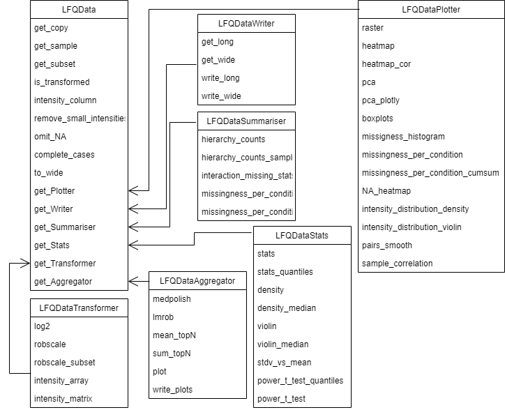
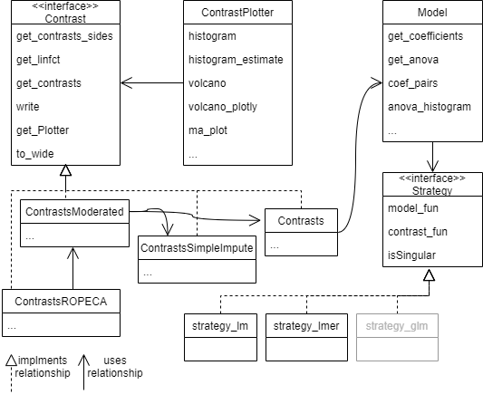

```{r setup, include=FALSE}
library(tidyverse)

library(ggplot2)

knitr::opts_chunk$set(echo = FALSE, warning = FALSE, message = FALSE, fig.width = 7, fig.height = 5)

```


See ACS guidelines [https://publish.acs.org/publish/author_guidelines?coden=ancham#manuscript_text_components]

# Abstract (80–250 words) 

[Copied this paragraph from a different article. Needs to be adjusted for prolfqua and this article]
"Protein mass spectrometry with label-free quantification is widely used for quantitative proteomics studies. Nevertheless, well-principled statistical inference procedures are still lacking, and most practitioners adopt methods from transcriptomics. These, however, cannot properly treat the principal complication of label-free proteomics, namely many non-randomly missing values." (rewrite this sentence)

The _prolfqua_ package integrates essential steps of the mass spectrometry based label free quantification data analysis workflow: quality control, data normalization, protein aggregation, modeling, hypothesis testing and sample size estimation. We use _prolfqua_ to develop highly customizable, visually appealing, and interactive data analysis reports in pdf or HTML format.  We use _prolfqua_ to visualize and model simple experimental designs with a single explanatory variable and complex experiments with multiple factors. Furthermore, we use _prolfqua_ to benchmark data acquisition, data preprocessing or data modeling methods. We developed and improved the package by applying the "Eating your own dog food" principle, making it easy to use.


# Introduction

[Jonas/Paolo could you provide some references here [...] doi's will do.]
Proteins are carriers of function and structure in living cells. Hence, measuring changes in protein abundance is the subject of active research [....]. However, identifying and quantifying intact proteins in complex samples containing hundreds of proteins is not possible using existing methods at the moment. Hence, the bottom-up mass spectrometric method is employed [...]. Proteins that are extracted from biological samples are specifically and reproducible digested into protein fragments - peptides. The peptides are first separated by their chemical and physical properties using High-Pressure Liquid Chromatography (HPLC). Afterward, they are weighted, identified, and quantified using mass spectrometric techniques, e.g., Electro-Spray-Ionization Mass Spectrometry (ESI-MS). Finally, peptide identification is achieved by fragmenting and matching the measured fragment masses to theoretical masses computed from known peptide sequences[...]. For quantification, intact peptide ions [DDA ref - method and sofware] or products of peptide ion fragmentation [DIA ref method and software] are counted and aggregated. Finally, the identified and quantified peptides are assigned to proteins based on protein sequence information [...prot inference ref].

Label-Free Quantification (LFQ) Proteomics Experiments enable monitoring relative abundances of thousands of proteins in biological samples. For most studies, parallel designs with a single explanatory variable are used, e.g., treatment vs. control. More recently, more complex experimental designs are implemented with increasing numbers of samples, i.e., factorial designs and longitudinal studies (time series), sometimes with repeated measurements on the same subject [...]. The obtained data can be modeled using linear fixed, mixed, or random-effects models [@Bates2015FittingJSS]. Based on these models, tests can be applied to examine whether a factor or interactions are significant, or differences between factor levels can be estimated, and their significance tested.  Proteins can be ordered or grouped using the estimated fold-change, t-statistics, scaled p-value, or false discovery rate (FDR) and then subjected to gene set enrichment or over-representation analysis [...] or validation experiments.


Several packages exist to model mass spectrometry LFQ experiments, e.g. _limma_[@Ritchie2015], _MSStats_[@Choi2014], _ROPECA_[@Suomi2017bEnhanced],  _MSqRob2_ [@Goeminne2016] or _proDA_ [@bioxrvproDA2020], to mention some, all implemented in the R. Each of them has some unique features. For example, _MSStats_ infers the model from the sample annotation and generates the model formula. At the same time, _limma_ allows to specify a linear model formula and implements the empirical Bayes variance shrinkage method. The R-package _ROPECA_, performs a roll-up of peptide level fold change and p-value estimates, obtained from _limma_, to protein level estimates. Furthermore, _MSqRob2_ implements two models: robust linear models fitted to protein intensities and robust ridge regression fitted to peptide intensities and combines them with empirical Baye's variance shrinkage known from _limma_. The _proDA_ package implements a linear probabilistic dropout model to account for missing data without imputation.

When analyzing parallel designs using a single explanatory variable, we can use all packages for the statistical data analysis of the data; however, if we want to model factorial designs or repeated measurements, we can use only some of them. Table \ref@(tab:tableOverview) gives an overview of the models and features supported by these packages.

```{r tableOverview}
xx <- list(
  triqler = c("pd" = "Y"),
  MSstats = c("pd" = "Y", "rm" = "Y", "mem" = "y"),
  ROPECA = c("pd" = "Y", "rm" = "Y*", fd = "Y", int = "Y", eb = "Y"),
  limma  = c("pd" = "Y", "rm" = "Y*", fd = "Y", int = "Y",eb = "Y"),
  MSqRob2_rlm = c("pd" = "Y", "rm" = "Y*", fd = "Y", int = "Y",eb = "Y", md = "?"),
  proDA = c("pd" = "Y", "rm" = "Y*", fd = "Y", int = "Y",eb = "Y", md = "Y"),
  prolfqua = c("pd" = "Y", "rm" = "Y", fd = "Y", int = "Y", mem = "Y",eb = "Y", md = "Y"))

bb <- data.frame(bind_rows(xx))
rownames(bb) <- names(xx)
knitr::kable(data.frame(bb), caption = "Rows - R package, Columns - types of models supported: pd - parallel design, rm - repeated measurements, fd - factorial design, int - interactions among factors, mem - mixed effect models, eb - empirical Bayes, md - missing data modelling. Y - yes, y - yes but only for random effects, * - repeated measurements are only modeled using a fixed effects. ? - the hurdle model is not implemented in the msqrob2 package yet.")
```


We were inspired by the excellent R package caret, which enables to call various machine learning methods, making selecting the best ML algorithm for your problem easy. We wanted to have a similar tool for the analysis of LFQ data. However, after examining the R packages for modeling proteomics quantification data, we observed that model specification, input, and output formats differ widely and wildly. However, all of them fit some type of linear model either to peptide or protein intensities, determine contrasts among conditions, and afterward, some of them apply empirical Bayes variance shrinkage. Therefore, the revised goal was to provide a modular design, with R linear models as a core, where features such as p-value aggregation (ROPECA) or variance shrinkage could be easily enabled if required. 

Models in _prolfqua_ are specified using R’s linear model and mixed model formula interface. Therefore, knowledge of the R regression model infrastructure is an advantage when using our package. Furthermore, this glass box approach should make it easy to reimplement an analysis performed with _prolfqua_ using base R or other programming languages by reading the analysis script and without looking at the package code. However, acknowledging the R formula interface’s complexity to non-statisticians and the popularity of MSstats, we provide the functionality to suggest a model formula from the sample annotation.

An important aspect of mass spectrometric data are missing values. Missing values lead to groups of varying size. Linear and mixed effect models can handle unbalanced designs, i.e. different group sizes. As long as there is at least one observation per group they do produce unbiased estimates. We use this feature instead of imputing missing observations. However, if there are not observation in one of the groups, then contrasts involving this group can not be estimated. To adres it, for the group without observations, we use a point prior equal to the average of $10\%$ smallest group mean intensities in the dataset and infer the variance from the variance in other groups. A way to adress this is to annotate the produced models with information about missigness which is done by for instance MSStats. How missigness can modelled using the Hurdle model is described here, however to our knowledge only the R package _proDA_ models missingness directly. 


Furthermore, the functionality of _prolfqua_ also includes methods specific to proteomics data. For example, we implemented strategies to infer protein intensities from peptide intensities: top N, Tukey's median polish, robust linear models. Furthermore, peptide or protein intensities can be scaled using the robust scaling method or transformed using _quantile_ normalization or _vsn_ from Bioconductor to remove systematic differences among samples and heteroscedasticity. In this respect, _prolfqua_ can be compared with other R packages such _DEP_ [@DEP2018] or POMA [@POMA2021] which support the entire LFQ analysis pipeline.


We use the Ionstar [@shen2018ionstar] dataset to benchmark the analysis pipeline and modeling methods implemented within _prolfqua_ and to compare our results with those of _MSstats_ and _proDA_. 


# Implementation & Methods (Experimental Section)

## Implementation

We store all the data needed for analysis in a single data frame in a tidy table, i.e., every column is a variable, every row is an observation, every cell is a single value[@tidydata2014]. Using an __R6__[@R6cite] configuration object, we specify what variable is in which column, making it easy to integrate new inputs in _prolfqua_ if provided in tidy tables. For example, to visualize tidy _Spectronaut_, or _Skyline_ outputs, or data in _MSStats_ format, only a few lines of code to update the _prolfqua_ configuration are needed. For popular software like _MaxQuant_ or _MSFragger_, which stores the same variable (e.g., intensity) in multiple columns, one for each sample, we implemented methods that transform the data into tidy tables. Relying on the tidy data table enabled us to easily interface with many data manipulation, visualization, and modeling methods implemented in base __R__[@RCoreTeam2021] and the tidyverse[@tidyverse2019]. We use __R6__ classes to structure the functionality of the package (see Figure \@ref(fig:LFQData) and Figure \@ref(fig:ContrastUML)). __R6__ classes are well supported (e.g. auto-completion) and easy to use (OOP).


```{r LFQData, echo=FALSE, fig.cap="Class Diagram for LFQData and related objects. The LFQData_Plotter class uses the LFQData class to implement methods for plotting.", out.width = '90%'}

```

__R__ linear model and linear mixed effect models allow modeling parallel designs, repeated measurements, factorial designs, and many more. __R__'s formula interface for linear models is flexible, widely used, and well documented. This makes it easy to reproduce an analysis performed with _prolfqua_ in other statistical programming languages. We implemented features specific to high throughput experiments, such as the experimental Bayes variance and p-value moderation, which utilizes the parallel structure of the protein measurements and the analysis [@Ritchie2015]. We also compute probabilities of differential protein regulation based on peptide level models [@Suomi2017bEnhanced]. We use R6 to model the statistical modeling functionality in `proflqua` (see Figure \@ref(fig:ContrastUML)).

(ref:ContrastUML) UML diagram of modeling and contrast related classes. Different strategies e.g. _lm_, _lmer_, and _glm_ can be used to fit various types of models using a model builder (see code). All classes computing contrasts implement the _Contrast_ interface.

```{r ContrastUML, echo=FALSE, fig.cap="(ref:ContrastUML)", out.width = '90%'}

```

## Benchmark dataset

Ionstar dataset, give Pride ids, describe MaxQuant settings and version. Give reference to Experiment hub and the _prolfquaData_ package.

## Modelling

### Estimating contrasts for linear models

Given a linear model contrasts can be computed by $\hat{\beta_{c}} = \sum l\beta_{m}$ and $\textrm{var} \hat\beta_c = l\sigma^2 (X^T X)^{-1} l^T$, with $X$ being the design matrix, $\beta_m$ the model parameters and $l$ an array of coefficients.  The degrees of freedom for the contrast are equal to the residual degrees of freedom of the linear model.
For estimating contrasts from mixed effects models we used the function `contest` implemented in the R package `lmerTest` [@Kuznetsova2017lmerTest] and used the Satterthwaite method to estimate the denominator degrees of freedom. These methods are implemented in the class `Contrast` (see Figure \@ref(fig:ContrastUML))

### Contrast estimation in presence of missing data.


If there are no observation in a group we assume that there are no observations because of the limit of detection (LOD). Furthermore, we assume that the variance of the protein is constant in all the conditions.
We impute the mean estimate of the group by using the average of $10\%$ smallest group mean intensities in the experiment. To estimate the variance in the condition, we use the pooled variance based on all conditions: 

$$s_p^2=\frac{\sum_{i=1}^k (n_i - 1)s_i^2}{\sum_{i=1}^k (n_i - 1)},$$
with $n_i$ the number of observations, and $s_i$ the standard deviation in each condition.
The standard deviation for the t-statics is then given by:

$$
s = \sqrt{2}\sqrt{\frac{n_g s_p^2}{n}},
$$

Where, $n_G$ is the number of groups and $n$ is the number of observations.

This methods are implemented in the class `ContrastSimpleImpute` (see Figure \@ref(fig:ContrastUML)).


### P-value moderation

From the linear and the mixed effect models, we can obtain the residual standard deviation $\sigma$, and degrees of freedom.  [@Smyth2004linear] discuss how, using the empirical Bayes paradigm, to use the $\sigma$ and $df$ of all models to estimate a prior $\sigma$ and prior degrees of freedom, and posterior $\tilde \sigma$. These can be used to moderate the t-statistics by:
$\tilde{t}_{pj} = \frac{t_{pj} s_p}{\tilde{s}_p}$
and subsequently the p-values. We implemented this method in the class `ContrastModerated` (Figure \@ref(fig:ContrastUML)).

### Summarizing peptide level models

To summarize peptide level models to protein models we did applied the method suggested by [@Suomi2017bEnhanced], that is to use the median scaled p-value of the peptide models and cumulative distribution function of the beta distribution function to determine a regulation probability of the protein. 

To obtain the median p-value of the protein, we first rescaled the peptide p-values by taking the direction of the fold-change $\hat \beta$ into account, i.e.:


\begin{equation}
p_{s} =
  \begin{cases}
1-p, & \textrm{if}~ \hat{\beta} > 0\\
p-1, & \textrm{otherwise}
\end{cases}
(\#eq:scalepvalue)
\end{equation}

Afterwards, the median scaled p-value $\tilde{p}_s$ is determined and using the transformation below, transformed back onto the original scale. 

$$
\tilde{p} = 1 - |\tilde{p}_{s}|
$$
Because we used the median as the i-th order statistic  $i = n/2 +0.5$. Therefore, $\gamma = i = n/2 + 0.5$ and $\delta = n - i + 1 = n - (n/2 + 0.5) + 1 = n/2 + 0.5 = \gamma$ are used to parameterize the CDF of the Beta distribution. We implemented this method in the class `ContrastROPECA` (Figure \@ref(fig:ContrastUML)).


# Example Analysis

Peptide intensities are $\log_2$ transformed and robust z-score scaled but then rescaled to preserves the original range of the data using the method `robscale`. We show the distribution of the normalized intensities in Figure \@ref(fig:prepro) Panel A. Protein intensities are estimated using Tukey's median polish. Figure \@ref(fig:prepro) Panel B shows the peptide intensities and the estimated protein intensities in black. The boxplot (Panel D) shows the distribution of the protein intensity estimate in each condition. Finally, Panel C shows the distribution of the protein standard deviations for each condition.


```{r prepro,  echo = TRUE , fig.cap="(ref:scaling)", out.width = '90%', fig.width = 8, fig.height = 8}
library(prolfqua)
d <- prolfqua::data_ionstar$filtered()
lfqd <- LFQData$new(d$data, d$config) 
t <- lfqd$get_Transformer()
lfqd <-  t$log2()$robscale()$lfq
pl <- lfqd$get_Plotter()
p_a <- pl$intensity_distribution_density() +
  labs(tag = "A") + theme(legend.position = "none")
agr <- lfqd$get_Aggregator()
lfqp <- agr$medpolish()
p_b <- agr$plot()$plots[[1]] + labs(tag = "B")
p_c <- lfqp$get_Stats()$violin() + labs(tag = "C")
pl <- lfqp$get_Plotter()
p_d <- pl$boxplots()$boxplot[[1]] + labs(tag = "D")
ggpubr::ggarrange(p_a, p_b, p_c, p_d)

```


(ref:scaling) Panel A - Peptide intensity distributions for 20 samples, Panel B - Peptide intensities for protein _5NTD_ and protein intensity estimate (black dashed line), Panel C - distribution of protein standard deviations for all dilutions, Panel D - Distribution of protein intensities for protein _5NTD_.


The following code example illustrates how we compute contrast comparing the protein intensities in the condition. First, the differences and the linear model are specified. Afterward, the model is fitted to the data using the `build_model` function. Next, we examine the importance of the factors in the model using the ANOVA function, which facilitates model selection for models with one explanatory variable. Finally, we estimate the contrasts either from the linear model using the `Contrasts` class or directly from the data using the `ContrastsSimpleImpute` class. Afterward, we apply t-statistic moderation using the `ContrastModerated` class. Finally, the `addContrastResults` function merges both sets of contrast estimates, preferring the one obtained from the linear model. Figure \@ref(fig:exampleContrasts) Panel A shows the distribution of the p-values, while figure Panel B shows the volcano-plot for each comparison.

(ref:exampleContrasts) Left panel - histogram of p-values. Right panel - volcano plots.

```{r exampleContrasts, fig.cap="(ref:exampleContrasts)", echo=TRUE, out.width = '90%'}
contrasts <- c(
  "dilution_(9/7.5)_1.2" =   "dilution.e - dilution.d",
  "dilution_(7.5/6)_1.25" =   "dilution.d - dilution.c"
  #,"dilution_(6/4.5)_1.3(3)" =   "dilution.c - dilution.b",
  #,"dilution_(4.5/3)_1.5" =   "dilution.b - dilution.a"
)
# fit model
lmmodel <- paste(lfqp$intensity_column()," ~ dilution.")
modelFunction <- strategy_lm( lmmodel, model_name = "lm")
models <- build_model(lfqp, modelFunction)
p0 <- models$anova_histogram()
# compute contrasts from linear model and with imputation
contr <- prolfqua::Contrasts$new(models, contrasts) %>% 
  prolfqua::ContrastsModerated$new()
conI <- prolfqua::ContrastsSimpleImpute$new( lfqp, contrasts) %>% 
  prolfqua::ContrastsModerated$new()
tmp <- prolfqua::addContrastResults(prefer = contr, add = conI)
# visualize results
pl <- tmp$merged$get_Plotter()
p1 <- pl$histogram()$p.value
p2 <- pl$volcano()$FDR +
   theme(legend.position = "bottom")
gridExtra::grid.arrange(p1, p2, ncol = 2)

```


# Benchmarking


The peptide intensities from the _peptide.txt_ file were $log_2$ transformed, and subsequent robust z-score transformation, where median and the mean average deviation (mad) were obtained from the human proteins only. We removed _one hit wonders_, i.e. proteins with a single peptide assignment. No further data filtering was used. We also did not use imputation. The protein level linear model was fitted to the protein intensities inferred from the peptide intensities using the Tukey's median polish. The mixed effect linear model, and the ROPECA model were fitted to the peptide intensities. The details of the _prolfqua_ benchmark implementation are available online  [BenchmarkingIonstarData](https://wolski.github.io/prolfqua/articles/BenchmarkingIonstarData.html).

For benchmarking of MSstats we used the defaults specified in the [Benchmarking_MSstats](https://wolski.github.io/prolfqua/articles/)

The Benchmark functionality of _prolfqua_ includes ROC curves and computes partial areas under those curves (pAUC) and other scores, e.g. the false discovery proportion FDP. We use it to study how well linear, mixed effect models or p-value moderation model quantitative mass spectrometric high throughput experiments and compare it with results produced by MSstats [@MSstats2014] and by proDA [@bioxrvproDA2020]. Figure \@ref(fig:benchmarkROC)

The IonStar  [@shen2018ionstar] benchmark dataset contains _H. sapiens_ proteins with constant concentrations and _E. coli_ proteins with varying concentrations. We know that for _H. sapiens_ proteins the difference $\beta$ between two dilutions should be $\beta = 0$ while for _E. coli_ proteins, we know that the difference between dilutions should be $\beta \ne 0$. To compare the performance of the various methods implemented in _prolfqua_ we use only the contrasts resulting in small fold-changes $\beta = 1.2,1.25,1.3(3),1.5$. 


We can use various statistics to examine the alternative hypothesis $\beta \ne 0$: the contrast estimate, i.e. the $\log_2$ fold-change $\beta$, the t-statistic $\frac{\beta}{\sqrt{var(\beta)}}$, or the $p-value$ and moderated $p-value$. For each statistic and each value of the statistics we then compute a confusion matrix (see Table \@ref(tab:confusionMatrix)). From the confusion matrix we obtain measures such as true positive rate (TPR), false positive rate (FPR), or false discovery proportion (FDP) which are given by:


```{r confusionMatrix}
table <- data.frame( c("beta != 0", "beta == 0", "Total"), matrix(c("TP","FP","R","FN","TN","","P","N","m"), ncol = 3, byrow = T))
colnames(table) <- c("Prediction \\ Truth","E.coli", "H.sapiens", "Total")
knitr::kable(table, caption = "Confusion matrix, TP - true positive, FP - false positive, FN - false negative, P - all positive cases (all E. coli proteins), N - all negative cases (all H. sapiens proteins), m- all proteins.")

```


$$
\begin{aligned}
TPR &= \frac{TP}{TP+FN} = \frac{TP}{P}\\
FPR &= \frac{FP}{FP+TN} = \frac{FP}{N}\\
FDP &= \frac{FP}{TP + FP} = \frac{FP}{R}
\end{aligned}
$$


By plotting the $TPR$ versus the $FPR$ we obtain the receiver operator characteristic curve (ROC curve). The area under the curve (AUC) or partial areas under the curve (pAUC), at various values of the $FPR$, are measures of performance derived from the ROC curve. By using these measures we can compare the performances of the statistics produced by the various methods examined.


```{r}
allBenchmarks <- readRDS("../../inst/Benchresults/allBenchmarks.RDS")
benchmark_msstats <- readRDS("../../inst/Benchresults/benchmark_msstats.RDS")
benchmark_prodA <- readRDS("../../inst/Benchresults/benchmark_medpolish_proDA.RDS")
msFragger <- readRDS(file = "../../inst/Benchresults/MSFragger_medpol_benchmark.RDS")

allBenchmarks$benchmark_mssstats <- benchmark_msstats
allBenchmarks$benchmark_msFragger <- msFragger
allBenchmarks$benchmark_proDA <- benchmark_prodA
allBenchmarks <- allBenchmarks[c("benchmark_imputation","benchmark_ProtModerated",  "benchmark_mixedModerated", "benchmark_ropeca","benchmark_merged","benchmark_mssstats","benchmark_proDA"   )]
```

(ref:benchmarkROC) Left panel - Partial area under the ROC curve at $10\%$ FPR for all contrasts. Red line average area under the curve. Left panel - Difference to mean partial area under the ROC curve for various models, at $10\%$ FPR, by fold change.

```{r benchmarkROC, fig.cap="(ref:benchmarkROC)", out.width = '90%', fig.width=12, fig.height=10}

ttt <- sapply(allBenchmarks, function(x){x$complete(FALSE)})
res <- map_df(allBenchmarks, function(x){x$pAUC()})
res <- res %>% mutate(whatfix = case_when(what == "scaled.beta.based.significance" ~ "scaled.p.value", TRUE ~ what))

norm <- res %>% group_by(contrast,whatfix) %>% summarize(meanpAUC_10 = mean(pAUC_10))
res <- inner_join(res, norm)
res <- mutate(res , pAUC_10n = pAUC_10 - meanpAUC_10)

resAllB <- res %>% dplyr::filter(contrast == "all")

p1 <- ggplot(resAllB, aes(x = Name, y = pAUC_10)) +
  geom_bar(stat = "identity") +
  facet_wrap(~whatfix)  + 
  coord_cartesian(ylim = c(min(resAllB$pAUC_10),max(resAllB$pAUC_10))) + 
  theme_minimal() + 
  theme(axis.text.x = element_text(angle = -90, vjust = 0.5)) +
  geom_hline(aes(yintercept = meanpAUC_10), color = "red") + xlab("")

p2 <- ggplot(res, aes(x = contrast, y = pAUC_10n, group = Name)) +
  geom_line(stat = "identity", aes(linetype = Name, color = Name), size = 1) + 
  facet_wrap(~ whatfix, scales = "free") +
  theme_minimal() + 
  theme(axis.text.x = element_text(angle = -90, vjust = 0.5)) +
  geom_hline(aes(yintercept = 0), color = "red") + 
   theme(legend.position = "bottom", legend.title = element_blank())

gridExtra::grid.arrange(p1, p2, ncol = 2)

```


A relevant parameter is the number of contracts a given method estimates from the data(see Figure \@ref(fig:FDRfdp) left Panel). It indicates how robust the procedure works in the presence of missing data. For each protein, we can estimate four contrast which for 4046 proteins, at least two peptides resulted in $16184$ possible contrast estimates. Because the set of contrasts slightly differs for each method, it makes comparing them complicated. For instance, we observe that MSstas estimates $16058$ while the mixed effect models estimate the fewest with $15940$. Hence, to conclude that one method shows a better performance, the score, e.g., pAUC, needs to be greater, but also the number of estimated contrasts needs to be equal or larger. 

Figure \@ref(fig:benchmarkROC) left panel, shows how various estimates obtained from the models, i.e. $\log_2(FC)$, $t-statistics$ and scaled p-values allow to identify true positives (TP) given a false positive rate. When testing for differential expression, the $\log_2(FC)$ is outperformed by than the t-statistic or p-value. 
If an accurate estimate of the $log_2(FC)$ is essential, the linear models fitted to protein intensities, estimated using Tukey's median polish, show the best performance. We speculate that this is because of the robustness of Tukey's median polish method. This hypothesis could be examined, by including other forms of protein intensity inferences implemented in `prolfqua`, e.g. `top-N` or `rlm`, into the benchmark.

There are only minor differences in the p-AUC when using the t-statistics or the scaled p-value  (see Figure \@ref(fig:benchmarkROC) right panel). In order to compute the confusion matrices based on the p-value we first need to rescale it (see Equation \@ref(eq:scalepvalue)). Thus, the p-value is a function of the t-statistics and the degrees of freedom. Interestingly, the pAUC increases when using p-values instead of the t-statistics for linear models, while it decreases for mixed effect models. The reason is erroneous denominator degrees of freedom estimation for many proteins in the mixed-effect models.

We also benchmark if the FDR obtained from a model is an unbiased estimate of the false discovery proportion (FDP). Figure \@ref(fig:FDRfdp) right panel draws on the horizontal axis the FDR determined from the model, and on the vertical axis, the FDP obtained from the confusion matrix.  We see that most of the lines are below the diagonal, indicating that the FDR estimates obtained with _prolfqua_ are modestly conservative for this benchmark dataset provide. In the case of MSstats, we observe a high proportion of false discoveries for small FDR values. In the case of ROPECA, the FDR estimates, obtained when Benjamini-Hochberg correcting the regulation probabilities, strongly overestimate the FDP.

(ref:FDRfdp) Left panel - Number and percentage of estimated contrasts by modeling method. Right panel - Compare FDR estimate with false discovery proportion (FDP).


```{r FDRfdp, fig.cap = "(ref:FDRfdp)", out.width = '90%', fig.width=12, fig.height=10}

dd <- map_df(allBenchmarks, function(x){res <- x$smc$summary; res$name <- x$model_name;res})
dd <- dd %>% mutate(nrcontrasts = protein_Id * (4 - nr_missing))
dds <- dd %>% group_by(name) %>% summarize(nrcontrasts = sum(nrcontrasts))
dds$percent <- dds$nrcontrasts/max(dds$nrcontrasts) * 100

nrgg <- dds %>% ggplot(aes(x = name, y = nrcontrasts )) + 
  geom_bar(stat = "identity", fill="white", colour = "black") + 
  coord_cartesian(ylim = c(min(dds$nrcontrasts) - 100, max(dds$nrcontrasts) + 10)) +
  theme(axis.text.x = element_text(angle = -90, vjust = 0.5)) +
  geom_text(aes(label = round(nrcontrasts, digits = 1)),
            vjust = 1, hjust = -0.2, angle = -90) + 
  geom_text(aes(label = paste0("(",round(percent, digits = 1),"%)")),
            vjust = -1, hjust = -0.2, angle = -90) 
p1 <- nrgg

dd <- map_df(allBenchmarks, function(x){res <- x$get_confusion_FDRvsFDP(); res$name <- x$model_name;res})

ddb <- filter(dd, contrast == "dilution_(4.5/3)_1.5")
ddb <- dd %>% dplyr::filter(contrast == "dilution_(7.5/6)_1.25")
ddb <- dd %>% dplyr::filter(contrast == "all")


p2 <- ddb %>% ggplot(aes(y = FDP_,  x  = scorecol )) + 
  geom_line(aes(color = model_name, linetype = model_name)) +
  facet_wrap(~contrast) + 
   geom_abline(intercept = 0, slope = 1, color = 2) + 
   theme(legend.position = "bottom")

gridExtra::grid.arrange(p1, p2, ncol = 2)

```


# Conclusions

We assessed the performance of different modeling approaches implemented in prolfqua and MSstats using a benchmark dataset whose ground truth was known. However, the dataset used has several limitations. First, the design is a parallel-group design; secondly, essential sources of variation present in every experiment, such as the biochemical and biological, are not measured. The dataset captures only the variance from the chromatography, electrospray, and mass spectrometric measurement methods. Thus, while we can extrapolate some of the results obtained to more realistic datasets, we need to be careful not to over-interpret the results.

We can conclude that if we want to order the proteins according to the likelihood of being differentially regulated, for instance, to perform gene enrichment analysis, the t-statistic is better suited than the fold-change estimate. Modeling the degrees of freedom when computing the p-values might improve the inference further. However, the observed change is minuscule. 

For the fixed effect linear model, the empirical Bayes variance shrinkage, as first suggested by [@Smyth2004linear], gives a consistent improvement compared with the unmoderated estimates (data not shown). However, there is no such effect for the mixed effect model, most likely because the degrees of freedom are erroneously estimated for a large proportion of models.

Computing the statistics at the peptide level, e.g., the t-statistics or p-value, then summarizing these statistics using their median produces the highest AUC scores among all the tested models. By using the beta distribution to model the number of peptides observed, we can further improve the pAUC scores (see Figure). However, the properties of beta-based probabilities are not well understood; for instance, they have no uniform distribution under the null hypothesis. The FDR estimates obtained when correcting multiple testing with the Benjamini-Hochberg method are strongly biased (see Figure \@ref()). Therefore, we can not recommend this method if an unbiased estimate of FDR is essential, which is frequently the case.

Leveraging on these computer experiments, we can provide the following advice. First, aggregate the peptide intensities to protein intensities using a robust regression method. Second, use linear models as long as they suffice to model your experimental design. Use mixed effect models only if you have to (e.g., repeated measurements). If you use fixed-effect linear models, apply variance moderation since this improves the t-statistics and p-value estimates. If you want to sort your protein lists to perform gene set enrichment analysis, use the t-statistic instead of the fold change. If you plan to select proteins to study them further based on the FDR, you can expect some bias.


_prolfqua_ allows for considerable flexibility to model your experiments. Various types of models are available, and the contrast specification is consistent and intuitive for all models. The benchmarking results are comparable with other methods. The modular design of _prolfqua_, allows for customizing the analysis or adding new features, e.g., generalized linear models (_glm_'s) for missing data modeling or robust linear models (_rlm_'s), quickly.

Using the tidy table to model the data ensures interoperability with other proteomics-related packages that manage their data with tidy-tables, e.g., _protti_. Furthermore, the use of `R6` classes, which encapsulate the configuration and the data, allows writing very concise code (no function arguments needed), and auto-completion support in the Rstudio editor makes it easy for novices to explore _prolfquas_ functionality. 

In summary _prolfqua_ is an easy-to-use and feature rich R package to analyse quantitative mass spectrometric data, report results, and benchmark MS software and statistical methods. We provide more details at the website https://wolski.github.io/prolfqua/. To install:


```{r echo=TRUE, eval=FALSE}
install.packages('remotes')
remotes::install_gitlab("wolski/prolfquaData",
                        host="gitlab.bfabric.org")
remotes::install_github('wolski/prolfqua',
                        build_vignettes = TRUE)

```


```{r}
proda <- allBenchmarks$benchmark_proDA$data()
imp <- allBenchmarks$benchmark_imputation$data()

x <- inner_join(imp, proda, by = c("contrast","protein_Id"), suffix = c(".imp",".proda"))
plot(x$estimate.imp, x$estimate.proda, col = as.factor(x$species.imp))

xy <- x %>% select(protein_Id   , contrast , estimate.imp,estimate.proda, species.imp) %>% filter( abs( x$estimate.imp - x$estimate.proda ) > 1)
plot(xy$estimate.imp, xy$estimate.proda, col = as.factor(xy$species.imp))
abline(0,1, col=2)
abline(h=1, col=2)
abline(v=1, col=2)


```

#

```{r}

prodB <- allBenchmarks$benchmark_proDA$clone(deep=TRUE)
proda <-prodB$.data
modB <-allBenchmarks$benchmark_ProtModerated 
mod <- modB$.data
modB$smc$summary

prodaMod <- semi_join(proda, mod, by = c("contrast", "protein_Id"))
prodB$.data <- prodaMod
prodB$smc

pp <- prodB$pAUC_summaries()
pq <- allBenchmarks$benchmark_ProtModerated$pAUC_summaries()

gridExtra::grid.arrange(pp$barp, pq$barp)
```


# Acknoledgements

The authors thank the technology platform fund of the University of Zurich.


# References
